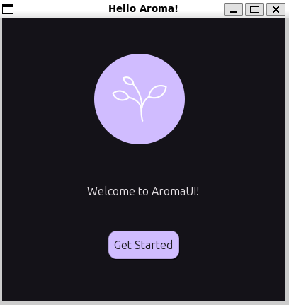

# AromaUI


<br/>

<div style="text-align:center;">
  
</div>

<br/>

AromaUI is a modern, lightweight C UI framework designed for embedded and desktop applications. It provides a set of customizable widgets and tools to build beautiful, responsive user interfaces in C.

## Features
- Modular widget system
- Material design components
- Multi-window support
- Customizable themes
- Efficient rendering
- Easy integration with existing C projects

## Getting Started

### Prerequisites
- C compiler (GCC/Clang)
- CMake 3.10+
- Linux, Windows (Embedded Coming Soon)

### Build Instructions
```sh
mkdir build
cd build
cmake ..
make
```

### Running Examples
Navigate to any example folder and build:
```sh
cd examples/minimal
mkdir build && cd build
cmake ..
make
./minimal
```



## Example: Settings App
AromaUI comes with a sample settings application to demonstrate its capabilities.


To run:
```sh
cd examples/settings_app/build
./settings_app
```

## Directory Structure
- `src/` - Core library source code
- `include/` - Public headers
- `examples/` - Example applications
- `tests/` - Unit tests
- `vendors/` - Third-party dependencies
- `images/` - Project images and screenshots

## Contributing
Contributions are welcome! Please open issues or pull requests to help improve AromaUI.

## License
AromaUI is released under the MIT License.
