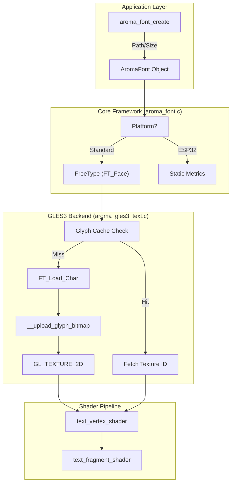
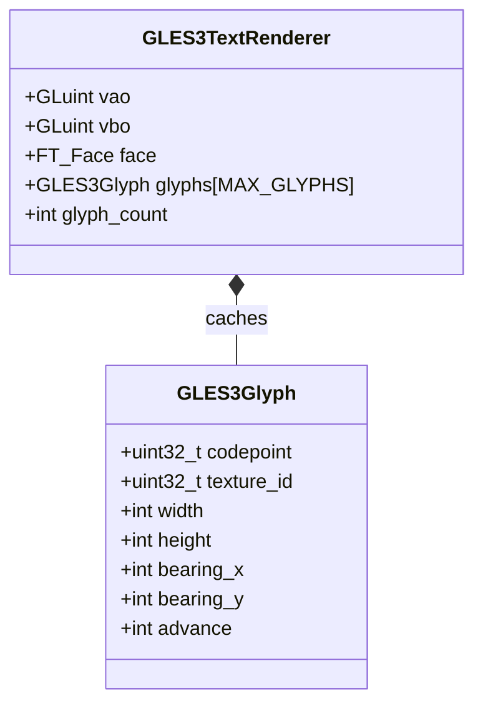

# Font System
Relevant source files
- [.gitmodules](https://github.com/BinaryInkTN/AromaUI/blob/afd1c6b6/.gitmodules)
- [buzzer/src/main.c](https://github.com/BinaryInkTN/AromaUI/blob/afd1c6b6/buzzer/src/main.c)
- [docs/ui/font_system.md](https://github.com/BinaryInkTN/AromaUI/blob/afd1c6b6/docs/ui/font_system.md?plain=1)
- [include/aroma_font.h](https://github.com/BinaryInkTN/AromaUI/blob/afd1c6b6/include/aroma_font.h)
- [include/aroma_ubuntu_font.h](https://github.com/BinaryInkTN/AromaUI/blob/afd1c6b6/include/aroma_ubuntu_font.h)
- [src/backends/graphics/utils/aroma_gles3_text.c](https://github.com/BinaryInkTN/AromaUI/blob/afd1c6b6/src/backends/graphics/utils/aroma_gles3_text.c)
- [src/backends/graphics/utils/helpers_gles3.h](https://github.com/BinaryInkTN/AromaUI/blob/afd1c6b6/src/backends/graphics/utils/helpers_gles3.h)
- [src/core/aroma_common.h](https://github.com/BinaryInkTN/AromaUI/blob/afd1c6b6/src/core/aroma_common.h)
- [src/core/aroma_font.c](https://github.com/BinaryInkTN/AromaUI/blob/afd1c6b6/src/core/aroma_font.c)
- [src/core/aroma_ubuntu_font.c](https://github.com/BinaryInkTN/AromaUI/blob/afd1c6b6/src/core/aroma_ubuntu_font.c)
- [src/widgets/aroma_image.c](https://github.com/BinaryInkTN/AromaUI/blob/afd1c6b6/src/widgets/aroma_image.c)

The **Font System** in AromaUI provides a unified interface for loading, managing, and rendering typography across diverse platforms, ranging from high-performance desktop environments to resource-constrained embedded systems. It leverages **FreeType** for vector font rasterization on most platforms while providing specialized optimizations for GLES3 backends and fallback mechanisms for TFT-based hardware.

## Architecture Overview

The font system is split into a platform-agnostic core and backend-specific implementations. The core manages the `AromaFont` lifecycle and metrics, while the graphics backends handle the actual glyph rasterization and GPU texture caching.

### Key Components

- **AromaFont**: An opaque handle representing a loaded font face at a specific pixel size [include/aroma_font.h16](https://github.com/BinaryInkTN/AromaUI/blob/afd1c6b6/include/aroma_font.h#L16-L16)
- **FreeType Integration**: Uses the FreeType library (via `vendors/freetype`) to parse TTF/OTF files and generate glyph bitmaps [src/core/aroma_font.c107-108](https://github.com/BinaryInkTN/AromaUI/blob/afd1c6b6/src/core/aroma_font.c#L107-L108)
- **Embedded Fonts**: Includes a bundled Ubuntu TTF as a byte array for out-of-the-box usage without filesystem dependencies [include/aroma_ubuntu_font.h8-9](https://github.com/BinaryInkTN/AromaUI/blob/afd1c6b6/include/aroma_ubuntu_font.h#L8-L9)
- **GLES3 LRU Cache**: A per-window glyph cache that stores rasterized characters as OpenGL textures to minimize redundant FreeType calls [src/backends/graphics/utils/aroma_gles3_text.c127-147](https://github.com/BinaryInkTN/AromaUI/blob/afd1c6b6/src/backends/graphics/utils/aroma_gles3_text.c#L127-L147)

### Data Flow: Font to Screen



**Sources:**[src/core/aroma_font.c148-174](https://github.com/BinaryInkTN/AromaUI/blob/afd1c6b6/src/core/aroma_font.c#L148-L174)[src/backends/graphics/utils/aroma_gles3_text.c152-199](https://github.com/BinaryInkTN/AromaUI/blob/afd1c6b6/src/backends/graphics/utils/aroma_gles3_text.c#L152-L199)[src/backends/graphics/utils/helpers_gles3.h123-146](https://github.com/BinaryInkTN/AromaUI/blob/afd1c6b6/src/backends/graphics/utils/helpers_gles3.h#L123-L146)

---

## Font Lifecycle and Management

### Loading Fonts

Fonts can be loaded from the filesystem or directly from memory buffers. Memory loading is preferred for cross-platform portability and embedded assets.

| Function | Description | Source |
| --- | --- | --- |
| `aroma_font_create` | Loads font from disk; resolves asset paths automatically. | [src/core/aroma_font.c148-174](https://github.com/BinaryInkTN/AromaUI/blob/afd1c6b6/src/core/aroma_font.c#L148-L174) |
| `aroma_font_create_from_memory` | Loads font from a raw `unsigned char` buffer. | [src/core/aroma_font.c176-209](https://github.com/BinaryInkTN/AromaUI/blob/afd1c6b6/src/core/aroma_font.c#L176-L209) |
| `aroma_font_destroy` | Releases `FT_Face` and frees font memory. | [src/core/aroma_font.c217-221](https://github.com/BinaryInkTN/AromaUI/blob/afd1c6b6/src/core/aroma_font.c#L217-L221) |

### Metrics and Measurement

AromaUI provides APIs to query font metrics essential for layout calculations. All measurements are returned in pixels.

- **Line Height**: The recommended vertical distance between baselines [src/core/aroma_font.c239-243](https://github.com/BinaryInkTN/AromaUI/blob/afd1c6b6/src/core/aroma_font.c#L239-L243)
- **Ascender/Descender**: The distance from the baseline to the highest/lowest point of the font [src/core/aroma_font.c245-255](https://github.com/BinaryInkTN/AromaUI/blob/afd1c6b6/src/core/aroma_font.c#L245-L255)
- **Text Width**: Calculated by summing the `advance` property of each glyph in a string [src/core/aroma_font.c223-236](https://github.com/BinaryInkTN/AromaUI/blob/afd1c6b6/src/core/aroma_font.c#L223-L236)

**Sources:**[include/aroma_font.h41-77](https://github.com/BinaryInkTN/AromaUI/blob/afd1c6b6/include/aroma_font.h#L41-L77)

---

## GLES3 Backend Implementation

The GLES3 backend utilizes a specialized `GLES3TextRenderer` to handle high-performance text rendering.

### Glyph Caching

To avoid the overhead of re-rasterizing characters every frame, the backend maintains a `GLES3Glyph` cache.

1. **Initial Load**: Characters 32-127 (Standard ASCII) are pre-loaded into textures during `gles3_text_renderer_load_font`[src/backends/graphics/utils/aroma_gles3_text.c127-147](https://github.com/BinaryInkTN/AromaUI/blob/afd1c6b6/src/backends/graphics/utils/aroma_gles3_text.c#L127-L147)
2. **Dynamic Loading**: If a codepoint (e.g., UTF-8 or Extended Latin) is missing, `__get_glyph` triggers a FreeType load and uploads a new texture to the GPU [src/backends/graphics/utils/aroma_gles3_text.c152-199](https://github.com/BinaryInkTN/AromaUI/blob/afd1c6b6/src/backends/graphics/utils/aroma_gles3_text.c#L152-L199)
3. **Texture Storage**: Glyph bitmaps are stored using `GL_RED` (or `GL_LUMINANCE` on WebGL/Emscripten) to save memory [src/backends/graphics/utils/aroma_gles3_text.c95-101](https://github.com/BinaryInkTN/AromaUI/blob/afd1c6b6/src/backends/graphics/utils/aroma_gles3_text.c#L95-L101)

### Shaders

Text is rendered as a series of quads. The fragment shader samples the single-channel glyph texture and applies a uniform `textColor`.



**Sources:**[src/backends/graphics/utils/aroma_gles3_text.h](https://github.com/BinaryInkTN/AromaUI/blob/afd1c6b6/src/backends/graphics/utils/aroma_gles3_text.h)[src/backends/graphics/utils/helpers_gles3.h137-146](https://github.com/BinaryInkTN/AromaUI/blob/afd1c6b6/src/backends/graphics/utils/helpers_gles3.h#L137-L146)

---

## DP/SP Scaling

AromaUI supports density-independent pixels (**DP**) for layouts and scale-independent pixels (**SP**) for fonts. This ensures that text remains legible across different screen densities.

On Android, the system bridges these calls to `aroma_android_sp_to_px`[buzzer/src/main.c28-34](https://github.com/BinaryInkTN/AromaUI/blob/afd1c6b6/buzzer/src/main.c#L28-L34) Developers typically define font sizes using SP constants to maintain accessibility standards.

```
#define FONT_TITLE_SP      36
#define FONT_LARGE_SP      28
 
// Usage in application
int size = sp(FONT_TITLE_SP);
AromaFont* font = aroma_font_create_from_memory(aroma_ubuntu_ttf, aroma_ubuntu_ttf_len, size);
```

**Sources:**[buzzer/src/main.c59-62](https://github.com/BinaryInkTN/AromaUI/blob/afd1c6b6/buzzer/src/main.c#L59-L62)[src/core/aroma_ubuntu_font.c5-104](https://github.com/BinaryInkTN/AromaUI/blob/afd1c6b6/src/core/aroma_ubuntu_font.c#L5-L104)

---

## Platform Specifics: ESP32

On **ESP32** (TFT_eSPI backend), the font system is simplified to reduce memory footprint. It bypasses FreeType and uses fixed metrics for built-in fonts like `FreeSans12pt7b` or `GLCD`[src/core/aroma_font.c14-32](https://github.com/BinaryInkTN/AromaUI/blob/afd1c6b6/src/core/aroma_font.c#L14-L32)

- **aroma_font_create**: Instead of loading a file, it matches the `font_path` string to internal identifiers [src/core/aroma_font.c34-66](https://github.com/BinaryInkTN/AromaUI/blob/afd1c6b6/src/core/aroma_font.c#L34-L66)
- **aroma_font_get_face**: Returns `NULL` as there is no underlying `FT_Face` object [src/core/aroma_font.c99-103](https://github.com/BinaryInkTN/AromaUI/blob/afd1c6b6/src/core/aroma_font.c#L99-L103)

**Sources:**[src/core/aroma_font.c6-103](https://github.com/BinaryInkTN/AromaUI/blob/afd1c6b6/src/core/aroma_font.c#L6-L103)