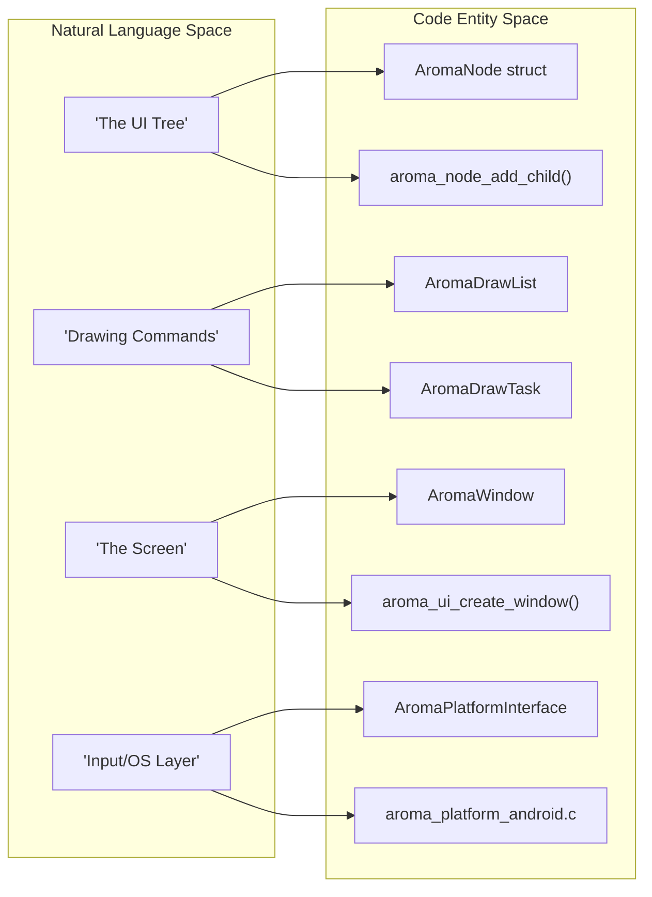
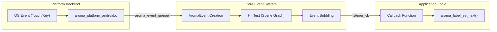

# Glossary

This page provides definitions for codebase-specific terms, abbreviations, and domain concepts used throughout the AromaUI framework. It serves as a technical reference for onboarding engineers to understand the internal nomenclature and implementation pointers.

## Core Concepts

### AromaNode

The fundamental building block of the AromaUI scene graph. Every UI element (windows, buttons, containers) is an `AromaNode`. It manages the hierarchical parent-child relationship (limited to 64 children for performance) and maintains spatial properties like `AromaRect`.

- **Implementation:**[include/aroma_node.h1-50](https://github.com/BinaryInkTN/AromaUI/blob/afd1c6b6/include/aroma_node.h#L1-L50)
- **Lifecycle:** Initialized via `__node_system_init`[src/core/aroma_ui_impl.c165](https://github.com/BinaryInkTN/AromaUI/blob/afd1c6b6/src/core/aroma_ui_impl.c#L165-L165)

### AromaBackendABI

The "Application Binary Interface" proxy layer that decouples the core framework from specific graphics and platform implementations. It routes generic draw calls (e.g., `draw_rect`) to the active backend (GLES3, Vulkan, or TFT_eSPI).

- **Implementation:**[src/backends/aroma_abi.c1-100](https://github.com/BinaryInkTN/AromaUI/blob/afd1c6b6/src/backends/aroma_abi.c#L1-L100)
- **Access:** Accessed via the global `aroma_backend_abi` struct [src/core/aroma_ui_impl.c33](https://github.com/BinaryInkTN/AromaUI/blob/afd1c6b6/src/core/aroma_ui_impl.c#L33-L33)

### DrawList

A command-buffer system used for deferred rendering. Instead of immediate execution, UI nodes record drawing commands into an `AromaDrawList`. This allows for Z-index sorting, frustum culling, and batching before the final flush to the GPU.

- **Implementation:**[src/core/aroma_drawlist.c1-150](https://github.com/BinaryInkTN/AromaUI/blob/afd1c6b6/src/core/aroma_drawlist.c#L1-L150)
- **Usage:** Collected during the frame update via `collect_draw_tasks`[src/core/aroma_ui_impl.c71-73](https://github.com/BinaryInkTN/AromaUI/blob/afd1c6b6/src/core/aroma_ui_impl.c#L71-L73)

### Dirty-Region Tracking

An optimization technique where only portions of the screen that have changed are re-rendered. Nodes are marked "dirty" via `aroma_node_invalidate`, adding them to a global dirty list.

- **Implementation:**[src/core/aroma_node.c120-150](https://github.com/BinaryInkTN/AromaUI/blob/afd1c6b6/src/core/aroma_node.c#L120-L150)
- **Trigger:**`aroma_node_invalidate(g_main_window)`[src/core/aroma_ui_impl.c221](https://github.com/BinaryInkTN/AromaUI/blob/afd1c6b6/src/core/aroma_ui_impl.c#L221-L221)

---

## System Architecture Mapping

The following diagram maps high-level system concepts to their specific code entities and file locations.

**Natural Language to Code Entity Space**

**Sources:**[include/aroma_node.h1-20](https://github.com/BinaryInkTN/AromaUI/blob/afd1c6b6/include/aroma_node.h#L1-L20)[src/core/aroma_ui_impl.c54-65](https://github.com/BinaryInkTN/AromaUI/blob/afd1c6b6/src/core/aroma_ui_impl.c#L54-L65)[src/backends/platforms/aroma_platform_android.c1-50](https://github.com/BinaryInkTN/AromaUI/blob/afd1c6b6/src/backends/platforms/aroma_platform_android.c#L1-L50)[include/aroma_drawlist.h1-30](https://github.com/BinaryInkTN/AromaUI/blob/afd1c6b6/include/aroma_drawlist.h#L1-L30)

---

## Technical Terms & Abbreviations

| Term | Definition | Code Pointer |
| --- | --- | --- |
| **ABI** | Aroma Backend Interface; the abstraction layer for graphics/platform. | `aroma_backend_abi`[src/backends/aroma_abi.c10-15](https://github.com/BinaryInkTN/AromaUI/blob/afd1c6b6/src/backends/aroma_abi.c#L10-L15) |
| **Slab Allocator** | A memory management system for fixed-size node allocations, critical for embedded targets. | [src/core/aroma_slab_alloc.c1-100](https://github.com/BinaryInkTN/AromaUI/blob/afd1c6b6/src/core/aroma_slab_alloc.c#L1-L100) |
| **Hit-Testing** | The process of determining which node an input event (touch/click) belongs to. | `aroma_event_hit_test`[src/core/aroma_event.c50-80](https://github.com/BinaryInkTN/AromaUI/blob/afd1c6b6/src/core/aroma_event.c#L50-L80) |
| **Z-Layer** | Integer priority determining the stack order of UI elements. | `aroma_node_set_z_index`[examples/car_infotainment/vehicle_view.c67](https://github.com/BinaryInkTN/AromaUI/blob/afd1c6b6/examples/car_infotainment/vehicle_view.c#L67-L67) |
| **DP/SP** | Density-independent Pixels / Scale-independent Pixels (for fonts). | `android_sp_to_px`[src/backends/platforms/aroma_platform_android.c98-99](https://github.com/BinaryInkTN/AromaUI/blob/afd1c6b6/src/backends/platforms/aroma_platform_android.c#L98-L99) |
| **Vosk** | The offline speech recognition engine used for voice commands. | `vosk_model_new`[examples/car_infotainment/voice_control.c153](https://github.com/BinaryInkTN/AromaUI/blob/afd1c6b6/examples/car_infotainment/voice_control.c#L153-L153) |
| **Telemetery Bridge** | Shared memory interface for IPC (Inter-Process Communication) of vehicle data. | `telemetry_bridge_open`[examples/car_infotainment/main.c70](https://github.com/BinaryInkTN/AromaUI/blob/afd1c6b6/examples/car_infotainment/main.c#L70-L70) |

---

## Domain Concepts: Android Integration

AromaUI treats Android as a specific platform backend that utilizes JNI (Java Native Interface) to access system services.

### AromaHelper

The Java-side singleton that handles Android-specific tasks like Bluetooth scanning, Toast messages, and Preferences.

- **Template:**[tools/cli/templates/android/app/src/main/java/AromaHelper.java.tpl1-200](https://github.com/BinaryInkTN/AromaUI/blob/afd1c6b6/tools/cli/templates/android/app/src/main/java/AromaHelper.java.tpl#L1-L200)
- **JNI Cache:** Native code caches method IDs in `AromaHelperCache` for high-speed calls. [src/backends/platforms/aroma_platform_android.c133-171](https://github.com/BinaryInkTN/AromaUI/blob/afd1c6b6/src/backends/platforms/aroma_platform_android.c#L133-L171)

### Native App Glue

The standard Android NDK utility used to manage the `android_app` state and the `ANativeWindow` lifecycle.

- **Pointer:**`g_app`[src/backends/platforms/aroma_platform_android.c50](https://github.com/BinaryInkTN/AromaUI/blob/afd1c6b6/src/backends/platforms/aroma_platform_android.c#L50-L50)
- **Callback:**`aroma_android_set_app`[src/core/aroma_ui_impl.c31-39](https://github.com/BinaryInkTN/AromaUI/blob/afd1c6b6/src/core/aroma_ui_impl.c#L31-L39)

---

## Data Flow: Event to Action

This diagram illustrates how a physical interaction travels through the system to trigger application logic.

**Event Pipeline Data Flow**

**Sources:**[src/core/aroma_event.c1-100](https://github.com/BinaryInkTN/AromaUI/blob/afd1c6b6/src/core/aroma_event.c#L1-L100)[src/backends/platforms/aroma_platform_android.c86-114](https://github.com/BinaryInkTN/AromaUI/blob/afd1c6b6/src/backends/platforms/aroma_platform_android.c#L86-L114)[examples/car_infotainment/vehicle_view.c6-14](https://github.com/BinaryInkTN/AromaUI/blob/afd1c6b6/examples/car_infotainment/vehicle_view.c#L6-L14)

---

## Embedded & Web Terms

- **TFT_eSPI:** A specific backend for ESP32/embedded displays that uses tiled rendering to fit within small RAM constraints. [src/backends/graphics/aroma_graphics_tft_espi.cpp1-50](https://github.com/BinaryInkTN/AromaUI/blob/afd1c6b6/src/backends/graphics/aroma_graphics_tft_espi.cpp#L1-L50)
- **Emscripten/WASM:** The toolchain and target for running AromaUI in a web browser.

- **DPR:** Device Pixel Ratio handling for high-DPI web screens. [src/core/aroma_ui_impl.c85-88](https://github.com/BinaryInkTN/AromaUI/blob/afd1c6b6/src/core/aroma_ui_impl.c#L85-L88)
- **Fetch:**`emscripten_fetch` used for async tile loading in the Map widget. [src/widgets/aroma_map.c21](https://github.com/BinaryInkTN/AromaUI/blob/afd1c6b6/src/widgets/aroma_map.c#L21-L21)
- **OSRM:** Open Source Routing Machine; the backend API used by `aroma_map.c` to calculate navigation paths. [src/widgets/aroma_map.c240-260](https://github.com/BinaryInkTN/AromaUI/blob/afd1c6b6/src/widgets/aroma_map.c#L240-L260)

**Sources:**

- [src/core/aroma_ui_impl.c1-250](https://github.com/BinaryInkTN/AromaUI/blob/afd1c6b6/src/core/aroma_ui_impl.c#L1-L250)
- [src/backends/platforms/aroma_platform_android.c1-230](https://github.com/BinaryInkTN/AromaUI/blob/afd1c6b6/src/backends/platforms/aroma_platform_android.c#L1-L230)
- [include/aroma_node.h1-50](https://github.com/BinaryInkTN/AromaUI/blob/afd1c6b6/include/aroma_node.h#L1-L50)
- [examples/car_infotainment/main.c1-125](https://github.com/BinaryInkTN/AromaUI/blob/afd1c6b6/examples/car_infotainment/main.c#L1-L125)
- [src/widgets/aroma_map.c1-260](https://github.com/BinaryInkTN/AromaUI/blob/afd1c6b6/src/widgets/aroma_map.c#L1-L260)