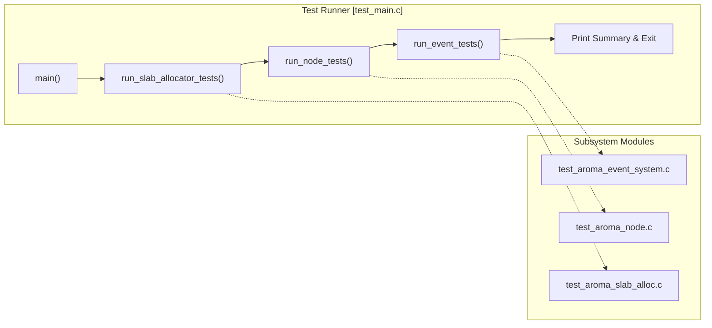
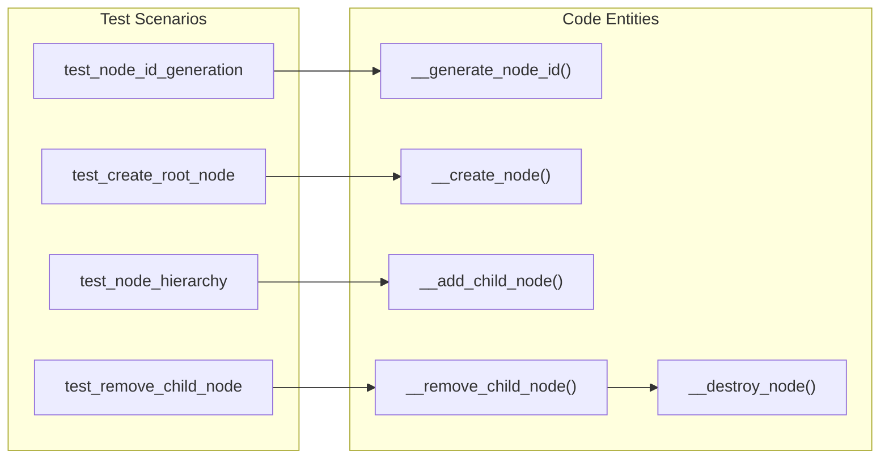
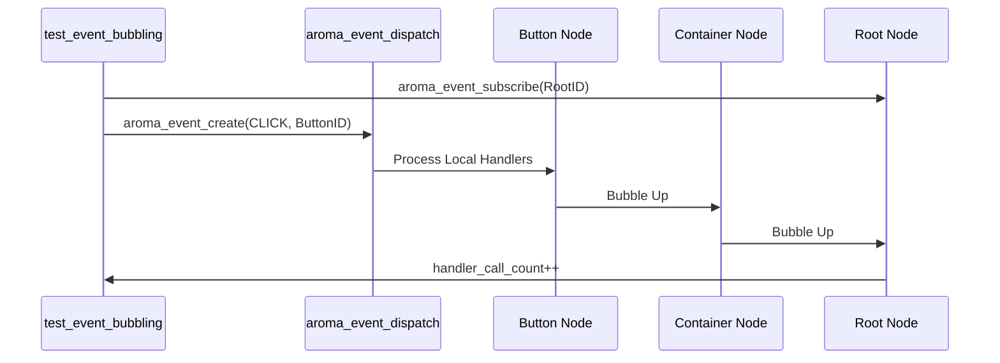

# Testing and Quality

The AromaUI test suite provides a comprehensive set of unit and integration tests designed to ensure the stability of core UI primitives, memory management, and event propagation. The testing architecture is decoupled from any specific platform backend, allowing tests to run in a headless environment (typically Linux) to validate logic without requiring a GPU or display.

## Test Suite Architecture

The test suite is organized into modular components targeting specific subsystems. The entry point is `test_main.c`, which orchestrates the execution of different test modules and aggregates results.

### Test Execution Flow

Title: AromaUI Test Execution Pipeline

Sources: [tests/test_main.c27-55](https://github.com/BinaryInkTN/AromaUI/blob/afd1c6b6/tests/test_main.c#L27-L55)[tests/test_aroma_slab_alloc.c232-242](https://github.com/BinaryInkTN/AromaUI/blob/afd1c6b6/tests/test_aroma_slab_alloc.c#L232-L242)

## Memory Allocator Tests (`test_aroma_slab_alloc.c`)

These tests validate the `AromaSlabAllocator`, which is critical for deterministic memory performance on embedded targets. The tests focus on the multi-cache slab system used for both internal `AromaNode` structures and variable-sized widget data.

Key functions tested:

- **Initialization**: `test_memory_system_init` ensures `aroma_memory_system_init` and `aroma_memory_system_destroy` correctly manage the global allocator state [tests/test_aroma_slab_alloc.c37-45](https://github.com/BinaryInkTN/AromaUI/blob/afd1c6b6/tests/test_aroma_slab_alloc.c#L37-L45)
- **Widget Allocation**: `test_widget_allocation` verifies that `aroma_widget_alloc` provides memory for different sizes and that `aroma_widget_free` allows for subsequent re-allocation [tests/test_aroma_slab_alloc.c47-74](https://github.com/BinaryInkTN/AromaUI/blob/afd1c6b6/tests/test_aroma_slab_alloc.c#L47-L74)
- **Stress Testing**: `test_widget_allocation_stress` performs 100 interleaved allocations and deallocations of varying sizes to detect fragmentation or pool exhaustion [tests/test_aroma_slab_alloc.c76-110](https://github.com/BinaryInkTN/AromaUI/blob/afd1c6b6/tests/test_aroma_slab_alloc.c#L76-L110)
- **Node Pooling**: `test_node_allocation` specifically targets the fixed-size pool used for `AromaNode` structs via `__slab_pool_alloc`[tests/test_aroma_slab_alloc.c112-140](https://github.com/BinaryInkTN/AromaUI/blob/afd1c6b6/tests/test_aroma_slab_alloc.c#L112-L140)

Sources: [tests/test_aroma_slab_alloc.c1-242](https://github.com/BinaryInkTN/AromaUI/blob/afd1c6b6/tests/test_aroma_slab_alloc.c#L1-L242)

## Scene Graph Tests (`test_aroma_node.c`)

The node system tests verify the integrity of the UI tree, including parent-child relationship management, ID generation, and the cleanup of complex hierarchies.

### Node Management Logic

Title: Node Lifecycle and Hierarchy Validation

Key validation logic:

- **ID Uniqueness**: `test_node_id_generation` asserts that every call to `__generate_node_id` returns a strictly increasing, unique identifier [tests/test_aroma_node.c59-73](https://github.com/BinaryInkTN/AromaUI/blob/afd1c6b6/tests/test_aroma_node.c#L59-L73)
- **Hierarchy Integrity**: `test_node_hierarchy` builds a tree (Root -> Container -> Button) and asserts that `child_count` and `parent_node` pointers are correctly maintained across levels [tests/test_aroma_node.c140-160](https://github.com/BinaryInkTN/AromaUI/blob/afd1c6b6/tests/test_aroma_node.c#L140-L160)
- **Partial Tree Removal**: `test_remove_child_node` verifies that removing a node from the middle of a child array correctly shifts the remaining siblings to maintain array density [tests/test_aroma_node.c162-196](https://github.com/BinaryInkTN/AromaUI/blob/afd1c6b6/tests/test_aroma_node.c#L162-L196)

Sources: [tests/test_aroma_node.c59-196](https://github.com/BinaryInkTN/AromaUI/blob/afd1c6b6/tests/test_aroma_node.c#L59-L196)

## Event System Tests (`test_aroma_event_system.c`)

These tests simulate user interaction to verify hit-testing, subscription priorities, and the event bubbling mechanism.

### Event Propagation Model

Title: Event Dispatch and Bubbling Test Flow

Key behaviors verified:

- **Subscription**: `test_event_subscription_and_dispatch` ensures that `aroma_event_subscribe` correctly registers a callback and that `aroma_event_dispatch` triggers it when the target ID matches [tests/test_aroma_event_system.c95-123](https://github.com/BinaryInkTN/AromaUI/blob/afd1c6b6/tests/test_aroma_event_system.c#L95-L123)
- **Bubbling**: `test_event_bubbling` verifies that an event targeting a leaf node (Button) propagates up to the Root if not consumed [tests/test_aroma_event_system.c125-159](https://github.com/BinaryInkTN/AromaUI/blob/afd1c6b6/tests/test_aroma_event_system.c#L125-L159)
- **Consumption**: `test_event_consumption_stops_bubbling` validates that calling `aroma_event_consume` inside a high-priority handler prevents lower-priority or parent-node handlers from receiving the event [tests/test_aroma_event_system.c161-199](https://github.com/BinaryInkTN/AromaUI/blob/afd1c6b6/tests/test_aroma_event_system.c#L161-L199)
- **Queueing**: `test_event_queue_processing` tests the asynchronous event path where events are added via `aroma_event_queue` and processed later during `aroma_event_process_queue`[tests/test_aroma_event_system.c201-231](https://github.com/BinaryInkTN/AromaUI/blob/afd1c6b6/tests/test_aroma_event_system.c#L201-L231)

Sources: [tests/test_aroma_event_system.c95-231](https://github.com/BinaryInkTN/AromaUI/blob/afd1c6b6/tests/test_aroma_event_system.c#L95-L231)

## Build Configuration

The test suite is integrated into the CMake build system, allowing for automated testing and memory sanitization.

### CMake Integration (`tests/CMakeLists.txt`)

The `aroma_tests` executable links against the core `aroma` library and includes the project headers.

| Feature | Implementation |
| --- | --- |
| **Target Name** | `aroma_tests`[tests/CMakeLists.txt1](https://github.com/BinaryInkTN/AromaUI/blob/afd1c6b6/tests/CMakeLists.txt#L1-L1) |
| **Address Sanitizer** | Enabled via `ENABLE_ASAN`, adding `-fsanitize=address` to catch memory leaks and buffer overflows [tests/CMakeLists.txt16-22](https://github.com/BinaryInkTN/AromaUI/blob/afd1c6b6/tests/CMakeLists.txt#L16-L22) |
| **Test Registration** | Uses `add_test` to integrate with CTest [tests/CMakeLists.txt24](https://github.com/BinaryInkTN/AromaUI/blob/afd1c6b6/tests/CMakeLists.txt#L24-L24) |
| **Includes** | Includes both `include/` and the local `tests/` directory for private test headers [tests/CMakeLists.txt11-14](https://github.com/BinaryInkTN/AromaUI/blob/afd1c6b6/tests/CMakeLists.txt#L11-L14) |

Sources: [tests/CMakeLists.txt1-24](https://github.com/BinaryInkTN/AromaUI/blob/afd1c6b6/tests/CMakeLists.txt#L1-L24)