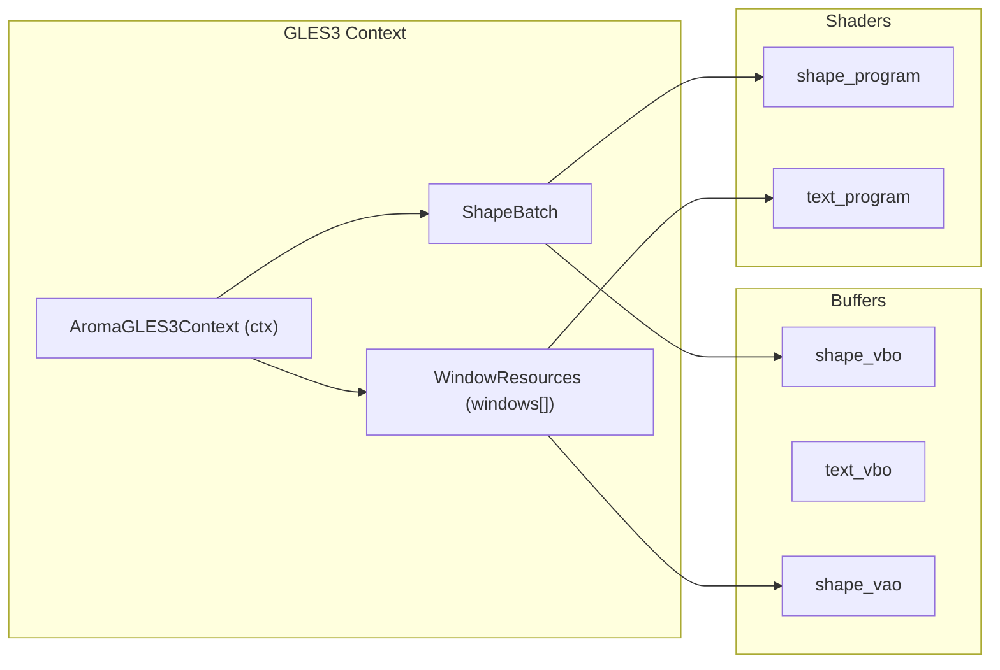
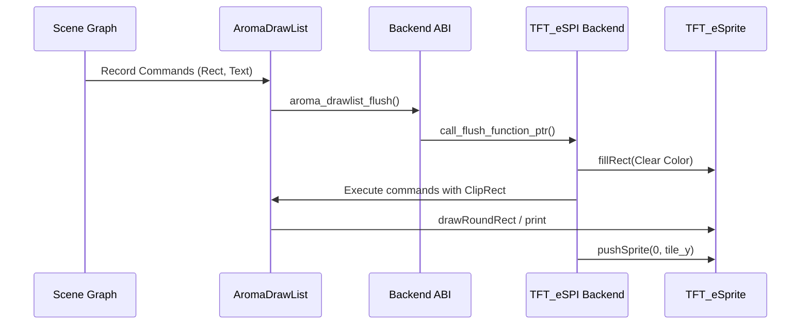

# Graphics Backends
Relevant source files
- [examples/car_infotainment/assets/Ubuntu-Light.ttf](https://github.com/BinaryInkTN/AromaUI/blob/afd1c6b6/examples/car_infotainment/assets/Ubuntu-Light.ttf)
- [include/aroma_drawlist.h](https://github.com/BinaryInkTN/AromaUI/blob/afd1c6b6/include/aroma_drawlist.h)
- [include/widgets/aroma_card.h](https://github.com/BinaryInkTN/AromaUI/blob/afd1c6b6/include/widgets/aroma_card.h)
- [include/widgets/aroma_image.h](https://github.com/BinaryInkTN/AromaUI/blob/afd1c6b6/include/widgets/aroma_image.h)
- [src/backends/graphics/aroma_graphics_gles3.c](https://github.com/BinaryInkTN/AromaUI/blob/afd1c6b6/src/backends/graphics/aroma_graphics_gles3.c)
- [src/backends/graphics/aroma_graphics_interface.h](https://github.com/BinaryInkTN/AromaUI/blob/afd1c6b6/src/backends/graphics/aroma_graphics_interface.h)
- [src/backends/graphics/aroma_graphics_tft_espi.cpp](https://github.com/BinaryInkTN/AromaUI/blob/afd1c6b6/src/backends/graphics/aroma_graphics_tft_espi.cpp)
- [src/backends/graphics/aroma_graphics_vulkan.c](https://github.com/BinaryInkTN/AromaUI/blob/afd1c6b6/src/backends/graphics/aroma_graphics_vulkan.c)
- [src/backends/graphics/utils/aroma_gles3_text.h](https://github.com/BinaryInkTN/AromaUI/blob/afd1c6b6/src/backends/graphics/utils/aroma_gles3_text.h)
- [src/backends/graphics/utils/aroma_vulkan_text.c](https://github.com/BinaryInkTN/AromaUI/blob/afd1c6b6/src/backends/graphics/utils/aroma_vulkan_text.c)
- [src/backends/graphics/utils/helpers_gles3.c](https://github.com/BinaryInkTN/AromaUI/blob/afd1c6b6/src/backends/graphics/utils/helpers_gles3.c)
- [src/backends/graphics/utils/helpers_vulkan.h](https://github.com/BinaryInkTN/AromaUI/blob/afd1c6b6/src/backends/graphics/utils/helpers_vulkan.h)
- [src/backends/graphics/utils/linmath.h](https://github.com/BinaryInkTN/AromaUI/blob/afd1c6b6/src/backends/graphics/utils/linmath.h)
- [src/backends/graphics/utils/nanosvg.h](https://github.com/BinaryInkTN/AromaUI/blob/afd1c6b6/src/backends/graphics/utils/nanosvg.h)
- [src/backends/graphics/utils/nanosvgrast.h](https://github.com/BinaryInkTN/AromaUI/blob/afd1c6b6/src/backends/graphics/utils/nanosvgrast.h)
- [src/backends/platforms/aroma_platform_tft_espi.cpp](https://github.com/BinaryInkTN/AromaUI/blob/afd1c6b6/src/backends/platforms/aroma_platform_tft_espi.cpp)
- [src/core/aroma_drawlist.c](https://github.com/BinaryInkTN/AromaUI/blob/afd1c6b6/src/core/aroma_drawlist.c)
- [src/widgets/aroma_card.c](https://github.com/BinaryInkTN/AromaUI/blob/afd1c6b6/src/widgets/aroma_card.c)
- [tools/cli/templates/app/main.c.tpl](https://github.com/BinaryInkTN/AromaUI/blob/afd1c6b6/tools/cli/templates/app/main.c.tpl)

The Graphics Backend subsystem in AromaUI provides a hardware-agnostic interface for rendering primitives, text, and images. It is managed by the **Backend Abstraction Layer (ABI)**, which routes high-level draw commands to one of three specialized implementations: **GLES3**, **Vulkan**, or **TFT_eSPI**.

## Backend Architecture Overview

The `AromaGraphicsInterface` structure defines the contract that every graphics backend must implement. This includes lifecycle management, primitive drawing (rectangles, arcs), text rendering via FreeType, and image loading using `stb_image` or `NanoSVG`.

### Graphics Interface Contract

| Function Category | Key Functions |
| --- | --- |
| **Lifecycle** | `setup_shared_window_resources`, `setup_separate_window_resources`, `shutdown` |
| **Primitives** | `fill_rectangle`, `draw_hollow_rectangle`, `draw_arc` |
| **Text** | `render_text`, `measure_text` |
| **Images** | `load_image`, `load_image_from_memory`, `draw_image` |
| **State** | `graphics_set_clip`, `graphics_clear_clip`, `notify_dirty_region` |

**Sources:**[src/backends/graphics/aroma_graphics_interface.h15-107](https://github.com/BinaryInkTN/AromaUI/blob/afd1c6b6/src/backends/graphics/aroma_graphics_interface.h#L15-L107)

---

## GLES3 Backend

The GLES3 backend is the primary renderer for Desktop (Linux/GLFW) and Android targets. It utilizes modern OpenGL ES 3.0 features to achieve high-performance UI rendering through batching and specialized shaders.

### Implementation Details

- **Shape Batching:** To minimize draw calls, the backend uses a `ShapeBatch` structure [src/backends/graphics/aroma_graphics_gles3.c50-56](https://github.com/BinaryInkTN/AromaUI/blob/afd1c6b6/src/backends/graphics/aroma_graphics_gles3.c#L50-L56) Quads are collected into a vertex buffer (VBO) and flushed in batches of up to 256 quads [src/backends/graphics/aroma_graphics_gles3.c24-26](https://github.com/BinaryInkTN/AromaUI/blob/afd1c6b6/src/backends/graphics/aroma_graphics_gles3.c#L24-L26)
- **Rounded-Rect SDF Shaders:** Rectangles are rendered using a fragment shader (`rectangle_fragment_shader`) that calculates Signed Distance Fields (SDF) to provide perfectly anti-aliased rounded corners and borders without additional geometry [src/backends/graphics/aroma_graphics_gles3.c227-230](https://github.com/BinaryInkTN/AromaUI/blob/afd1c6b6/src/backends/graphics/aroma_graphics_gles3.c#L227-L230)
- **LRU Font Cache:** Each window maintains a `CachedFontRenderer`[src/backends/graphics/aroma_graphics_gles3.c59-64](https://github.com/BinaryInkTN/AromaUI/blob/afd1c6b6/src/backends/graphics/aroma_graphics_gles3.c#L59-L64) If the cache exceeds `MAX_FONT_CACHE_PER_WINDOW` (16), the Least Recently Used (LRU) font is evicted to save GPU memory [src/backends/graphics/aroma_graphics_gles3.c114-144](https://github.com/BinaryInkTN/AromaUI/blob/afd1c6b6/src/backends/graphics/aroma_graphics_gles3.c#L114-L144)
- **Image Loading:** Integrates `stb_image` for raster formats and `NanoSVG` for vector assets, converting them into GL textures [src/backends/graphics/aroma_graphics_gles3.c12-18](https://github.com/BinaryInkTN/AromaUI/blob/afd1c6b6/src/backends/graphics/aroma_graphics_gles3.c#L12-L18)

### GLES3 Entity Mapping

**Sources:**[src/backends/graphics/aroma_graphics_gles3.c28-95](https://github.com/BinaryInkTN/AromaUI/blob/afd1c6b6/src/backends/graphics/aroma_graphics_gles3.c#L28-L95)

---

## Vulkan Backend

The Vulkan backend provides a high-efficiency alternative for Android and Linux platforms, specifically targeting low-overhead draw call submission and explicit resource management.

### Key Features

- **Surface Management:** Uses `vkCreateAndroidSurfaceKHR` (on Android) or KHR surface extensions provided by the platform interface to bind to native windows [src/backends/graphics/aroma_graphics_vulkan.c163-174](https://github.com/BinaryInkTN/AromaUI/blob/afd1c6b6/src/backends/graphics/aroma_graphics_vulkan.c#L163-L174)
- **Command Buffering:** Implements a double-buffered frame approach using `VK_MAX_FRAMES_IN_FLIGHT` (2) to allow the CPU to record commands for the next frame while the GPU processes the current one [src/backends/graphics/utils/helpers_vulkan.h21](https://github.com/BinaryInkTN/AromaUI/blob/afd1c6b6/src/backends/graphics/utils/helpers_vulkan.h#L21-L21)
- **Push Constants:** Uses `VkWhiteTexture` and push constants for immediate updates to projection matrices and shape properties (radius, border width) without updating descriptor sets [src/backends/graphics/utils/helpers_vulkan.h104-114](https://github.com/BinaryInkTN/AromaUI/blob/afd1c6b6/src/backends/graphics/utils/helpers_vulkan.h#L104-L114)
- **Text Pipeline:** Uses a dedicated `VulkanTextRenderer` that manages a glyph atlas and specific pipelines for alpha-blended text [src/backends/graphics/aroma_graphics_vulkan.c23-29](https://github.com/BinaryInkTN/AromaUI/blob/afd1c6b6/src/backends/graphics/aroma_graphics_vulkan.c#L23-L29)

**Sources:**[src/backends/graphics/aroma_graphics_vulkan.c51-70](https://github.com/BinaryInkTN/AromaUI/blob/afd1c6b6/src/backends/graphics/aroma_graphics_vulkan.c#L51-L70)[src/backends/graphics/utils/helpers_vulkan.h62-140](https://github.com/BinaryInkTN/AromaUI/blob/afd1c6b6/src/backends/graphics/utils/helpers_vulkan.h#L62-L140)

---

## TFT_eSPI Backend (Embedded)

Designed for resource-constrained microcontrollers (e.g., ESP32), this backend interacts with the `TFT_eSPI` library. It emphasizes memory efficiency through tiling and smart flushing.

### Tiled Rendering and Double Buffering

Since many embedded targets lack enough RAM for a full-screen frame buffer, AromaUI employs a **Tiled Rendering** strategy:

1. The screen is divided into vertical tiles of height `TILE_H` (typically 100px) [src/backends/platforms/aroma_platform_tft_espi.cpp21](https://github.com/BinaryInkTN/AromaUI/blob/afd1c6b6/src/backends/platforms/aroma_platform_tft_espi.cpp#L21-L21)
2. A `TFT_eSprite` is used as a temporary back-buffer for a single tile [src/backends/platforms/aroma_platform_tft_espi.cpp62-68](https://github.com/BinaryInkTN/AromaUI/blob/afd1c6b6/src/backends/platforms/aroma_platform_tft_espi.cpp#L62-L68)
3. The `call_flush_function_ptr` iterates through dirty tiles, renders the `DrawList` clipped to that tile's bounds, and pushes the sprite to the physical display via SPI [src/backends/platforms/aroma_platform_tft_espi.cpp169-200](https://github.com/BinaryInkTN/AromaUI/blob/afd1c6b6/src/backends/platforms/aroma_platform_tft_espi.cpp#L169-L200)

### TFT_eSPI Data Flow

**Sources:**[src/backends/platforms/aroma_platform_tft_espi.cpp28-38](https://github.com/BinaryInkTN/AromaUI/blob/afd1c6b6/src/backends/platforms/aroma_platform_tft_espi.cpp#L28-L38)[src/backends/graphics/aroma_graphics_tft_espi.cpp103-113](https://github.com/BinaryInkTN/AromaUI/blob/afd1c6b6/src/backends/graphics/aroma_graphics_tft_espi.cpp#L103-L113)

---

## The DrawList System

The `AromaDrawList` acts as a command buffer between the UI widgets and the graphics backends. This allows for deferred rendering, Z-index sorting, and the "Smart Flush" mechanism used by the TFT backend.

### Command Buffering

Widgets do not call graphics functions directly. Instead, they record `AromaDrawCmd` entries into an active list:

- `aroma_drawlist_cmd_fill_rect`[src/core/aroma_drawlist.c174-189](https://github.com/BinaryInkTN/AromaUI/blob/afd1c6b6/src/core/aroma_drawlist.c#L174-L189)
- `aroma_drawlist_cmd_text`[src/core/aroma_drawlist.c226-241](https://github.com/BinaryInkTN/AromaUI/blob/afd1c6b6/src/core/aroma_drawlist.c#L226-L241)
- `aroma_drawlist_cmd_image`[src/core/aroma_drawlist.c243-256](https://github.com/BinaryInkTN/AromaUI/blob/afd1c6b6/src/core/aroma_drawlist.c#L243-L256)

### Smart Flush

The `aroma_drawlist_smart_flush` function is critical for tiled rendering. It accepts a clipping rectangle and only executes commands that intersect with that region, significantly reducing processing time for partial updates [include/aroma_drawlist.h186](https://github.com/BinaryInkTN/AromaUI/blob/afd1c6b6/include/aroma_drawlist.h#L186-L186)

**Sources:**[src/core/aroma_drawlist.c28-85](https://github.com/BinaryInkTN/AromaUI/blob/afd1c6b6/src/core/aroma_drawlist.c#L28-L85)[include/aroma_drawlist.h37-46](https://github.com/BinaryInkTN/AromaUI/blob/afd1c6b6/include/aroma_drawlist.h#L37-L46)