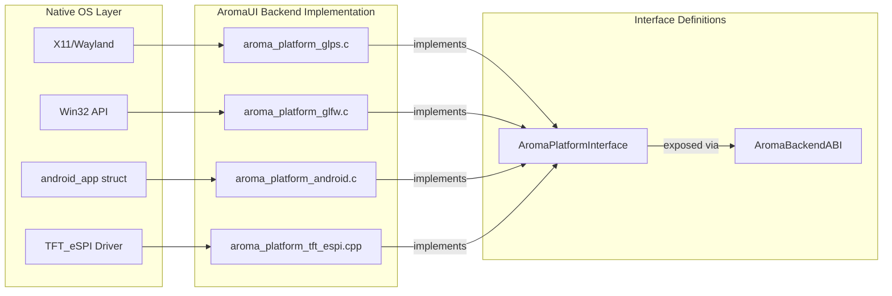
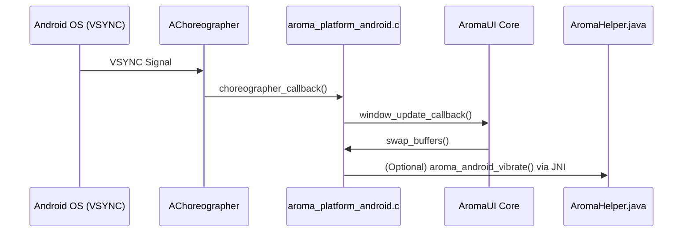

# Platform Backends
Relevant source files
- [examples/gstreamer_example/ev_cluster.c](https://github.com/BinaryInkTN/AromaUI/blob/afd1c6b6/examples/gstreamer_example/ev_cluster.c)
- [include/aroma_android.h](https://github.com/BinaryInkTN/AromaUI/blob/afd1c6b6/include/aroma_android.h)
- [include/aroma_drawlist.h](https://github.com/BinaryInkTN/AromaUI/blob/afd1c6b6/include/aroma_drawlist.h)
- [include/aroma_event.h](https://github.com/BinaryInkTN/AromaUI/blob/afd1c6b6/include/aroma_event.h)
- [include/aroma_ui.h](https://github.com/BinaryInkTN/AromaUI/blob/afd1c6b6/include/aroma_ui.h)
- [src/backends/graphics/aroma_graphics_gles3.c](https://github.com/BinaryInkTN/AromaUI/blob/afd1c6b6/src/backends/graphics/aroma_graphics_gles3.c)
- [src/backends/graphics/aroma_graphics_interface.h](https://github.com/BinaryInkTN/AromaUI/blob/afd1c6b6/src/backends/graphics/aroma_graphics_interface.h)
- [src/backends/graphics/aroma_graphics_tft_espi.cpp](https://github.com/BinaryInkTN/AromaUI/blob/afd1c6b6/src/backends/graphics/aroma_graphics_tft_espi.cpp)
- [src/backends/platforms/aroma_platform_android.c](https://github.com/BinaryInkTN/AromaUI/blob/afd1c6b6/src/backends/platforms/aroma_platform_android.c)
- [src/backends/platforms/aroma_platform_glfw.c](https://github.com/BinaryInkTN/AromaUI/blob/afd1c6b6/src/backends/platforms/aroma_platform_glfw.c)
- [src/backends/platforms/aroma_platform_glps.c](https://github.com/BinaryInkTN/AromaUI/blob/afd1c6b6/src/backends/platforms/aroma_platform_glps.c)
- [src/backends/platforms/aroma_platform_interface.h](https://github.com/BinaryInkTN/AromaUI/blob/afd1c6b6/src/backends/platforms/aroma_platform_interface.h)
- [src/backends/platforms/aroma_platform_tft_espi.cpp](https://github.com/BinaryInkTN/AromaUI/blob/afd1c6b6/src/backends/platforms/aroma_platform_tft_espi.cpp)
- [src/core/aroma_drawlist.c](https://github.com/BinaryInkTN/AromaUI/blob/afd1c6b6/src/core/aroma_drawlist.c)
- [src/core/aroma_event.c](https://github.com/BinaryInkTN/AromaUI/blob/afd1c6b6/src/core/aroma_event.c)
- [src/core/aroma_ui_impl.c](https://github.com/BinaryInkTN/AromaUI/blob/afd1c6b6/src/core/aroma_ui_impl.c)
- [src/widgets/aroma_debug_overlay.c](https://github.com/BinaryInkTN/AromaUI/blob/afd1c6b6/src/widgets/aroma_debug_overlay.c)
- [tools/cli/templates/android/app/src/main/java/AromaHelper.java.tpl](https://github.com/BinaryInkTN/AromaUI/blob/afd1c6b6/tools/cli/templates/android/app/src/main/java/AromaHelper.java.tpl)

Platform backends in AromaUI serve as the hardware and operating system abstraction layer. They implement the `AromaPlatformInterface` defined in [src/backends/platforms/aroma_platform_interface.h35-265](https://github.com/BinaryInkTN/AromaUI/blob/afd1c6b6/src/backends/platforms/aroma_platform_interface.h#L35-L265) providing standardized hooks for window management, input capture, and system-specific services (e.g., Android Bluetooth or JNI bridges). This architecture allows the Core Framework to remain platform-agnostic while supporting diverse targets ranging from embedded ESP32 displays to desktop Linux and mobile Android environments.

## Architecture and Abstraction

The `AromaPlatformInterface` acts as a contract that each backend must fulfill. During initialization, the `AromaBackendABI` routes calls to the active platform implementation [src/core/aroma_ui_impl.c170-181](https://github.com/BinaryInkTN/AromaUI/blob/afd1c6b6/src/core/aroma_ui_impl.c#L170-L181)

### Platform Interface Lifecycle

1. **Initialize**: Sets up the native windowing system or hardware drivers [src/backends/platforms/aroma_platform_interface.h43](https://github.com/BinaryInkTN/AromaUI/blob/afd1c6b6/src/backends/platforms/aroma_platform_interface.h#L43-L43)
2. **Window Creation**: Returns a `size_t` window ID used for context management [src/backends/platforms/aroma_platform_interface.h62-66](https://github.com/BinaryInkTN/AromaUI/blob/afd1c6b6/src/backends/platforms/aroma_platform_interface.h#L62-L66)
3. **Event Loop**: A blocking or non-blocking call that processes native OS messages and translates them into `AromaEvent` objects [src/backends/platforms/aroma_platform_interface.h103](https://github.com/BinaryInkTN/AromaUI/blob/afd1c6b6/src/backends/platforms/aroma_platform_interface.h#L103-L103)
4. **Shutdown**: Releases native resources [src/backends/platforms/aroma_platform_interface.h48](https://github.com/BinaryInkTN/AromaUI/blob/afd1c6b6/src/backends/platforms/aroma_platform_interface.h#L48-L48)

### Platform-to-Code Mapping

The following diagram maps high-level platform concepts to the specific C structures and functions that implement them.

**Platform Backend Entity Mapping**

Sources: [src/backends/platforms/aroma_platform_interface.h35-265](https://github.com/BinaryInkTN/AromaUI/blob/afd1c6b6/src/backends/platforms/aroma_platform_interface.h#L35-L265)[src/backends/platforms/aroma_platform_glps.c31-38](https://github.com/BinaryInkTN/AromaUI/blob/afd1c6b6/src/backends/platforms/aroma_platform_glps.c#L31-L38)[src/backends/platforms/aroma_platform_android.c50-58](https://github.com/BinaryInkTN/AromaUI/blob/afd1c6b6/src/backends/platforms/aroma_platform_android.c#L50-L58)

---

## GLPS (Linux Desktop Default)

The GLPS backend is the primary target for Linux and desktop development. It utilizes the `glps_WindowManager` to handle X11 or Wayland surfaces [src/backends/platforms/aroma_platform_glps.c200-205](https://github.com/BinaryInkTN/AromaUI/blob/afd1c6b6/src/backends/platforms/aroma_platform_glps.c#L200-L205)

### Input Translation

GLPS captures native events and maps them to the AromaUI event system:

- **Mouse**: `glps_mouse_move_callback` and `glps_mouse_click_callback` calculate deltas and trigger `aroma_event_queue`[src/backends/platforms/aroma_platform_glps.c86-114](https://github.com/BinaryInkTN/AromaUI/blob/afd1c6b6/src/backends/platforms/aroma_platform_glps.c#L86-L114)
- **Keyboard**: Translates X11 keycodes to ASCII/UTF-8 values and handles modifiers like `AROMA_KEY_MOD_CAPSLOCK`[src/backends/platforms/aroma_platform_glps.c116-173](https://github.com/BinaryInkTN/AromaUI/blob/afd1c6b6/src/backends/platforms/aroma_platform_glps.c#L116-L173)
- **Scrolling**: Maps vertical/horizontal scroll axes to `EVENT_TYPE_MOUSE_SCROLL`[src/backends/platforms/aroma_platform_glps.c176-196](https://github.com/BinaryInkTN/AromaUI/blob/afd1c6b6/src/backends/platforms/aroma_platform_glps.c#L176-L196)

Sources: [src/backends/platforms/aroma_platform_glps.c1-243](https://github.com/BinaryInkTN/AromaUI/blob/afd1c6b6/src/backends/platforms/aroma_platform_glps.c#L1-L243)

---

## GLFW (Cross-Platform & Headless)

The GLFW backend provides a portable implementation for Windows, macOS, and Linux. It supports both standard windowed modes and a specialized "surfaceless" mode for headless rendering [src/backends/platforms/aroma_platform_glfw.c38-51](https://github.com/BinaryInkTN/AromaUI/blob/afd1c6b6/src/backends/platforms/aroma_platform_glfw.c#L38-L51)

### Surfaceless/EGL Path

For environments without a display server (e.g., GStreamer pipelines), the backend initializes an EGL context using `EGL_KHR_surfaceless_context`[src/backends/platforms/aroma_platform_glfw.c63-182](https://github.com/BinaryInkTN/AromaUI/blob/afd1c6b6/src/backends/platforms/aroma_platform_glfw.c#L63-L182)

- **Context**: Uses `eglGetDisplay(EGL_DEFAULT_DISPLAY)` and `eglCreateContext` with `EGL_PBUFFER_BIT`[src/backends/platforms/aroma_platform_glfw.c103-157](https://github.com/BinaryInkTN/AromaUI/blob/afd1c6b6/src/backends/platforms/aroma_platform_glfw.c#L103-L157)
- **Use Case**: Integrated in `examples/gstreamer_example/ev_cluster.c` to render UI frames directly into shared memory (`/aroma_frame_shm`) for video encoding [examples/gstreamer_example/ev_cluster.c1-18](https://github.com/BinaryInkTN/AromaUI/blob/afd1c6b6/examples/gstreamer_example/ev_cluster.c#L1-L18)

Sources: [src/backends/platforms/aroma_platform_glfw.c1-219](https://github.com/BinaryInkTN/AromaUI/blob/afd1c6b6/src/backends/platforms/aroma_platform_glfw.c#L1-L219)[examples/gstreamer_example/ev_cluster.c1-102](https://github.com/BinaryInkTN/AromaUI/blob/afd1c6b6/examples/gstreamer_example/ev_cluster.c#L1-L102)

---

## Android Backend

The Android backend manages the complex lifecycle of an `ANativeActivity` and coordinates with the Java-side `AromaHelper` via JNI [src/backends/platforms/aroma_platform_android.c1-30](https://github.com/BinaryInkTN/AromaUI/blob/afd1c6b6/src/backends/platforms/aroma_platform_android.c#L1-L30)

### Frame Scheduling with AChoreographer

Unlike desktop backends that might poll, Android uses the system `AChoreographer` to sync rendering with the display refresh rate (VSYNC) [src/backends/platforms/aroma_platform_android.c80-85](https://github.com/BinaryInkTN/AromaUI/blob/afd1c6b6/src/backends/platforms/aroma_platform_android.c#L80-L85)

- **`choreographer_callback`**: Triggered by the OS; it calls `update_surface_size` and executes the registered `window_update_callback`[src/backends/platforms/aroma_platform_android.c86-114](https://github.com/BinaryInkTN/AromaUI/blob/afd1c6b6/src/backends/platforms/aroma_platform_android.c#L86-L114)
- **`request_frame`**: Posts a new callback to the choreographer only when a redraw is needed [src/backends/platforms/aroma_platform_android.c116-124](https://github.com/BinaryInkTN/AromaUI/blob/afd1c6b6/src/backends/platforms/aroma_platform_android.c#L116-L124)

### Data Flow: JNI and System Services

The backend maintains an `AromaHelperCache` of JNI method IDs to call into Java for system services [src/backends/platforms/aroma_platform_android.c133-171](https://github.com/BinaryInkTN/AromaUI/blob/afd1c6b6/src/backends/platforms/aroma_platform_android.c#L133-L171)

| Feature | Implementation Mechanism | Code Reference |
| --- | --- | --- |
| **Permissions** | `platform->android_check_permission` via JNI | [include/aroma_android.h89-95](https://github.com/BinaryInkTN/AromaUI/blob/afd1c6b6/include/aroma_android.h#L89-L95) |
| **Bluetooth** | `android_bt_scan` calling Java `bt_scan` | [include/aroma_android.h199-204](https://github.com/BinaryInkTN/AromaUI/blob/afd1c6b6/include/aroma_android.h#L199-L204) |
| **Haptics** | `android_vibrate` calling Java `vibrator` | [include/aroma_android.h136-144](https://github.com/BinaryInkTN/AromaUI/blob/afd1c6b6/include/aroma_android.h#L136-L144) |
| **Lifecycle** | `android_native_app_glue` events (Focus/Pause) | [src/backends/platforms/aroma_platform_android.c4-7](https://github.com/BinaryInkTN/AromaUI/blob/afd1c6b6/src/backends/platforms/aroma_platform_android.c#L4-L7) |

**Android Backend Internal Flow**

Sources: [src/backends/platforms/aroma_platform_android.c86-114](https://github.com/BinaryInkTN/AromaUI/blob/afd1c6b6/src/backends/platforms/aroma_platform_android.c#L86-L114)[include/aroma_android.h136-144](https://github.com/BinaryInkTN/AromaUI/blob/afd1c6b6/include/aroma_android.h#L136-L144)

---

## TFT_eSPI and Emscripten

### TFT_eSPI (Embedded)

The TFT_eSPI backend targets ESP32 and similar microcontrollers. It is unique in its support for **Tiled Rendering**.

- **Dirty Regions**: It tracks dirty tiles via `tft_mark_tiles_dirty` to minimize SPI bus traffic [src/backends/platforms/aroma_platform_interface.h135](https://github.com/BinaryInkTN/AromaUI/blob/afd1c6b6/src/backends/platforms/aroma_platform_interface.h#L135-L135)
- **Flush Mechanism**: The `call_flush_function_ptr` allows the Core to push `AromaDrawList` contents to the `TFT_eSprite` buffer [src/backends/platforms/aroma_platform_interface.h122-130](https://github.com/BinaryInkTN/AromaUI/blob/afd1c6b6/src/backends/platforms/aroma_platform_interface.h#L122-L130)

### Emscripten (Web)

For WebAssembly targets, the backend utilizes Emscripten's browser hooks.

- **DPI Scaling**: Uses `aroma_emscripten_device_pixel_ratio` to scale the UI for high-density (Retina) displays [src/core/aroma_ui_impl.c84-88](https://github.com/BinaryInkTN/AromaUI/blob/afd1c6b6/src/core/aroma_ui_impl.c#L84-L88)
- **Main Loop**: Employs `emscripten_set_main_loop` (abstracted in the platform's `run_event_loop`) to prevent blocking the browser's UI thread.

Sources: [src/backends/platforms/aroma_platform_interface.h110-141](https://github.com/BinaryInkTN/AromaUI/blob/afd1c6b6/src/backends/platforms/aroma_platform_interface.h#L110-L141)[src/core/aroma_ui_impl.c84-102](https://github.com/BinaryInkTN/AromaUI/blob/afd1c6b6/src/core/aroma_ui_impl.c#L84-L102)