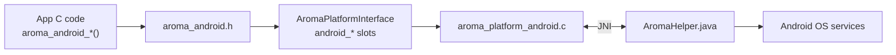

> Android specific. This section only applies to Android builds. All C APIs here need `__ANDROID__`. On Linux, Web, or embedded targets these symbols do not exist.

Android support lives in three files. They call each other across JNI.

| Layer | File | What it does |
|---|---|---|
| C API | `include/aroma_android.h` | Inline wrappers your app calls |
| Backend | `src/backends/platforms/aroma_platform_android.c` | NativeActivity lifecycle, EGL display, input, JNI bridge |
| Java bridge | `tools/cli/templates/android/app/src/main/java/AromaHelper.java.tpl` | AromaHelper class copied into each generated app |



**Sources:** [include/aroma_android.h1-20](https://github.com/BinaryInkTN/AromaUI/blob/main/include/aroma_android.h#L1-L20) [src/backends/platforms/aroma_platform_android.c3170-3258](https://github.com/BinaryInkTN/AromaUI/blob/main/src/backends/platforms/aroma_platform_android.c#L3170-L3258)

## Pages in this section

Read them in order. Each page covers one topic. The header range column tells you where each API lives in `aroma_android.h`.

| Page | Topic | Header range |
|---|---|---|
| [App Setup](App-Setup.md) | Entry point, manifest, JNI handles | `aroma_ui.h` + `aroma_android.h` 65-81 |
| [Permissions](Permissions.md) | Check and request runtime permissions | `aroma_android.h` 84-108 |
| [System UI](System-UI.md) | Toast, settings screen, vibration | `aroma_android.h` 111-144 |
| [Bluetooth Scan](Bluetooth-Scan.md) | Scan modes, device types, discovery, callbacks | `aroma_android.h` 26-62, 197-257 |
| [Bluetooth Connect](Bluetooth-Connect.md) | Pair, connect, send data, status | `aroma_android.h` 189-195, 260-419 |
| [Device APIs](Device-APIs.md) | Battery, WiFi, camera, gallery, storage, services | `aroma_android.h` 146-183, 422-481 |
| [Display](Display.md) | Density, units, screen size, orientation | `aroma_android.h` 484-749 |
| [Preferences](Preferences.md) | SharedPreferences for settings | `aroma_android.h` 750-826 |
| [Internals](Internals.md) | Backend lifecycle and Java bridge reference | `aroma_platform_android.c` |

## Rule for all pages

Guard Android code with `#ifdef __ANDROID__`. Include `aroma_android.h` only inside that guard. The backend slots for these APIs are stubs on other platforms.

```c
#ifdef __ANDROID__
#include <aroma_android.h>
#endif
```
