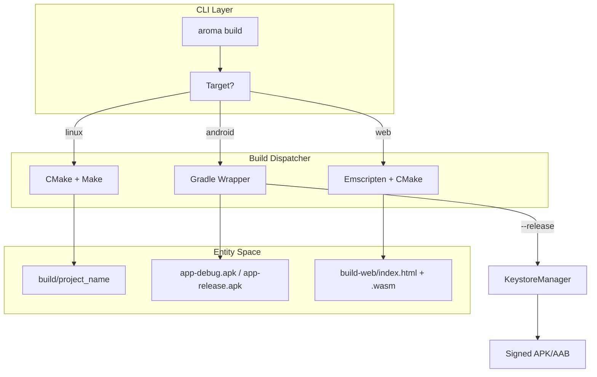
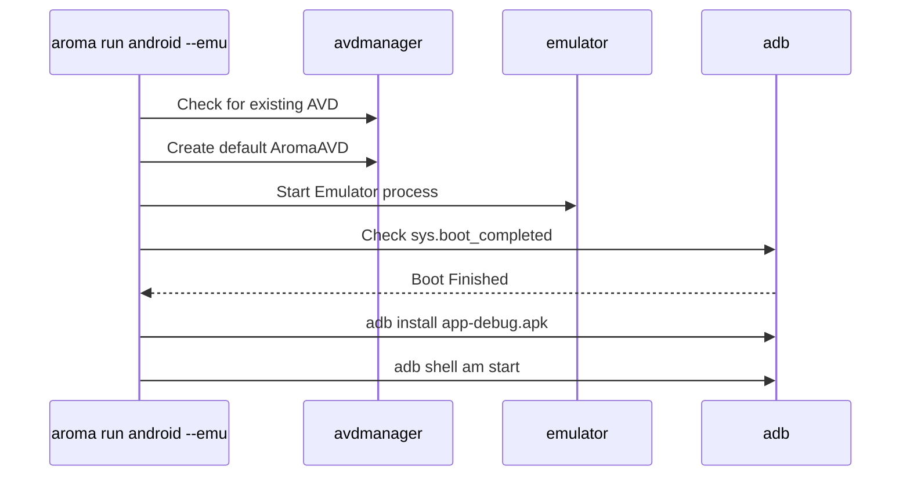

# Building and Deployment
Relevant source files
- [.gitignore](https://github.com/BinaryInkTN/AromaUI/blob/afd1c6b6/.gitignore)
- [bin/aroma](https://github.com/BinaryInkTN/AromaUI/blob/afd1c6b6/bin/aroma)
- [docker/Dockerfile](https://github.com/BinaryInkTN/AromaUI/blob/afd1c6b6/docker/Dockerfile)
- [docker/docker-compose.yml](https://github.com/BinaryInkTN/AromaUI/blob/afd1c6b6/docker/docker-compose.yml)
- [docs/connectivity/bluetooth_classic.md](https://github.com/BinaryInkTN/AromaUI/blob/afd1c6b6/docs/connectivity/bluetooth_classic.md?plain=1)
- [docs/tools/building_deployment.md](https://github.com/BinaryInkTN/AromaUI/blob/afd1c6b6/docs/tools/building_deployment.md?plain=1)
- [docs/ui/dpi.md](https://github.com/BinaryInkTN/AromaUI/blob/afd1c6b6/docs/ui/dpi.md?plain=1)
- [docs/ui/orientation.md](https://github.com/BinaryInkTN/AromaUI/blob/afd1c6b6/docs/ui/orientation.md?plain=1)
- [docs/website/dashboard.jpg](https://github.com/BinaryInkTN/AromaUI/blob/afd1c6b6/docs/website/dashboard.jpg)
- [tools/cli/aroma.py](https://github.com/BinaryInkTN/AromaUI/blob/afd1c6b6/tools/cli/aroma.py)
- [tools/cli/templates/android/app/build.gradle](https://github.com/BinaryInkTN/AromaUI/blob/afd1c6b6/tools/cli/templates/android/app/build.gradle)

This page documents the complete build and deployment toolchain for AromaUI. The system is managed by the `aroma` CLI, a Python-based utility that abstracts the complexities of CMake, Android Gradle, and Emscripten to provide a unified interface for cross-platform development.

## 1. CLI Architecture and Environment Validation

The `aroma` CLI is the central entry point for all development tasks. It resides in `tools/cli/aroma.py` and is typically invoked via the `bin/aroma` wrapper script [bin/aroma1-9](https://github.com/BinaryInkTN/AromaUI/blob/afd1c6b6/bin/aroma#L1-L9)

### Environment Validation (`aroma doctor`)

The `doctor` command validates the local development environment. It checks for:

- **System Dependencies**: Python 3, Java (JDK), and Git [tools/cli/aroma.py234-240](https://github.com/BinaryInkTN/AromaUI/blob/afd1c6b6/tools/cli/aroma.py#L234-L240)
- **Android SDK/NDK**: Presence of required versions (SDK 34, NDK 25.1.8937393) [tools/cli/aroma.py18-29](https://github.com/BinaryInkTN/AromaUI/blob/afd1c6b6/tools/cli/aroma.py#L18-L29)
- **Build Tools**: CMake 3.22.1 and platform-specific compilers [tools/cli/aroma.py20](https://github.com/BinaryInkTN/AromaUI/blob/afd1c6b6/tools/cli/aroma.py#L20-L20)

### SDK Management (`aroma install-sdk`)

The `AndroidSDK` class automates the acquisition of the Android toolchain. It handles:

1. **Command Line Tools**: Downloads the latest zip from Google repositories [tools/cli/aroma.py190-215](https://github.com/BinaryInkTN/AromaUI/blob/afd1c6b6/tools/cli/aroma.py#L190-L215)
2. **License Acceptance**: Automatically accepts Android SDK licenses required for automated builds [tools/cli/aroma.py175](https://github.com/BinaryInkTN/AromaUI/blob/afd1c6b6/tools/cli/aroma.py#L175-L175)
3. **Package Installation**: Uses `sdkmanager` to install platforms, build-tools, NDK, and CMake [tools/cli/aroma.py23-29](https://github.com/BinaryInkTN/AromaUI/blob/afd1c6b6/tools/cli/aroma.py#L23-L29)

**Sources:**[tools/cli/aroma.py17-36](https://github.com/BinaryInkTN/AromaUI/blob/afd1c6b6/tools/cli/aroma.py#L17-L36)[tools/cli/aroma.py144-182](https://github.com/BinaryInkTN/AromaUI/blob/afd1c6b6/tools/cli/aroma.py#L144-L182)[bin/aroma1-9](https://github.com/BinaryInkTN/AromaUI/blob/afd1c6b6/bin/aroma#L1-L9)

---

## 2. Build Process Flow

The build system follows a platform-specific dispatch logic based on the target provided to `aroma build`.

### Data Flow: CLI to Compiler

The following diagram illustrates how a build command translates from the CLI into a platform-specific binary.

**Build Pipeline Logic**

**Sources:**[docs/tools/building_deployment.md22-48](https://github.com/BinaryInkTN/AromaUI/blob/afd1c6b6/docs/tools/building_deployment.md?plain=1#L22-L48)[docs/tools/building_deployment.md55-67](https://github.com/BinaryInkTN/AromaUI/blob/afd1c6b6/docs/tools/building_deployment.md?plain=1#L55-L67)[tools/cli/aroma.py144-182](https://github.com/BinaryInkTN/AromaUI/blob/afd1c6b6/tools/cli/aroma.py#L144-L182)

---

## 3. Platform Specifics

### 3.1 Linux Deployment

The Linux build is a native compilation targeting the host architecture.

- **Command**: `aroma build linux`[docs/tools/building_deployment.md25](https://github.com/BinaryInkTN/AromaUI/blob/afd1c6b6/docs/tools/building_deployment.md?plain=1#L25-L25)
- **Workflow**: The CLI creates a `build/` directory, runs CMake, and executes Make [docs/tools/building_deployment.md28-32](https://github.com/BinaryInkTN/AromaUI/blob/afd1c6b6/docs/tools/building_deployment.md?plain=1#L28-L32)
- **Execution**: `aroma run linux` launches the binary immediately after ensuring it is up to date [docs/tools/building_deployment.md43](https://github.com/BinaryInkTN/AromaUI/blob/afd1c6b6/docs/tools/building_deployment.md?plain=1#L43-L43)

### 3.2 Android Deployment

Android builds utilize a template-based Gradle structure.

- **Debug**: `aroma build android` generates an APK at `android/app/build/outputs/apk/debug/app-debug.apk`[docs/tools/building_deployment.md60-66](https://github.com/BinaryInkTN/AromaUI/blob/afd1c6b6/docs/tools/building_deployment.md?plain=1#L60-L66)
- **Release**: `aroma build android --release` produces a signed APK [docs/tools/building_deployment.md125-131](https://github.com/BinaryInkTN/AromaUI/blob/afd1c6b6/docs/tools/building_deployment.md?plain=1#L125-L131)
- **App Bundle**: Adding the `--aab` flag generates the `.aab` format required for Google Play [docs/tools/building_deployment.md148-154](https://github.com/BinaryInkTN/AromaUI/blob/afd1c6b6/docs/tools/building_deployment.md?plain=1#L148-L154)

### 3.3 Web (WASM) Deployment

Web builds use the Emscripten toolchain.

- **Command**: `aroma build web`
- **Output**: Files are placed in `build-web/` or `build-ems/` as defined in `.gitignore`[ .gitignore5-6](https://github.com/BinaryInkTN/AromaUI/blob/afd1c6b6/ .gitignore#L5-L6)

**Sources:**[docs/tools/building_deployment.md20-155](https://github.com/BinaryInkTN/AromaUI/blob/afd1c6b6/docs/tools/building_deployment.md?plain=1#L20-L155)[.gitignore1-6](https://github.com/BinaryInkTN/AromaUI/blob/afd1c6b6/.gitignore#L1-L6)

---

## 4. Signing and Security

Release builds for Android require a valid RSA keystore. AromaUI provides a `KeystoreManager` logic within the CLI to simplify this.

### Keystore Generation (`aroma sign`)

The `aroma sign` command automates the following:

1. **RSA Key Generation**: Generates a 2048-bit RSA key [docs/tools/building_deployment.md103-105](https://github.com/BinaryInkTN/AromaUI/blob/afd1c6b6/docs/tools/building_deployment.md?plain=1#L103-L105)
2. **Keystore Storage**: Creates `android/keystore/release.keystore`[docs/tools/building_deployment.md109](https://github.com/BinaryInkTN/AromaUI/blob/afd1c6b6/docs/tools/building_deployment.md?plain=1#L109-L109)
3. **Properties Mapping**: Generates `android/keystore.properties` which is consumed by Gradle [docs/tools/building_deployment.md110](https://github.com/BinaryInkTN/AromaUI/blob/afd1c6b6/docs/tools/building_deployment.md?plain=1#L110-L110)
4. **Gradle Integration**: Injects the signing configuration into the `app/build.gradle` template [docs/tools/building_deployment.md111](https://github.com/BinaryInkTN/AromaUI/blob/afd1c6b6/docs/tools/building_deployment.md?plain=1#L111-L111)

**Sources:**[docs/tools/building_deployment.md95-120](https://github.com/BinaryInkTN/AromaUI/blob/afd1c6b6/docs/tools/building_deployment.md?plain=1#L95-L120)[tools/cli/templates/android/app/build.gradle1-34](https://github.com/BinaryInkTN/AromaUI/blob/afd1c6b6/tools/cli/templates/android/app/build.gradle#L1-L34)

---

## 5. Deployment and Emulation

### Device Execution (`aroma run`)

The `run` command handles the transfer of binaries to targets:

- **Linux**: Local process execution.
- **Android**: Uses `adb install -r` to push the APK to a connected device [docs/tools/building_deployment.md165](https://github.com/BinaryInkTN/AromaUI/blob/afd1c6b6/docs/tools/building_deployment.md?plain=1#L165-L165)
- **Emulator**: `aroma run android --emu` triggers the AVD (Android Virtual Device) lifecycle [docs/tools/building_deployment.md83](https://github.com/BinaryInkTN/AromaUI/blob/afd1c6b6/docs/tools/building_deployment.md?plain=1#L83-L83)

### Android Emulator Lifecycle

**Sources:**[docs/tools/building_deployment.md83-93](https://github.com/BinaryInkTN/AromaUI/blob/afd1c6b6/docs/tools/building_deployment.md?plain=1#L83-L93)[tools/cli/aroma.py151](https://github.com/BinaryInkTN/AromaUI/blob/afd1c6b6/tools/cli/aroma.py#L151-L151)

---

## 6. Command Summary Table

| Command | Action | Key Entities Involved |
| --- | --- | --- |
| `aroma build linux` | Native compilation | `CMake`, `Make` |
| `aroma build android` | Gradle build (Debug) | `gradlew`, `AromaHelper.java` |
| `aroma build android --release` | Signed Release build | `KeystoreManager`, `gradlew` |
| `aroma sign` | Keystore setup | `keytool`, `keystore.properties` |
| `aroma run android --emu` | Emulator deployment | `avdmanager`, `emulator`, `adb` |
| `aroma install-sdk` | Toolchain setup | `AndroidSDK`, `sdkmanager` |
| `aroma doctor` | Env validation | `Config`, `subprocess` |

**Sources:**[docs/tools/building_deployment.md247-290](https://github.com/BinaryInkTN/AromaUI/blob/afd1c6b6/docs/tools/building_deployment.md?plain=1#L247-L290)[tools/cli/aroma.py17-29](https://github.com/BinaryInkTN/AromaUI/blob/afd1c6b6/tools/cli/aroma.py#L17-L29)