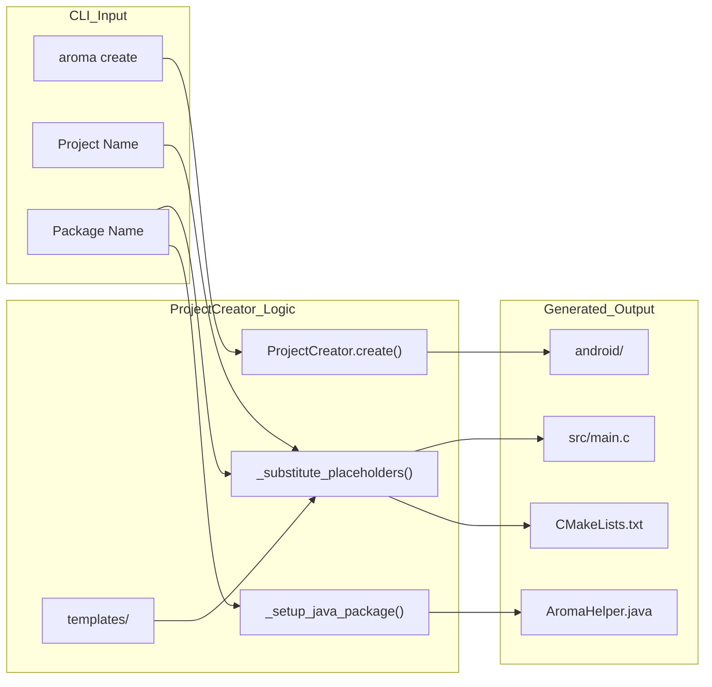
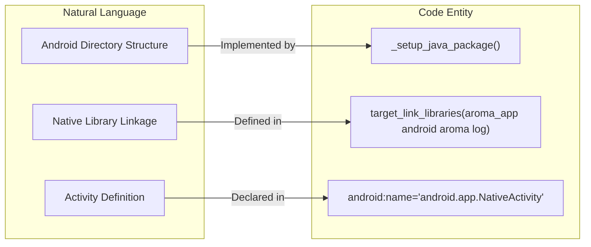

# Project Creation and Scaffolding
Relevant source files
- [.gitignore](https://github.com/BinaryInkTN/AromaUI/blob/afd1c6b6/.gitignore)
- [bin/aroma](https://github.com/BinaryInkTN/AromaUI/blob/afd1c6b6/bin/aroma)
- [docs/website/dashboard.jpg](https://github.com/BinaryInkTN/AromaUI/blob/afd1c6b6/docs/website/dashboard.jpg)
- [src/backends/graphics/utils/aroma_vulkan_text.c](https://github.com/BinaryInkTN/AromaUI/blob/afd1c6b6/src/backends/graphics/utils/aroma_vulkan_text.c)
- [tools/cli/aroma.py](https://github.com/BinaryInkTN/AromaUI/blob/afd1c6b6/tools/cli/aroma.py)
- [tools/cli/templates/android/app/build.gradle](https://github.com/BinaryInkTN/AromaUI/blob/afd1c6b6/tools/cli/templates/android/app/build.gradle)
- [tools/cli/templates/android/app/src/main/AndroidManifest.xml](https://github.com/BinaryInkTN/AromaUI/blob/afd1c6b6/tools/cli/templates/android/app/src/main/AndroidManifest.xml)
- [tools/cli/templates/android/app/src/main/cpp/CMakeLists.txt.tpl](https://github.com/BinaryInkTN/AromaUI/blob/afd1c6b6/tools/cli/templates/android/app/src/main/cpp/CMakeLists.txt.tpl)
- [tools/cli/templates/app/main.c.tpl](https://github.com/BinaryInkTN/AromaUI/blob/afd1c6b6/tools/cli/templates/app/main.c.tpl)

The AromaUI toolchain provides a streamlined project initialization system via the `aroma create` command. This system utilizes a template engine to generate cross-platform project structures, handling the complexities of Android directory layouts, JNI setup, and CMake configuration.

### The ProjectCreator Engine

The `aroma create` workflow is managed by the `ProjectCreator` class within the Python-based CLI. It automates the transition from a blank directory to a functional AromaUI application by performing placeholder substitution and platform-specific file system organization.

#### Placeholder Substitution

The engine scans template files (typically ending in `.tpl`) and replaces double-curly-brace placeholders with user-provided or system-calculated values:

- `{{PROJECT_NAME}}`: The name of the application [tools/cli/templates/android/app/src/main/AndroidManifest.xml6](https://github.com/BinaryInkTN/AromaUI/blob/afd1c6b6/tools/cli/templates/android/app/src/main/AndroidManifest.xml#L6-L6)
- `{{PACKAGE_NAME}}`: The Android-style reverse DNS package identifier (e.g., `com.example.app`) [tools/cli/templates/android/app/build.gradle6](https://github.com/BinaryInkTN/AromaUI/blob/afd1c6b6/tools/cli/templates/android/app/build.gradle#L6-L6)
- `{{AROMA_ROOT}}`: The absolute path to the AromaUI framework source, ensuring the generated project can link against the core library [tools/cli/templates/android/app/src/main/cpp/CMakeLists.txt.tpl4](https://github.com/BinaryInkTN/AromaUI/blob/afd1c6b6/tools/cli/templates/android/app/src/main/cpp/CMakeLists.txt.tpl#L4-L4)

#### Scaffolding Logic Flow

The following diagram illustrates the transformation from the CLI command to the generated file structure.

**Aroma Create Data Flow**



Sources: [tools/cli/aroma.py136-141](https://github.com/BinaryInkTN/AromaUI/blob/afd1c6b6/tools/cli/aroma.py#L136-L141)[tools/cli/templates/android/app/build.gradle1-15](https://github.com/BinaryInkTN/AromaUI/blob/afd1c6b6/tools/cli/templates/android/app/build.gradle#L1-L15)

### Android Scaffolding and Java Package Setup

A significant portion of the scaffolding logic is dedicated to the Android platform. Unlike Linux or Web builds, Android requires a specific directory hierarchy based on the `PACKAGE_NAME`.

#### _setup_java_package

The `_setup_java_package` function (internal to the CLI) takes a package name like `com.binaryink.test` and:

1. Converts dots to directory separators (`com/binaryink/test`).
2. Creates this path under `app/src/main/java/`.
3. Moves the `AromaHelper.java` template into this deep directory structure [tools/cli/aroma.py124-125](https://github.com/BinaryInkTN/AromaUI/blob/afd1c6b6/tools/cli/aroma.py#L124-L125)

This ensures that the Android Gradle plugin can correctly locate the Java classes required for the JNI bridge and system service integrations.

### Generated Project Layout

A standard project created via `aroma create` contains the following key components:

| File / Directory | Purpose |
| --- | --- |
| `src/main.c` | The application entry point, containing the `main()` and `android_main()` loops [tools/cli/templates/app/main.c.tpl29-120](https://github.com/BinaryInkTN/AromaUI/blob/afd1c6b6/tools/cli/templates/app/main.c.tpl#L29-L120) |
| `CMakeLists.txt` | Top-level build script that includes AromaUI and defines the executable. |
| `android/` | Complete Android Studio compatible project including Gradle wrappers. |
| `android/app/src/main/AndroidManifest.xml` | Configures the `NativeActivity` and metadata for the native library [tools/cli/templates/android/app/src/main/AndroidManifest.xml9-19](https://github.com/BinaryInkTN/AromaUI/blob/afd1c6b6/tools/cli/templates/android/app/src/main/AndroidManifest.xml#L9-L19) |
| `android/app/src/main/cpp/CMakeLists.txt` | Links the app with `android_native_app_glue`, `freetype`, and `aroma_lib`[tools/cli/templates/android/app/src/main/cpp/CMakeLists.txt.tpl16-26](https://github.com/BinaryInkTN/AromaUI/blob/afd1c6b6/tools/cli/templates/android/app/src/main/cpp/CMakeLists.txt.tpl#L16-L26) |

#### The JNI Bridge: AromaHelper.java

The scaffolding includes `AromaHelper.java`, which acts as the primary interface between the C framework and Android System Services. It is responsible for:

- Managing Bluetooth Classic connections and discovery.
- Accessing `SharedPreferences` for persistent storage.
- Handling runtime permissions and hardware features like the Vibrator.

**Entity Mapping: Template to Code**



Sources: [tools/cli/templates/android/app/src/main/cpp/CMakeLists.txt.tpl26](https://github.com/BinaryInkTN/AromaUI/blob/afd1c6b6/tools/cli/templates/android/app/src/main/cpp/CMakeLists.txt.tpl#L26-L26)[tools/cli/templates/android/app/src/main/AndroidManifest.xml9-14](https://github.com/BinaryInkTN/AromaUI/blob/afd1c6b6/tools/cli/templates/android/app/src/main/AndroidManifest.xml#L9-L14)

### Entry Point Implementation

The generated `main.c` demonstrates the standard AromaUI lifecycle. It initializes the UI engine, creates a window, and enters a polling loop that processes events and triggers renders.

```
// tools/cli/templates/app/main.c.tpl:89-93
while (aroma_ui_is_running())
{
    aroma_ui_process_events();
    aroma_ui_render(state.window);
}
```

For Android, the template includes the `android_main` wrapper which bridges the `android_app` state to the AromaUI platform backend:

```
// tools/cli/templates/app/main.c.tpl:115-119
void android_main(struct android_app *state)
{
    aroma_android_set_app(state);
    main(0, NULL);
}
```

Sources: [tools/cli/templates/app/main.c.tpl89-93](https://github.com/BinaryInkTN/AromaUI/blob/afd1c6b6/tools/cli/templates/app/main.c.tpl#L89-L93)[tools/cli/templates/app/main.c.tpl115-119](https://github.com/BinaryInkTN/AromaUI/blob/afd1c6b6/tools/cli/templates/app/main.c.tpl#L115-L119)