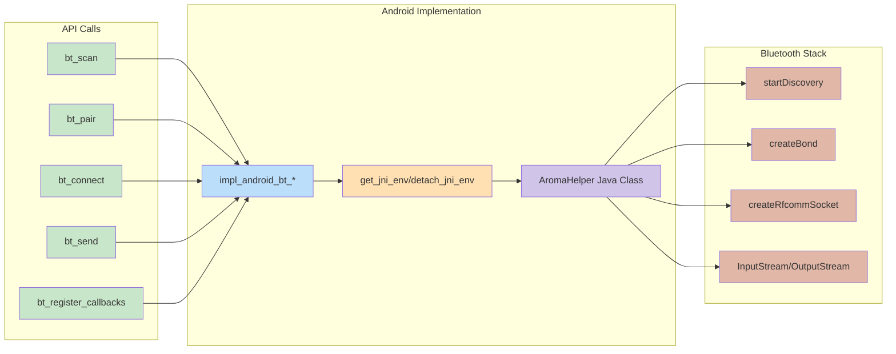
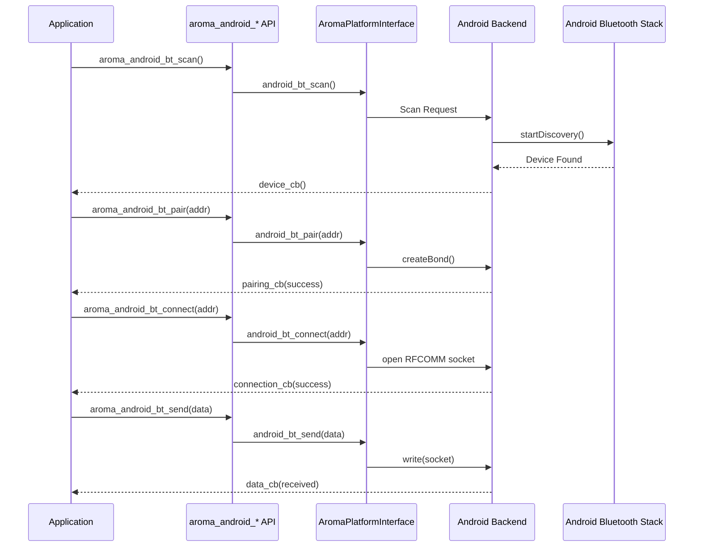

<br/>



This guide provides a structured, comprehensive explanation of the AromaUI Bluetooth Classic API for Android.

The API supports:

| Feature                     | Description                               |
| --------------------------- | ----------------------------------------- |
| Device scanning             | Discover nearby Bluetooth Classic devices |
| Pairing management          | Create and remove device bonds            |
| RFCOMM data communication   | Send and receive raw data                 |
| Connection state management | Monitor and control active connections    |
| Device type detection       | Identify connected device category        |

Limitations:

| Limitation           | Status        |
| -------------------- | ------------- |
| Bluetooth Classic    | Supported     |
| Bluetooth Low Energy | Not supported |
| GATT                 | Not supported |

All APIs are valid only when compiling with **ANDROID** defined.


# 1. Architecture Overview

The Bluetooth layer is exposed through inline wrappers that delegate to AromaPlatformInterface.

The following  sequence diagram illustrates a typical Bluetooth workflow:

* Scan for devices
* Pair with device
* Connect using RFCOMM
* Send and receive data




Many operations are asynchronous internally. Design your application around callbacks rather than blocking logic.


# 2. Android Permissions

Modern Android versions require runtime permissions.

For Android 12 and above:

* android.permission.BLUETOOTH_SCAN
* android.permission.BLUETOOTH_CONNECT
* android.permission.ACCESS_FINE_LOCATION

Check permission:

```
bool granted = aroma_android_check_permission(
    "android.permission.BLUETOOTH_SCAN"
);
```

Request permissions:

```
const char* perms[] = {
    "android.permission.BLUETOOTH_SCAN",
    "android.permission.BLUETOOTH_CONNECT"
};

aroma_android_request_permission(perms, 2);
```

Always verify Bluetooth state before scanning:

```
if (!aroma_android_is_bluetooth_enabled()) {
    // Prompt user to enable Bluetooth
}
```

# 3. Registering Callbacks

Register all callbacks before scanning or connecting.

```
aroma_android_bt_register_callbacks(
    device_cb,
    scan_finished_cb,
    pairing_cb,
    connection_cb,
    data_cb
);
```

## Callback Signatures

Device discovered:

```
void device_cb(const char* addr,
               const char* name,
               int type,
               int rssi);
```

Scan finished:

```
void scan_finished_cb(void);
```

Pairing result:

```
void pairing_cb(bool success,
                const char* addr,
                const char* name);
```

Connection result:

```
void connection_cb(bool success,
                   const char* addr,
                   int mode,
                   int device_type);
```

Data received:

```
void data_cb(const char* data,
             int len);
```

# 4. Device Scanning

## Scan Modes

| Constant                  | Description                    |
| ------------------------- | ------------------------------ |
| AROMA_BT_SCAN_MODE_PAIRED | Scan paired devices only       |
| AROMA_BT_SCAN_MODE_NEW    | Scan new unpaired devices only |
| AROMA_BT_SCAN_MODE_ALL    | Scan all devices               |

Start scanning:

```
aroma_android_bt_scan(
    AROMA_BT_SCAN_MODE_ALL,
    device_cb
);
```

Stop scanning:

```
aroma_android_bt_stop_scan();
```

Device callback example:

```
void device_cb(const char* addr,
               const char* name,
               int type,
               int rssi) {

    printf("Device: %s [%s] RSSI: %d Type: %d\n",
           name, addr, rssi, type);
}
```

# 5. Getting Paired Devices

```
char addrs[8][18];
char names[8][248];

int count = aroma_android_bt_get_paired(
    addrs,
    names,
    8
);
```

Address format:

XX:XX:XX:XX:XX:XX

Buffers must be preallocated.


# 6. Pairing Management

Start pairing:

```
bool started = aroma_android_bt_pair(addr);
```

Unpair:

```
aroma_android_bt_unpair(addr);
```

Check bond state:

```
int state = aroma_android_bt_get_pair_state(addr);
```

Bond states:

| Constant              | Description         |
| --------------------- | ------------------- |
| AROMA_BT_BOND_NONE    | Not bonded          |
| AROMA_BT_BOND_BONDING | Bonding in progress |
| AROMA_BT_BOND_BONDED  | Bonded              |


# 7. Connecting to a Device

Default connection:

```
aroma_android_bt_connect(addr);
```

Connection with mode:

```
aroma_android_bt_connect_with_mode(
    addr,
    AROMA_BT_MODE_DATA
);
```

Connection modes:

| Constant            | Description                 |
| ------------------- | --------------------------- |
| AROMA_BT_MODE_DATA  | RFCOMM data mode            |
| AROMA_BT_MODE_AUDIO | Audio profile mode          |
| AROMA_BT_MODE_HID   | Human Interface Device mode |
| AROMA_BT_MODE_AUTO  | Automatically selected mode |

Disconnect:

```
aroma_android_bt_disconnect();
```

Check connection:

```
bool connected = aroma_android_bt_is_connected();
```

# 8. Sending Data

```
const char* msg = "HELLO";

int sent = aroma_android_bt_send(msg, 5);
```

Returns:

* Number of bytes sent
* Returns negative one on error

Data reception happens through data_cb.

# 9. Connected Device Information

Device type:

```
int type = aroma_android_bt_get_device_type();
```

Device name:

```
const char* name = aroma_android_bt_get_device_name();
```

Current mode:

```
int mode = aroma_android_bt_get_current_mode();
```

Mode name:

```
const char* modeName = aroma_android_bt_get_mode_name();
```


