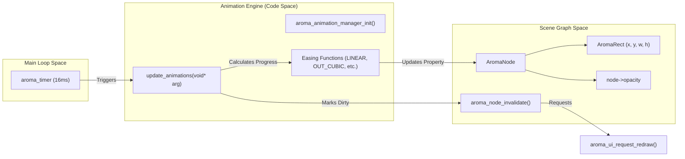
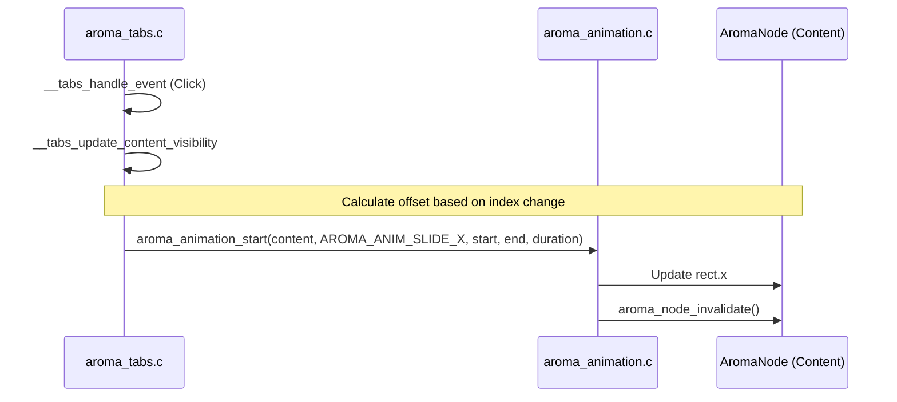

The AromaUI Animation Engine is a lightweight, retained-mode subsystem designed to provide smooth property transitions for `AromaNode` elements. It operates by interpolating values over time using various easing functions and automatically integrating with the framework's dirty-region tracking and layout phases to trigger necessary redraws.

## System Architecture

The animation engine is driven by a dedicated timer that updates at approximately 60 FPS (16ms intervals). It maintains a global linked list of active `AromaAnimation` structures, processing them sequentially during each tick.

### Animation Data Flow

The following diagram illustrates how the animation engine interacts with the core UI loop and the scene graph.

**Animation Update Lifecycle**



Sources: [src/core/aroma_animation.c17-113](https://github.com/BinaryInkTN/AromaUI/blob/afd1c6b6/src/core/aroma_animation.c#L17-L113)[src/core/aroma_animation.c115-119](https://github.com/BinaryInkTN/AromaUI/blob/afd1c6b6/src/core/aroma_animation.c#L115-L119)[include/aroma_animation.h32-46](https://github.com/BinaryInkTN/AromaUI/blob/afd1c6b6/include/aroma_animation.h#L32-L46)

## Animation Types

AromaUI supports built-in transitions for common geometric and visual properties, as well as a custom mode for widget-specific logic.

| Type | Enum Constant | Property Modified |
| --- | --- | --- |
| **Slide X** | `AROMA_ANIM_SLIDE_X` | `node->rect.x` |
| **Slide Y** | `AROMA_ANIM_SLIDE_Y` | `node->rect.y` |
| **Scale X** | `AROMA_ANIM_SCALE_X` | `node->rect.width` |
| **Scale Y** | `AROMA_ANIM_SCALE_Y` | `node->rect.height` |
| **Fade** | `AROMA_ANIM_FADE` | `node->opacity` |
| **Custom** | `AROMA_ANIM_CUSTOM` | User-defined via `AromaAnimationCallback` |

Sources: [include/aroma_animation.h10-18](https://github.com/BinaryInkTN/AromaUI/blob/afd1c6b6/include/aroma_animation.h#L10-L18)[src/core/aroma_animation.c81-100](https://github.com/BinaryInkTN/AromaUI/blob/afd1c6b6/src/core/aroma_animation.c#L81-L100)

## Easing Functions

Easings control the rate of change for the `current_val` relative to time progress. The default easing for all animations is `AROMA_EASE_OUT_CUBIC`.

- **Linear**: `AROMA_EASE_LINEAR` - Constant speed.
- **Quadratic**: `AROMA_EASE_IN_QUAD`, `AROMA_EASE_OUT_QUAD`, `AROMA_EASE_IN_OUT_QUAD`.
- **Cubic**: `AROMA_EASE_OUT_CUBIC` - Smooth deceleration.
- **Back**: `AROMA_EASE_OUT_BACK` - Slight overshoot before settling.
- **Elastic**: `AROMA_EASE_OUT_ELASTIC` - Damped oscillation effect.

Sources: [include/aroma_animation.h20-28](https://github.com/BinaryInkTN/AromaUI/blob/afd1c6b6/include/aroma_animation.h#L20-L28)[src/core/aroma_animation.c45-78](https://github.com/BinaryInkTN/AromaUI/blob/afd1c6b6/src/core/aroma_animation.c#L45-L78)

## API Reference

### Initialization and Management

The engine must be initialized before use, typically during application startup.

- `aroma_animation_manager_init()`: Creates the global 16ms timer and prepares the animation list. [src/core/aroma_animation.c115-119](https://github.com/BinaryInkTN/AromaUI/blob/afd1c6b6/src/core/aroma_animation.c#L115-L119)
- `aroma_animation_start(target, type, start, end, duration)`: Begins an animation. If the `target` node already has a running animation, it is stopped first. [src/core/aroma_animation.c121-142](https://github.com/BinaryInkTN/AromaUI/blob/afd1c6b6/src/core/aroma_animation.c#L121-L142)
- `aroma_animation_stop(target)`: Flags all animations on the target node as `is_running = false`, allowing them to be garbage collected on the next tick. [src/core/aroma_animation.c144-152](https://github.com/BinaryInkTN/AromaUI/blob/afd1c6b6/src/core/aroma_animation.c#L144-L152)

### Custom Animations

For properties not handled by the standard engine (e.g., color blending or rotation), `aroma_animation_start_custom` allows passing a callback.

```
// Definition of the custom callback
typedef void (*AromaAnimationCallback)(AromaNode* target, float current_val, void* user_data);
```

Sources: [include/aroma_animation.h30](https://github.com/BinaryInkTN/AromaUI/blob/afd1c6b6/include/aroma_animation.h#L30-L30)[src/core/aroma_animation.c155-162](https://github.com/BinaryInkTN/AromaUI/blob/afd1c6b6/src/core/aroma_animation.c#L155-L162)

## Integration with Layout and Widgets

Animations are deeply integrated into the layout phase. When an animation updates a node's property (like `rect.x`), it calls `aroma_node_invalidate(target)`. This marks the node's region as dirty, forcing the `aroma_ui_request_redraw` call at the end of the update tick. [src/core/aroma_animation.c102-112](https://github.com/BinaryInkTN/AromaUI/blob/afd1c6b6/src/core/aroma_animation.c#L102-L112)

### Example: Tab Transitions

The `AromaTabs` widget uses the animation engine to provide sliding transitions when switching content.

**Tab Animation Logic**



Sources: [src/widgets/aroma_tabs.c124-133](https://github.com/BinaryInkTN/AromaUI/blob/afd1c6b6/src/widgets/aroma_tabs.c#L124-L133)[src/widgets/aroma_tabs.c158-174](https://github.com/BinaryInkTN/AromaUI/blob/afd1c6b6/src/widgets/aroma_tabs.c#L158-L174)

## Implementation Details

### The Update Loop

The `update_animations` function is the core of the engine. It performs the following steps:

1. **Garbage Collection**: Removes animations where `is_running` is false. [src/core/aroma_animation.c27-36](https://github.com/BinaryInkTN/AromaUI/blob/afd1c6b6/src/core/aroma_animation.c#L27-L36)
2. **Progress Calculation**: Computes `progress` as `(now - start_time) / duration`. [src/core/aroma_animation.c38-42](https://github.com/BinaryInkTN/AromaUI/blob/afd1c6b6/src/core/aroma_animation.c#L38-L42)
3. **Interpolation**: Applies the selected `AromaEasingType` to transform linear progress into eased progress. [src/core/aroma_animation.c45-78](https://github.com/BinaryInkTN/AromaUI/blob/afd1c6b6/src/core/aroma_animation.c#L45-L78)
4. **Property Application**: Writes the calculated `current_val` directly to the `AromaNode` or invokes the `custom_cb`. [src/core/aroma_animation.c81-100](https://github.com/BinaryInkTN/AromaUI/blob/afd1c6b6/src/core/aroma_animation.c#L81-L100)
5. **Invalidation**: Triggers a UI redraw request if any animation was updated. [src/core/aroma_animation.c110-112](https://github.com/BinaryInkTN/AromaUI/blob/afd1c6b6/src/core/aroma_animation.c#L110-L112)

Sources: [src/core/aroma_animation.c17-113](https://github.com/BinaryInkTN/AromaUI/blob/afd1c6b6/src/core/aroma_animation.c#L17-L113)