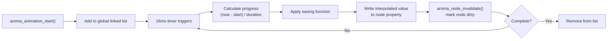

AromaUI includes a lightweight animation engine for smooth property transitions. It interpolates values over time using easing functions and integrates with the dirty-region system to trigger redraws automatically.

## Quick Start

```c
// Animate a node sliding in from the left
aroma_animation_start(node, AROMA_ANIM_SLIDE_X, -100.0f, 0.0f, 300);

// Fade out over 500ms
aroma_animation_start(node, AROMA_ANIM_FADE, 1.0f, 0.0f, 500);

// Custom animation (e.g., container tint)
static uint32_t s_anim_from;
static uint32_t s_anim_to;

static void on_tint_step(AromaNode *n, float current_val, void *ud) {
    (void)ud;
    aroma_container_set_debug_bg(n, aroma_color_blend(s_anim_from, s_anim_to, current_val));
}

aroma_animation_start_custom(node, 0.0f, 1.0f, 400, on_tint_step, NULL);
```

## Animation Types

| Type | Property animated |
|---|---|
| `AROMA_ANIM_SLIDE_X` | Node x position |
| `AROMA_ANIM_SLIDE_Y` | Node y position |
| `AROMA_ANIM_SCALE_X` | Node width |
| `AROMA_ANIM_SCALE_Y` | Node height |
| `AROMA_ANIM_FADE` | `node->opacity` |
| `AROMA_ANIM_CUSTOM` | User-defined callback |

Slide/scale writes go through `aroma_node_get_rect()` - pass animation
end values that match the widget's layout geometry (e.g. animate width
`0 → 280` for a 280px-wide card), otherwise the widget keeps the final
animated value.

## Easing Functions

| Easing | Effect |
|---|---|
| `AROMA_EASE_LINEAR` | Constant speed |
| `AROMA_EASE_IN_QUAD` | Slow start |
| `AROMA_EASE_OUT_QUAD` | Fast start, slow end |
| `AROMA_EASE_OUT_CUBIC` | Smooth deceleration (default) |
| `AROMA_EASE_OUT_BACK` | Slight overshoot before settling |
| `AROMA_EASE_OUT_ELASTIC` | Damped oscillation |

## How It Works



## Stopping Animations

```c
aroma_animation_stop(node);  // stops all animations on this node
```

If a node already has a running animation, `aroma_animation_start()` replaces it.

## Looping Animations

`aroma_animation_set_loop()` makes an animation restart from its start value
every time it reaches its end value, instead of completing. For a seamless
loop with no visible jump, `aroma_animation_set_loop_mode()` with
`AROMA_LOOP_PINGPONG` reverses direction each cycle instead. Completion
callbacks do not fire while looping is enabled; `aroma_animation_stop()`
halts a looping animation. Zero-duration animations never loop. In Incense,
`animation_loop: true` restarts each cycle while
`animation_loop: pingpong` alternates direction (pair it with a
non-overshooting easing such as `ease_in_out`).

## Integration with Layout

Animations update node properties (position, size, opacity) directly. The layout engine picks up these changes during the next frame's dirty-subtree traversal. No manual layout calls are needed.

## Animation APIs

The animation engine exposes these functions for property transitions:

| Function | Purpose |
|---|---|
| `aroma_animation_start(target, type, start, end, duration_ms)` | Begin a built-in animation (slide, scale, fade) |
| `aroma_animation_start_custom(target, start, end, duration_ms, callback, ud)` | Begin a user-defined animation |
| `aroma_animation_stop(target)` | Cancel all active animations on a node |
| `aroma_animation_set_loop(anim, loop)` | Loop the animation instead of completing |
| `aroma_animation_set_loop_mode(anim, mode)` | Restart (`AROMA_LOOP_RESTART`) or ping-pong (`AROMA_LOOP_PINGPONG`) |

Animations update node properties directly and integrate with the dirty-region system. The layout engine picks up changes automatically during the next frame.

## Live demo

A mini "Now Playing" screen where every widget animates in with a different
type and easing. The title drops from above (`slide_y`), the album card pops
with an overshoot (`scale_x` + `ease_out_back`), and the subtitle, progress
bar, and button fade and glide into place. The five equalizer bars breathe
up and down on staggered ping-pong loops (`scale_y` + `ease_in_out` +
`animation_loop: pingpong`), so the preview stays alive with no visible
jump - reload it to replay the entrance.

```incense-demo animation
```

## What's Next

- Learn how [Layout](Layout-Engine.md) resolves node positions.
- See how [Rendering](Rendering-Pipeline-and-DrawList.md) draws animated nodes.
- Explore [Theming](Theming-and-Styling.md) for visual design.
