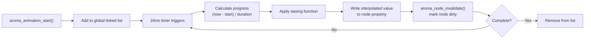

AromaUI includes a lightweight animation engine for smooth property transitions. It interpolates values over time using easing functions and integrates with the dirty-region system to trigger redraws automatically.

## Quick Start

```c
// Animate a node sliding in from the left
aroma_animation_start(node, AROMA_ANIM_SLIDE_X, -100.0f, 0.0f, 300);

// Fade out over 500ms
aroma_animation_start(node, AROMA_ANIM_FADE, 1.0f, 0.0f, 500);

// Custom animation (e.g., color blend)
aroma_animation_start_custom(node, 400, [](AromaNode *n, float progress, void *ud) {
    uint32_t color = aroma_color_blend(start_color, end_color, progress);
    aroma_node_set_bg_color(n, color);
}, NULL);
```

## Animation Types

| Type | Property Modified |
|---|---|
| `AROMA_ANIM_SLIDE_X` | `node->rect.x` |
| `AROMA_ANIM_SLIDE_Y` | `node->rect.y` |
| `AROMA_ANIM_SCALE_X` | `node->rect.width` |
| `AROMA_ANIM_SCALE_Y` | `node->rect.height` |
| `AROMA_ANIM_FADE` | `node->opacity` |
| `AROMA_ANIM_CUSTOM` | User-defined callback |

## Easing Functions

| Easing | Effect |
|---|---|
| `AROMA_EASE_LINEAR` | Constant speed |
| `AROMA_EASE_IN_QUAD` | Slow start |
| `AROMA_EASE_OUT_QUAD` | Fast start, slow end |
| `AROMA_EASE_OUT_CUBIC` | Smooth deceleration (default) |
| `AROMA_EASE_OUT_BACK` | Slight overshoot before settling |
| `AROMA_EASE_OUT_ELASTIC` | Damped oscillation |

## How It Works



## Stopping Animations

```c
aroma_animation_stop(node);  // stops all animations on this node
```

If a node already has a running animation, `aroma_animation_start()` replaces it.

## Integration with Layout

Animations update node properties (position, size, opacity) directly. The layout engine picks up these changes during the next frame's dirty-subtree traversal. No manual layout calls are needed.

## Animation APIs

The animation engine exposes these functions for property transitions:

| Function | Purpose |
|---|---|
| `aroma_animation_start(target, type, start, end, duration_ms)` | Begin a built-in animation (slide, scale, fade) |
| `aroma_animation_start_custom(target, duration_ms, callback, ud)` | Begin a user-defined animation |
| `aroma_animation_stop(target)` | Cancel all active animations on a node |

Animations update node properties directly and integrate with the dirty-region system. The layout engine picks up changes automatically during the next frame.

## What's Next

- Learn how [Layout](Layout-Engine.md) resolves node positions.
- See how [Rendering](Rendering-Pipeline-and-DrawList.md) draws animated nodes.
- Explore [Theming](Theming-and-Styling.md) for visual design.
