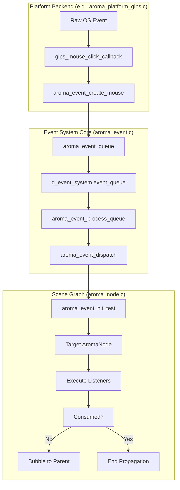
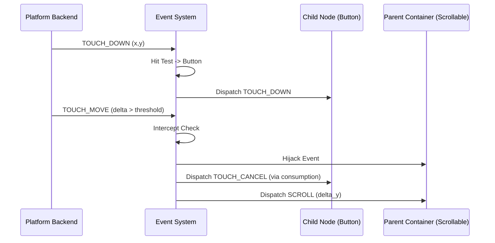

The Event System in AromaUI is a high-performance, deterministic pipeline responsible for capturing raw platform inputs and propagating them through the scene graph. It supports hit-testing, event bubbling, priority-based listeners, and specialized interception for touch-to-scroll physics.

## 1. Event Pipeline Overview

The event lifecycle follows a strict path from the hardware/OS layer to the individual `AromaNode` handlers.

1. **Capture**: The platform backend (e.g., GLPS, GLFW, Android) captures raw OS events.
2. **Creation**: Events are allocated from a static pool (`g_event_pool`) to avoid runtime fragmentation [src/core/aroma_event.c60-63](https://github.com/BinaryInkTN/AromaUI/blob/afd1c6b6/src/core/aroma_event.c#L60-L63)
3. **Hit-Testing**: For pointer events, the system performs a recursive search through the scene graph to find the front-most node at the (x, y) coordinates [src/core/aroma_event.c425-460](https://github.com/BinaryInkTN/AromaUI/blob/afd1c6b6/src/core/aroma_event.c#L425-L460)
4. **Queueing**: Events are placed in a thread-safe circular buffer (`event_queue`) [src/core/aroma_event.c48-51](https://github.com/BinaryInkTN/AromaUI/blob/afd1c6b6/src/core/aroma_event.c#L48-L51)
5. **Dispatch**: The main loop calls `aroma_event_process_queue()`, which resolves targets and executes listeners [src/core/aroma_event.c510-530](https://github.com/BinaryInkTN/AromaUI/blob/afd1c6b6/src/core/aroma_event.c#L510-L530)
6. **Bubbling**: If a listener does not mark an event as `consumed`, it propagates to the parent node [src/core/aroma_event.c380-410](https://github.com/BinaryInkTN/AromaUI/blob/afd1c6b6/src/core/aroma_event.c#L380-L410)

### Data Flow Diagram: Platform to Node

**Sources:**[src/backends/platforms/aroma_platform_glps.c101-114](https://github.com/BinaryInkTN/AromaUI/blob/afd1c6b6/src/backends/platforms/aroma_platform_glps.c#L101-L114)[src/core/aroma_event.c510-530](https://github.com/BinaryInkTN/AromaUI/blob/afd1c6b6/src/core/aroma_event.c#L510-L530)[src/core/aroma_event.c380-410](https://github.com/BinaryInkTN/AromaUI/blob/afd1c6b6/src/core/aroma_event.c#L380-L410)

---

## 2. Hit-Testing and Target Resolution

When a pointer event (Mouse/Touch) occurs, the system must identify the target node. This is handled by `aroma_event_hit_test`, which traverses the scene graph starting from the `root_node`[src/core/aroma_event.c425-460](https://github.com/BinaryInkTN/AromaUI/blob/afd1c6b6/src/core/aroma_event.c#L425-L460)

- **Z-Order Awareness**: The traversal respects the `z_index` of nodes, ensuring that top-most elements receive events first.
- **Visibility Check**: Nodes with `visible = false` or those outside the parent's clipping rect are ignored.
- **Coordinate Transformation**: Local coordinates are calculated by subtracting the node's absolute position from the screen-space event coordinates.

**Sources:**[src/core/aroma_event.c425-460](https://github.com/BinaryInkTN/AromaUI/blob/afd1c6b6/src/core/aroma_event.c#L425-L460)[src/core/aroma_event.h181-182](https://github.com/BinaryInkTN/AromaUI/blob/afd1c6b6/src/core/aroma_event.h#L181-L182)

---

## 3. Event Listeners and Priority

Nodes do not store listeners directly. Instead, a global hash map (`listener_map`) associates `node_id` with an array of `AromaEventListener` structures [src/core/aroma_event.c27-32](https://github.com/BinaryInkTN/AromaUI/blob/afd1c6b6/src/core/aroma_event.c#L27-L32)

### Listener Structure

| Field | Type | Description |
| --- | --- | --- |
| `event_type` | `AromaEventType` | The type of event to filter (e.g., `EVENT_TYPE_MOUSE_CLICK`) |
| `handler` | `AromaEventHandler` | Function pointer to the callback |
| `user_data` | `void*` | Context passed to the callback |
| `priority` | `uint32_t` | Execution order (higher runs first) |

### Registration API

Users register for events using `aroma_event_subscribe()`[src/core/aroma_event.c231-260](https://github.com/BinaryInkTN/AromaUI/blob/afd1c6b6/src/core/aroma_event.c#L231-L260) When an event is dispatched, the system retrieves the list for that node, sorts them by priority, and executes them until one returns `true` (consumed) [src/core/aroma_event.c330-370](https://github.com/BinaryInkTN/AromaUI/blob/afd1c6b6/src/core/aroma_event.c#L330-L370)

**Sources:**[src/core/aroma_event.c27-32](https://github.com/BinaryInkTN/AromaUI/blob/afd1c6b6/src/core/aroma_event.c#L27-L32)[src/core/aroma_event.c231-260](https://github.com/BinaryInkTN/AromaUI/blob/afd1c6b6/src/core/aroma_event.c#L231-L260)[include/aroma_event.h138-143](https://github.com/BinaryInkTN/AromaUI/blob/afd1c6b6/include/aroma_event.h#L138-L143)

---

## 4. Touch and Scroll Interception

AromaUI implements a sophisticated "Touch-to-Scroll" interception mechanism to handle scrollable containers (like `AromaListView`) [src/core/aroma_event.c74-78](https://github.com/BinaryInkTN/AromaUI/blob/afd1c6b6/src/core/aroma_event.c#L74-L78)

1. **Capture Phase**: On `EVENT_TYPE_TOUCH_DOWN`, the system identifies if the target is within a scrollable ancestor using `find_scrollable_ancestor`[src/core/aroma_event.c78](https://github.com/BinaryInkTN/AromaUI/blob/afd1c6b6/src/core/aroma_event.c#L78-L78)
2. **Threshold Detection**: As the user moves their finger (`TOUCH_MOVE`), the system tracks the delta. If the movement exceeds a pixel threshold, the event is "intercepted" by the scrollable container.
3. **Event Hijacking**: Once intercepted, the original target node stops receiving touch events, and they are redirected as `EVENT_TYPE_MOUSE_SCROLL` to the container to drive physics [src/core/aroma_event.c76](https://github.com/BinaryInkTN/AromaUI/blob/afd1c6b6/src/core/aroma_event.c#L76-L76)

**Sources:**[src/core/aroma_event.c74-78](https://github.com/BinaryInkTN/AromaUI/blob/afd1c6b6/src/core/aroma_event.c#L74-L78)[src/core/aroma_event.c470-500](https://github.com/BinaryInkTN/AromaUI/blob/afd1c6b6/src/core/aroma_event.c#L470-L500)

---

## 5. Memory Management: The Event Pool

To ensure suitability for embedded targets (ESP32/WASM), AromaUI uses a static allocation strategy for events [src/core/aroma_event.c60-63](https://github.com/BinaryInkTN/AromaUI/blob/afd1c6b6/src/core/aroma_event.c#L60-L63)

- **Static Pool**: `g_event_pool` is a fixed array of 256 `AromaEvent` structures.
- **Free List**: `g_event_free_list` tracks available indices in the pool.
- **Allocation**: `aroma_event_create()` pops an index from the free list [src/core/aroma_event.c265-285](https://github.com/BinaryInkTN/AromaUI/blob/afd1c6b6/src/core/aroma_event.c#L265-L285)
- **Deallocation**: Once an event is processed or the queue is cleared, the index is pushed back to the free list [src/core/aroma_event.c300-310](https://github.com/BinaryInkTN/AromaUI/blob/afd1c6b6/src/core/aroma_event.c#L300-L310)

This approach guarantees $O(1)$ allocation/deallocation and zero heap fragmentation during the event loop.

**Sources:**[src/core/aroma_event.c60-63](https://github.com/BinaryInkTN/AromaUI/blob/afd1c6b6/src/core/aroma_event.c#L60-L63)[src/core/aroma_event.c265-285](https://github.com/BinaryInkTN/AromaUI/blob/afd1c6b6/src/core/aroma_event.c#L265-L285)

---

## 6. Key Functions and Entities

| Entity | Location | Description |
| --- | --- | --- |
| `aroma_event_system_init` | [src/core/aroma_event.c146-160](https://github.com/BinaryInkTN/AromaUI/blob/afd1c6b6/src/core/aroma_event.c#L146-L160) | Initializes the listener map and event pool. |
| `aroma_event_dispatch` | [src/core/aroma_event.c330-370](https://github.com/BinaryInkTN/AromaUI/blob/afd1c6b6/src/core/aroma_event.c#L330-L370) | The core logic for running listeners and bubbling events. |
| `aroma_event_hit_test` | [src/core/aroma_event.c425-460](https://github.com/BinaryInkTN/AromaUI/blob/afd1c6b6/src/core/aroma_event.c#L425-L460) | Recursively finds the node at coordinates. |
| `aroma_event_process_queue` | [src/core/aroma_event.c510-530](https://github.com/BinaryInkTN/AromaUI/blob/afd1c6b6/src/core/aroma_event.c#L510-L530) | Called every frame to drain the `event_queue`. |
| `AromaEvent` | [include/aroma_event.h109-125](https://github.com/BinaryInkTN/AromaUI/blob/afd1c6b6/include/aroma_event.h#L109-L125) | The primary event container (union of Mouse, Key, Touch, etc.). |

**Sources:**[src/core/aroma_event.c146-160](https://github.com/BinaryInkTN/AromaUI/blob/afd1c6b6/src/core/aroma_event.c#L146-L160)[src/core/aroma_event.c330-370](https://github.com/BinaryInkTN/AromaUI/blob/afd1c6b6/src/core/aroma_event.c#L330-L370)[include/aroma_event.h109-125](https://github.com/BinaryInkTN/AromaUI/blob/afd1c6b6/include/aroma_event.h#L109-L125)