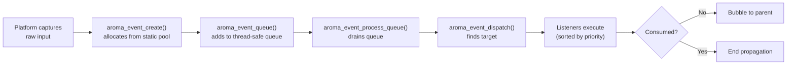

AromaUI's event system captures raw platform input and dispatches it to the correct `AromaNode`. It supports hit-testing, priority-based listeners, event bubbling, and touch-to-scroll interception.

## Event Lifecycle



## Hit-Testing

When a pointer event arrives, `aroma_event_hit_test()` recursively searches the scene graph from the root. It respects:
- **Z-order** - top-most nodes are tested first
- **Visibility** - hidden nodes are skipped
- **Clipping** - nodes outside their parent's clip rect are ignored

## Event Listeners

Register callbacks on any node:

```c
aroma_event_subscribe(node_id, EVENT_TYPE_MOUSE_CLICK, handler, user_data);
```

| Parameter | Description |
|---|---|
| `node_id` | Target node (returned by `aroma_node_create`) |
| `event_type` | `EVENT_TYPE_MOUSE_CLICK`, `EVENT_TYPE_TOUCH_DOWN`, etc. |
| `handler` | `bool (*)(AromaNode *target, AromaEvent *event, void *user_data)` |
| `user_data` | Optional context passed to the handler |

Return `true` from the handler to consume the event and stop bubbling.

## Scroll Interception

Scrollable containers (like `AromaContainer`) intercept touch events to implement kinetic scrolling:

1. `TOUCH_DOWN` - identifies scrollable ancestor
2. `TOUCH_MOVE` - tracks delta; if movement exceeds 8px threshold, intercepts
3. Once intercepted, child nodes receive `TOUCH_CANCEL` and the container handles scrolling

## Memory: Static Event Pool

Events are allocated from a fixed pool of 256 entries (`g_event_pool`). This guarantees O(1) allocation and zero heap fragmentation - critical for ESP32 and WASM targets.

## Internal APIs

The event system exposes these lower-level functions for framework internals and advanced use cases:

| Function | Role |
|---|---|
| `aroma_event_subscribe()` | Registers a listener on a node for a specific event type |
| `aroma_event_unsubscribe()` | Removes a previously registered listener |
| `aroma_event_create()` | Allocates an event from the static pool |
| `aroma_event_queue()` | Adds an event to the thread-safe processing queue |
| `aroma_event_process_queue()` | Drains the queue and dispatches events |
| `aroma_event_dispatch()` | Hit-tests and delivers events to target nodes |
| `aroma_event_hit_test()` | Recursive scene-graph search for pointer targets |

Application code typically interacts with events through widget-specific callbacks (e.g., `aroma_button_set_on_click`) rather than calling these functions directly.

## What's Next

- Learn how [Layout](Layout-Engine.md) positions nodes.
- See how events interact with [Rendering](Rendering-Pipeline-and-DrawList.md).
- Explore [Animation](Animation-Engine.md) for property transitions.
