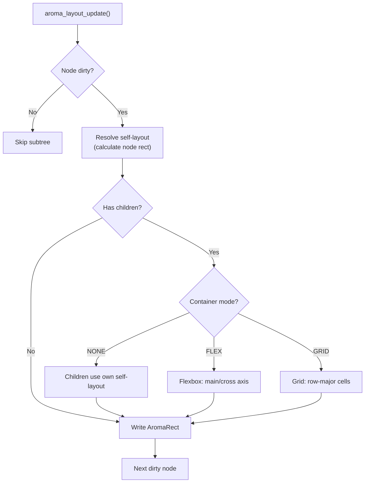

The layout engine calculates the screen-space position and size of every `AromaNode`. It runs every frame for dirty subtrees and supports absolute positioning, flexbox, and grid layouts.

## Layout Types

Each node has an `AromaLayout` struct that determines how it positions itself relative to its parent.

### Self-Layout (how a node positions itself)

| Mode | API | Description |
|---|---|---|
| None | `aroma_node_set_layout_none(node, x, y, w, h)` | Absolute positioning |
| Fill Parent | `aroma_node_set_layout_fill(node)` | Match parent bounds exactly |
| Center | `aroma_node_set_layout_center(node, w, h)` | Center within parent |
| Anchor | `aroma_node_set_layout_anchor(node, left, top, right, bottom)` | Pin to edges; supports stretching |

### Container Layout (how a node arranges its children)

Set via `aroma_node_set_layout_mode(node, mode)`:

| Mode | Description |
|---|---|
| `AROMA_LAYOUT_MODE_NONE` | Children use their own self-layout |
| `AROMA_LAYOUT_MODE_FLEX` | Flexbox: row or column layout |
| `AROMA_LAYOUT_MODE_GRID` | Equal-sized cells in row-major order |

## Flexbox Layout

The flex implementation supports:

- **Direction**: `AROMA_FLEX_ROW` or `AROMA_FLEX_COLUMN`
- **Justify**: `start`, `center`, `end`, `space_between`, `space_around`, `space_evenly`
- **Align**: `start`, `center`, `end`, `stretch`
- **Flex Grow**: Children with `flex_grow > 0` absorb remaining space

```c
aroma_node_set_layout_mode(container, AROMA_LAYOUT_MODE_FLEX);
aroma_node_set_flex_direction(container, AROMA_FLEX_COLUMN);
aroma_node_set_justify_content(container, AROMA_JUSTIFY_START);
aroma_node_set_align_items(container, AROMA_ALIGN_STRETCH);
```

## Grid Layout

```c
aroma_node_set_layout_mode(container, AROMA_LAYOUT_MODE_GRID);
aroma_container_set_grid_cols(container, 3);
aroma_container_set_grid_rows(container, 2);
```

Children are placed into equal-sized cells automatically.

## Scrollable Containers

`AromaContainer` can act as a scrollable viewport:

```c
AromaNode *sc = aroma_container_create(parent, x, y, w, h);
aroma_container_set_scrollable(sc, true);
aroma_container_set_scroll_direction(sc, AROMA_SCROLL_VERTICAL);
```

The container tracks `scroll_fx` / `scroll_fy` offsets, which are subtracted from child coordinates during layout and rendering. It includes:
- **Velocity tracking** for fling gestures
- **Overscroll bounce** with spring-back animation
- **Auto content sizing** based on children

## Layout Update Flow



1. `aroma_layout_update()` is called during the frame update
2. For each dirty node, resolve self-layout first (calculate node's own rect)
3. Then resolve container layout (position children)
4. Write final pixel values into `AromaRect`

## Key APIs

These functions control node layout behavior:

| Function | Purpose |
|---|---|
| `aroma_node_set_layout_none(node, x, y, w, h)` | Absolute positioning |
| `aroma_node_set_layout_fill(node)` | Match parent bounds exactly |
| `aroma_node_set_layout_center(node, w, h)` | Center within parent |
| `aroma_node_set_layout_anchor(node, l, t, r, b)` | Pin to edges with optional stretch |
| `aroma_node_set_layout_mode(node, mode)` | Set container layout mode (none/flex/grid) |
| `aroma_node_set_flex_direction(node, dir)` | Set flex direction (row/column) |
| `aroma_node_set_justify_content(node, mode)` | Set main-axis alignment |
| `aroma_node_set_align_items(node, mode)` | Set cross-axis alignment |
| `aroma_container_set_scrollable(node, bool)` | Enable scroll viewport behavior |
| `aroma_container_set_scroll_direction(node, dir)` | Lock scroll axis |
| `aroma_container_update_auto_content_size(node)` | Recalculate scroll bounds from children |

Higher-level factory functions in `include/aroma_ui.h` wrap many of these calls.

## What's Next

- Learn how nodes are rendered in the [Rendering Pipeline](Rendering-Pipeline-and-DrawList.md).
- See how [Events](Event-System.md) interact with scroll containers.
- Explore [Theming](Theming-and-Styling.md) for visual customization.
