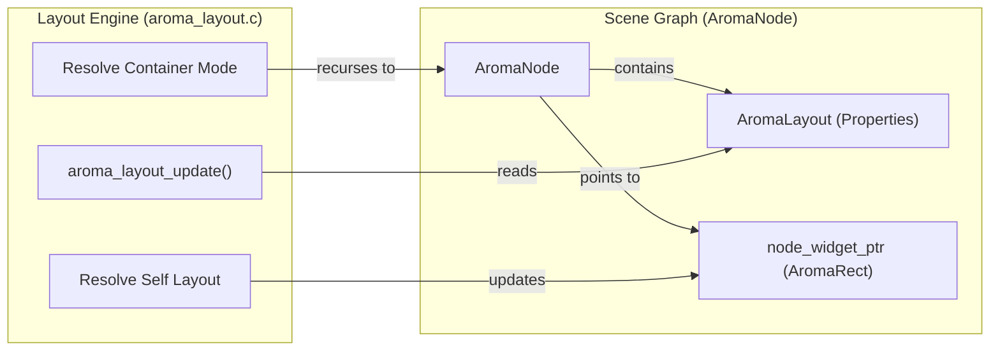
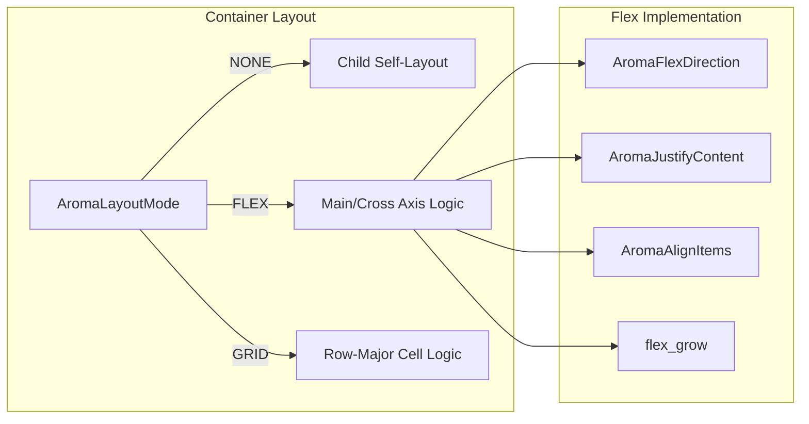

The AromaUI Layout Engine is a top-down recursive system responsible for calculating the screen-space coordinates and dimensions of every node in the scene graph. It operates by combining "self-layout" properties (how a node positions itself relative to its parent) and "container-layout" modes (how a node arranges its children) [docs/ui/layouts.md4-9](https://github.com/BinaryInkTN/AromaUI/blob/afd1c6b6/docs/ui/layouts.md?plain=1#L4-L9)

## System Overview

Layout is resolved during the frame update phase. The engine traverses the `AromaNode` tree, starting from a root node, and writes final pixel values into the `AromaRect` structure associated with each widget [docs/ui/layouts.md8-13](https://github.com/BinaryInkTN/AromaUI/blob/afd1c6b6/docs/ui/layouts.md?plain=1#L8-L13) The system uses signed 32-bit integers for coordinates, with the origin `(0, 0)` located at the top-left corner of the parent's bounds [docs/ui/layouts.md13](https://github.com/BinaryInkTN/AromaUI/blob/afd1c6b6/docs/ui/layouts.md?plain=1#L13-L13)

### Layout Process Flow

The following diagram illustrates the relationship between the Scene Graph and the Layout Engine logic.

"Layout Execution Flow"

Sources: [include/aroma_node.h123-148](https://github.com/BinaryInkTN/AromaUI/blob/afd1c6b6/include/aroma_node.h#L123-L148)[src/core/aroma_layout.c114-117](https://github.com/BinaryInkTN/AromaUI/blob/afd1c6b6/src/core/aroma_layout.c#L114-L117)

---

## Self-Layout Types

Self-layout determines a node's geometry relative to the bounds provided by its parent [docs/ui/layouts.md19-21](https://github.com/BinaryInkTN/AromaUI/blob/afd1c6b6/docs/ui/layouts.md?plain=1#L19-L21) These types are defined in `AromaLayoutType`[include/aroma_node.h43-48](https://github.com/BinaryInkTN/AromaUI/blob/afd1c6b6/include/aroma_node.h#L43-L48)

| Type | Function | Description |
| --- | --- | --- |
| `AROMA_LAYOUT_NONE` | N/A | Absolute positioning. Geometry is left unchanged by the engine [docs/ui/layouts.md33-35](https://github.com/BinaryInkTN/AromaUI/blob/afd1c6b6/docs/ui/layouts.md?plain=1#L33-L35) |
| `AROMA_LAYOUT_FILL_PARENT` | `aroma_node_set_layout_fill` | Node matches parent bounds exactly (`x=parent_x`, `y=parent_y`, `w=parent_w`, `h=parent_h`) [docs/ui/layouts.md41-54](https://github.com/BinaryInkTN/AromaUI/blob/afd1c6b6/docs/ui/layouts.md?plain=1#L41-L54) |
| `AROMA_LAYOUT_CENTER` | `aroma_node_set_layout_center` | Centers node within parent. Requires pre-set `width`/`height`[docs/ui/layouts.md58-71](https://github.com/BinaryInkTN/AromaUI/blob/afd1c6b6/docs/ui/layouts.md?plain=1#L58-L71) |
| `AROMA_LAYOUT_ANCHOR` | `aroma_node_set_layout_anchor` | Pins node to edges with pixel offsets. Supports stretching if both opposite edges are anchored [docs/ui/layouts.md75-100](https://github.com/BinaryInkTN/AromaUI/blob/afd1c6b6/docs/ui/layouts.md?plain=1#L75-L100) |

Sources: [include/aroma_node.h43-48](https://github.com/BinaryInkTN/AromaUI/blob/afd1c6b6/include/aroma_node.h#L43-L48)[src/core/aroma_layout.c40-57](https://github.com/BinaryInkTN/AromaUI/blob/afd1c6b6/src/core/aroma_layout.c#L40-L57)[docs/ui/layouts.md31-115](https://github.com/BinaryInkTN/AromaUI/blob/afd1c6b6/docs/ui/layouts.md?plain=1#L31-L115)

---

## Container Layout Modes

Container modes determine how a node positions its direct children. This is set via `aroma_node_set_layout_mode`[src/core/aroma_layout.c59-61](https://github.com/BinaryInkTN/AromaUI/blob/afd1c6b6/src/core/aroma_layout.c#L59-L61)

### Flexbox Layout (`AROMA_LAYOUT_MODE_FLEX`)

Children are arranged sequentially along a main axis (Row or Column) [docs/ui/layouts.md129-135](https://github.com/BinaryInkTN/AromaUI/blob/afd1c6b6/docs/ui/layouts.md?plain=1#L129-L135)

- **Direction**: `AROMA_FLEX_ROW` or `AROMA_FLEX_COLUMN`[include/aroma_node.h58-61](https://github.com/BinaryInkTN/AromaUI/blob/afd1c6b6/include/aroma_node.h#L58-L61)
- **Justification**: `justify_content` handles main-axis distribution (Start, Center, End, Space-Between, Space-Around, Space-Evenly) [include/aroma_node.h64-71](https://github.com/BinaryInkTN/AromaUI/blob/afd1c6b6/include/aroma_node.h#L64-L71)
- **Alignment**: `align_items` handles cross-axis positioning (Start, Center, End, Stretch) [include/aroma_node.h74-79](https://github.com/BinaryInkTN/AromaUI/blob/afd1c6b6/include/aroma_node.h#L74-L79)
- **Flex Grow**: If a child has `flex_grow > 0`, it absorbs remaining space on the main axis, overriding `justify_content`[src/core/aroma_layout.c198-205](https://github.com/BinaryInkTN/AromaUI/blob/afd1c6b6/src/core/aroma_layout.c#L198-L205)[docs/ui/layouts.md170-172](https://github.com/BinaryInkTN/AromaUI/blob/afd1c6b6/docs/ui/layouts.md?plain=1#L170-L172)

### Grid Layout (`AROMA_LAYOUT_MODE_GRID`)

Children are placed into equal-sized cells in row-major order [docs/ui/layouts.md175-184](https://github.com/BinaryInkTN/AromaUI/blob/afd1c6b6/docs/ui/layouts.md?plain=1#L175-L184) Cell size is calculated by dividing container dimensions by `grid_cols` and `grid_rows` minus gaps [docs/ui/layouts.md189-191](https://github.com/BinaryInkTN/AromaUI/blob/afd1c6b6/docs/ui/layouts.md?plain=1#L189-L191)

"Container Mode Logic"

Sources: [include/aroma_node.h51-80](https://github.com/BinaryInkTN/AromaUI/blob/afd1c6b6/include/aroma_node.h#L51-L80)[src/core/aroma_layout.c114-117](https://github.com/BinaryInkTN/AromaUI/blob/afd1c6b6/src/core/aroma_layout.c#L114-L117)[docs/ui/layouts.md117-196](https://github.com/BinaryInkTN/AromaUI/blob/afd1c6b6/docs/ui/layouts.md?plain=1#L117-L196)

---

## Scrollable Containers and Content Bounds

`AromaContainer` widgets extend the layout engine by managing a viewport that is smaller than its content bounds [src/widgets/aroma_container.c113-118](https://github.com/BinaryInkTN/AromaUI/blob/afd1c6b6/src/widgets/aroma_container.c#L113-L118)

### Content Size Calculation

Containers can automatically calculate their content size based on their children using `aroma_container_update_auto_content_size`[src/widgets/aroma_container.c117-118](https://github.com/BinaryInkTN/AromaUI/blob/afd1c6b6/src/widgets/aroma_container.c#L117-L118) This allows the container to determine the maximum scrollable range:

- `max_scroll_x = content_width - rect.width`[src/widgets/aroma_container.c168-172](https://github.com/BinaryInkTN/AromaUI/blob/afd1c6b6/src/widgets/aroma_container.c#L168-L172)
- `max_scroll_y = content_height - rect.height`[src/widgets/aroma_container.c173-177](https://github.com/BinaryInkTN/AromaUI/blob/afd1c6b6/src/widgets/aroma_container.c#L173-L177)

### Physics and Interaction

The container implementation includes a complex interaction model:

1. **Velocity Tracking**: Uses a `VelocityTracker` to sample input speed [src/widgets/aroma_container.c47-52](https://github.com/BinaryInkTN/AromaUI/blob/afd1c6b6/src/widgets/aroma_container.c#L47-L52)
2. **Fling**: Implements kinetic scrolling with friction coefficients and deceleration rates [src/widgets/aroma_container.c24-28](https://github.com/BinaryInkTN/AromaUI/blob/afd1c6b6/src/widgets/aroma_container.c#L24-L28)
3. **Overscroll/Bounce**: Supports stretching beyond bounds with resistance and a spring-back animation [src/widgets/aroma_container.c30-32](https://github.com/BinaryInkTN/AromaUI/blob/afd1c6b6/src/widgets/aroma_container.c#L30-L32)

### ListView Integration

`AromaListView` utilizes a specialized scroll container to manage large lists of items [src/widgets/aroma_listview.c25-26](https://github.com/BinaryInkTN/AromaUI/blob/afd1c6b6/src/widgets/aroma_listview.c#L25-L26) It calculates total content height by summing individual item heights (headers, separators, and normal items) and updates the parent container's content size accordingly [src/widgets/aroma_listview.c103-119](https://github.com/BinaryInkTN/AromaUI/blob/afd1c6b6/src/widgets/aroma_listview.c#L103-L119)

Sources: [src/widgets/aroma_container.c106-163](https://github.com/BinaryInkTN/AromaUI/blob/afd1c6b6/src/widgets/aroma_container.c#L106-L163)[src/widgets/aroma_listview.c103-119](https://github.com/BinaryInkTN/AromaUI/blob/afd1c6b6/src/widgets/aroma_listview.c#L103-L119)

---

## Implementation Details

### Data Structures

The primary configuration resides in the `AromaLayout` struct embedded within every `AromaNode`[include/aroma_node.h87-118](https://github.com/BinaryInkTN/AromaUI/blob/afd1c6b6/include/aroma_node.h#L87-L118)

### Internal Alignment

For WebAssembly (WASM) and embedded targets, the `AromaNode` and layout structures include explicit padding to ensure 8-byte alignment, preventing memory access faults [include/aroma_node.h144-147](https://github.com/BinaryInkTN/AromaUI/blob/afd1c6b6/include/aroma_node.h#L144-L147)

### Recursive Update

The layout pass is triggered by `aroma_layout_update` (often called from the main loop). It checks `is_dirty` and `subtree_dirty` flags to skip unnecessary calculations [include/aroma_node.h139-142](https://github.com/BinaryInkTN/AromaUI/blob/afd1c6b6/include/aroma_node.h#L139-L142)

Sources: [include/aroma_node.h87-148](https://github.com/BinaryInkTN/AromaUI/blob/afd1c6b6/include/aroma_node.h#L87-L148)[src/core/aroma_node.c88-91](https://github.com/BinaryInkTN/AromaUI/blob/afd1c6b6/src/core/aroma_node.c#L88-L91)