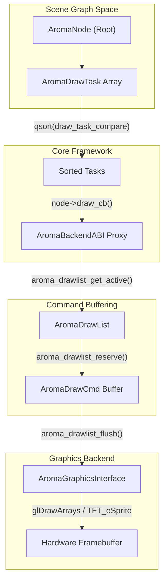
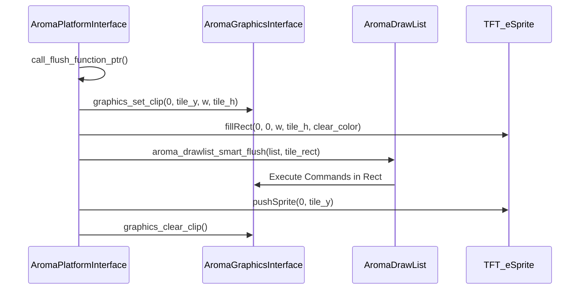

The AromaUI rendering pipeline is a multi-stage system designed to transform a hierarchical scene graph into optimized drawing commands. It supports both immediate mode for high-performance desktop rendering and a deferred, batched mode utilizing a `DrawList` for efficient tiling on resource-constrained embedded hardware.

## Rendering Lifecycle

The pipeline follows a strict sequence to minimize redundant calculations and GPU state changes.

### 1. Layout and Invalidation

The process begins when a node's state changes, triggering an invalidation via `aroma_node_invalidate`[src/core/aroma_ui_impl.c221](https://github.com/BinaryInkTN/AromaUI/blob/afd1c6b6/src/core/aroma_ui_impl.c#L221-L221) This adds the node to a dirty list. During the next frame update, the system checks if a redraw is necessary using `aroma_ui_consume_redraw`[src/core/aroma_ui_impl.c225-229](https://github.com/BinaryInkTN/AromaUI/blob/afd1c6b6/src/core/aroma_ui_impl.c#L225-L229)

### 2. Frame Initialization

A frame is initiated by `aroma_ui_begin_frame`[src/core/aroma_ui_impl.c165](https://github.com/BinaryInkTN/AromaUI/blob/afd1c6b6/src/core/aroma_ui_impl.c#L165-L165) This function activates the `AromaDrawList` associated with the target window [src/core/aroma_drawlist.c142-145](https://github.com/BinaryInkTN/AromaUI/blob/afd1c6b6/src/core/aroma_drawlist.c#L142-L145)

### 3. Draw Task Collection and Sorting

Instead of immediate rendering, the system performs a recursive traversal of the `AromaNode` tree to collect `AromaDrawTask` objects [src/core/aroma_ui_impl.c71-73](https://github.com/BinaryInkTN/AromaUI/blob/afd1c6b6/src/core/aroma_ui_impl.c#L71-L73)

- **Z-Index Sorting**: Tasks are collected into an array and sorted using `qsort` with `draw_task_compare`[src/core/aroma_ui_impl.c75](https://github.com/BinaryInkTN/AromaUI/blob/afd1c6b6/src/core/aroma_ui_impl.c#L75-L75) This ensures that nodes with higher Z-indices are drawn on top regardless of their position in the tree [examples/gstreamer_example/ev_cluster.c20-42](https://github.com/BinaryInkTN/AromaUI/blob/afd1c6b6/examples/gstreamer_example/ev_cluster.c#L20-L42)
- **Frustum Culling**: During collection, nodes are checked against the current clip rectangle; nodes outside the viewport are culled to save processing time.

### 4. Command Recording

Sorted tasks execute their `draw_cb`[include/aroma_drawlist.h30](https://github.com/BinaryInkTN/AromaUI/blob/afd1c6b6/include/aroma_drawlist.h#L30-L30) These callbacks invoke the `AromaBackendABI` proxy functions. If a `DrawList` is active, commands like `aroma_drawlist_cmd_fill_rect` or `aroma_drawlist_cmd_text` are recorded into a command buffer [src/core/aroma_drawlist.c174-230](https://github.com/BinaryInkTN/AromaUI/blob/afd1c6b6/src/core/aroma_drawlist.c#L174-L230)

### 5. Backend Flush

Finally, `aroma_ui_end_frame`[src/core/aroma_ui_impl.c166](https://github.com/BinaryInkTN/AromaUI/blob/afd1c6b6/src/core/aroma_ui_impl.c#L166-L166) calls `aroma_drawlist_flush`[src/core/aroma_drawlist.h184](https://github.com/BinaryInkTN/AromaUI/blob/afd1c6b6/src/core/aroma_drawlist.h#L184-L184) which iterates through the buffered commands and dispatches them to the selected `AromaGraphicsInterface` (GLES3, Vulkan, or TFT_eSPI) [src/backends/aroma_abi.c13-32](https://github.com/BinaryInkTN/AromaUI/blob/afd1c6b6/src/backends/aroma_abi.c#L13-L32)

**Sources:**[src/core/aroma_ui_impl.c68-76](https://github.com/BinaryInkTN/AromaUI/blob/afd1c6b6/src/core/aroma_ui_impl.c#L68-L76)[src/core/aroma_drawlist.c142-160](https://github.com/BinaryInkTN/AromaUI/blob/afd1c6b6/src/core/aroma_drawlist.c#L142-L160)[include/aroma_drawlist.h28-46](https://github.com/BinaryInkTN/AromaUI/blob/afd1c6b6/include/aroma_drawlist.h#L28-L46)

---

## Data Flow: From Node to Screen

The following diagram illustrates the transition from high-level `AromaNode` objects to the low-level graphics backend via the `DrawList` and `AromaBackendABI`.

### Rendering Data Flow

**Sources:**[src/core/aroma_ui_impl.c71-75](https://github.com/BinaryInkTN/AromaUI/blob/afd1c6b6/src/core/aroma_ui_impl.c#L71-L75)[src/core/aroma_drawlist.c87-91](https://github.com/BinaryInkTN/AromaUI/blob/afd1c6b6/src/core/aroma_drawlist.c#L87-L91)[src/backends/aroma_abi.c54-58](https://github.com/BinaryInkTN/AromaUI/blob/afd1c6b6/src/backends/aroma_abi.c#L54-L58)

---

## AromaBackendABI Proxy Pattern

The `AromaBackendABI` acts as a routing layer. It detects if a `DrawList` is active for the current thread. If active, it diverts the call to record a command; otherwise, it passes the call directly to the hardware backend (Immediate Mode).

| Proxy Function | DrawList Command | Hardware Backend Fallback |
| --- | --- | --- |
| `drawlist_proxy_clear` | `aroma_drawlist_cmd_clear` | `real->clear` |
| `drawlist_proxy_fill_rectangle` | `aroma_drawlist_cmd_fill_rect` | `real->fill_rectangle` |
| `drawlist_proxy_render_text` | `aroma_drawlist_cmd_text` | `real->render_text` |
| `drawlist_proxy_draw_image` | `aroma_drawlist_cmd_image` | `real->draw_image` |

**Sources:**[src/backends/aroma_abi.c34-159](https://github.com/BinaryInkTN/AromaUI/blob/afd1c6b6/src/backends/aroma_abi.c#L34-L159)

---

## Smart Flushing for TFT Tiling

On embedded targets (e.g., ESP32 with `TFT_eSPI`), memory is insufficient for a full-screen double buffer. AromaUI implements a "Smart Flush" tiling system.

1. **Dirty Tile Tracking**: The screen is divided into horizontal tiles (e.g., `TILE_H = 100`) [src/backends/platforms/aroma_platform_tft_espi.cpp21-22](https://github.com/BinaryInkTN/AromaUI/blob/afd1c6b6/src/backends/platforms/aroma_platform_tft_espi.cpp#L21-L22)
2. **Notification**: When a node is drawn, `tft_mark_tiles_dirty` flags the affected tiles [src/backends/platforms/aroma_platform_tft_espi.cpp28-38](https://github.com/BinaryInkTN/AromaUI/blob/afd1c6b6/src/backends/platforms/aroma_platform_tft_espi.cpp#L28-L38)
3. **Tiled Flush**: `call_flush_function_ptr` iterates only over dirty tiles [src/backends/platforms/aroma_platform_tft_espi.cpp169-200](https://github.com/BinaryInkTN/AromaUI/blob/afd1c6b6/src/backends/platforms/aroma_platform_tft_espi.cpp#L169-L200)
4. **Sprite Batching**: For each dirty tile, the system clears a small `TFT_eSprite`, executes the `DrawList` filtered by a scissor clip matching the tile, and pushes the sprite to the physical display [src/backends/platforms/aroma_platform_tft_espi.cpp190-194](https://github.com/BinaryInkTN/AromaUI/blob/afd1c6b6/src/backends/platforms/aroma_platform_tft_espi.cpp#L190-L194)

### Tiling Logic Diagram

**Sources:**[src/backends/platforms/aroma_platform_tft_espi.cpp169-200](https://github.com/BinaryInkTN/AromaUI/blob/afd1c6b6/src/backends/platforms/aroma_platform_tft_espi.cpp#L169-L200)[src/backends/platforms/aroma_platform_interface.h122-135](https://github.com/BinaryInkTN/AromaUI/blob/afd1c6b6/src/backends/platforms/aroma_platform_interface.h#L122-L135)

---

## Batching and Optimizations

### GLES3 Shape Batching

The GLES3 backend utilizes a `ShapeBatch` structure to group multiple rectangles into a single draw call [src/backends/graphics/aroma_graphics_gles3.c50-56](https://github.com/BinaryInkTN/AromaUI/blob/afd1c6b6/src/backends/graphics/aroma_graphics_gles3.c#L50-L56) It buffers up to 256 quads (`MAX_BATCH_QUADS`) before issuing a `glDrawArrays` command [src/backends/graphics/aroma_graphics_gles3.c24-26](https://github.com/BinaryInkTN/AromaUI/blob/afd1c6b6/src/backends/graphics/aroma_graphics_gles3.c#L24-L26)

### Font LRU Cache

To manage GPU memory, the GLES3 backend maintains a `CachedFontRenderer` per window [src/backends/graphics/aroma_graphics_gles3.c58-64](https://github.com/BinaryInkTN/AromaUI/blob/afd1c6b6/src/backends/graphics/aroma_graphics_gles3.c#L58-L64) If the cache exceeds `MAX_FONT_CACHE_PER_WINDOW` (16), the `evict_least_recently_used_font` function removes the least recently used font based on the `current_frame` timestamp [src/backends/graphics/aroma_graphics_gles3.c114-144](https://github.com/BinaryInkTN/AromaUI/blob/afd1c6b6/src/backends/graphics/aroma_graphics_gles3.c#L114-L144)

**Sources:**[src/backends/graphics/aroma_graphics_gles3.c20-95](https://github.com/BinaryInkTN/AromaUI/blob/afd1c6b6/src/backends/graphics/aroma_graphics_gles3.c#L20-L95)