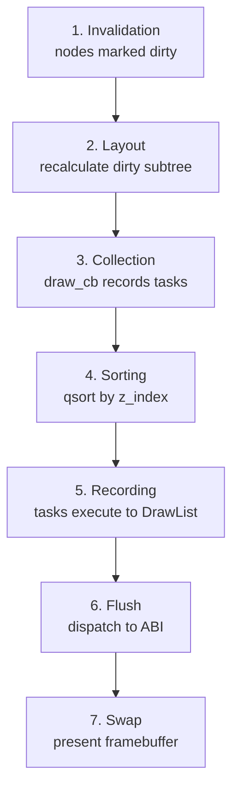

AromaUI uses deferred rendering. Instead of drawing immediately, widgets record commands into an `AromaDrawList`. At the end of each frame, commands are sorted by Z-index and flushed to the graphics backend.

## Frame Lifecycle



## DrawList Benefits

- **Z-sorting**: Nodes with higher `z_index` draw on top, regardless of tree order
- **Batching**: Multiple rectangles can be merged into a single `glDrawArrays` call
- **Frustum culling**: Offscreen nodes are skipped during collection

## AromaBackendABI

The ABI sits between the core framework and hardware backends. When a DrawList is active, it records commands. Otherwise, it passes calls directly to the backend (immediate mode).

```c
// Typical widget draw callback
void aroma_button_draw(AromaNode *node, size_t window_id) {
    AromaGraphicsInterface *gfx = aroma_graphics_get_interface(window_id);
    gfx->fill_rectangle(window_id, rect.x, rect.y, rect.w, rect.h, bg_color, true, radius);
    gfx->render_text(window_id, font, text, tx, ty, text_color);
}
```

## Backend Flush

During `aroma_drawlist_flush()`:
1. Iterate buffered commands
2. Dispatch to the active `AromaGraphicsInterface` (GLES3, Vulkan, or TFT_eSPI)
3. For TFT_eSPI: use smart tiling - only flush dirty horizontal tiles to avoid full-screen buffer allocation

## Batching Optimizations

### GLES3 Shape Batching

The GLES3 backend buffers up to 256 quads before issuing a draw call. This reduces GPU state changes for UIs with many simple rectangles.

### Font LRU Cache

Glyph textures are cached per-window (max 16 fonts). When the cache is full, the least recently used font is evicted.

## Implementation Notes

The rendering pipeline relies on these internal mechanisms:

| Concern | How It Works |
|---|---|
| Force redraw | `aroma_ui_request_redraw(window)` marks the window dirty |
| Draw order | Higher `z_index` draws later (on top) |
| Clip region | Set via `gfx->set_clip(rect)` before drawing |
| Backend selection | Configured at platform init (`aroma_backend_abi_init`) |

Most render control happens automatically through the DrawList and dirty-region system. Direct manipulation is rarely needed in application code.

## What's Next

- Learn about [Animation](Animation-Engine.md) for smooth property transitions.
- Explore [Theming](Theming-and-Styling.md) for visual customization.
- See [Scene Graph](Scene-Graph-and-Node-System.md) for node lifecycle details.
