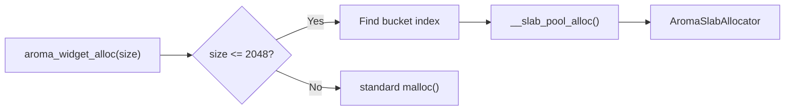

Every UI element in AromaUI is an `AromaNode`. Nodes form a tree, and the framework traverses this tree for layout, hit-testing, and rendering.

## The AromaNode Struct

```c
typedef struct AromaNode {
    uint64_t node_id;
    AromaNodeType node_type;        // ROOT, CONTAINER, WIDGET
    int32_t z_index;
    AromaRect rect;                 // x, y, width, height
    AromaLayout layout;             // layout hints
    bool visible;
    bool is_dirty;
    bool subtree_dirty;
    AromaNode *parent_node;
    AromaNode *child_nodes[64];     // max 64 children
    int child_count;
    void *node_widget_ptr;          // widget-specific data
    AromaNodeDrawFn draw_cb;
    // ... padding for alignment
} AromaNode;
```

**Key limits:**
- **64 children per node** - fixed-size array avoids dynamic allocation
- **64 properties per widget** - enforced by the Incense loader
- **1024 dirty nodes per frame** - global dirty list capacity

## Node Lifecycle

### Creation

```c
AromaNode *node = aroma_node_create(parent, NODE_TYPE_WIDGET, x, y, w, h);
```

Nodes are allocated from a slab allocator. For embedded targets (ESP32), this avoids heap fragmentation. For desktop/web, standard `malloc` is used as a fallback.

### Parenting

```c
aroma_node_add_child(parent, child);
```

- Child limit is enforced at 64.
- `subtree_dirty` propagates up to the root on invalidation.

### Destruction

```c
aroma_node_destroy(node);
```

Recursively destroys all children. Widgets can provide a `destroy_cb` to free internal state.

## Dirty-Region Tracking

Only dirty nodes are processed during layout and rendering.

```c
void aroma_node_invalidate(AromaNode *node);
```

Sets `is_dirty = true` on the node and `subtree_dirty = true` on all ancestors. The renderer skips branches where `subtree_dirty` is false.

## Memory Management

### Slab Allocator

For embedded targets, AromaUI uses a slab allocator with pools ranging from 32 bytes to 2048 bytes. Widget data (e.g., `AromaListViewInternal`) is allocated from these pools.



### Alignment

`AromaNode` includes explicit padding to ensure 8-byte alignment, preventing bus errors on RISC architectures and WASM.

## Internal APIs

The framework exposes these lower-level functions for advanced use cases and internal machinery:

| Function | Role |
|---|---|
| `aroma_node_create()` | Allocates a node from the slab allocator |
| `aroma_node_add_child()` | Links a child into the parent's fixed-size array |
| `aroma_node_remove_child()` | Shifts siblings to maintain array density |
| `aroma_node_destroy()` | Recursively frees a subtree |
| `aroma_node_invalidate()` | Marks a node dirty and propagates `subtree_dirty` upward |
| `aroma_node_set_layout_none()` | Absolute positioning |
| `aroma_node_set_layout_fill()` | Match parent bounds |
| `aroma_node_set_layout_center()` | Center within parent |
| `aroma_node_set_z_index()` | Controls draw order |
| `aroma_node_set_hidden()` | Toggles visibility without destruction |

Most applications should use the higher-level factory functions in `include/aroma_ui.h` instead of calling these directly.

## What's Next

- Learn how [Events](Event-System.md) are dispatched to nodes.
- Understand [Layout](Layout-Engine.md) calculation.
- See how nodes become pixels in the [Rendering Pipeline](Rendering-Pipeline-and-DrawList.md).
