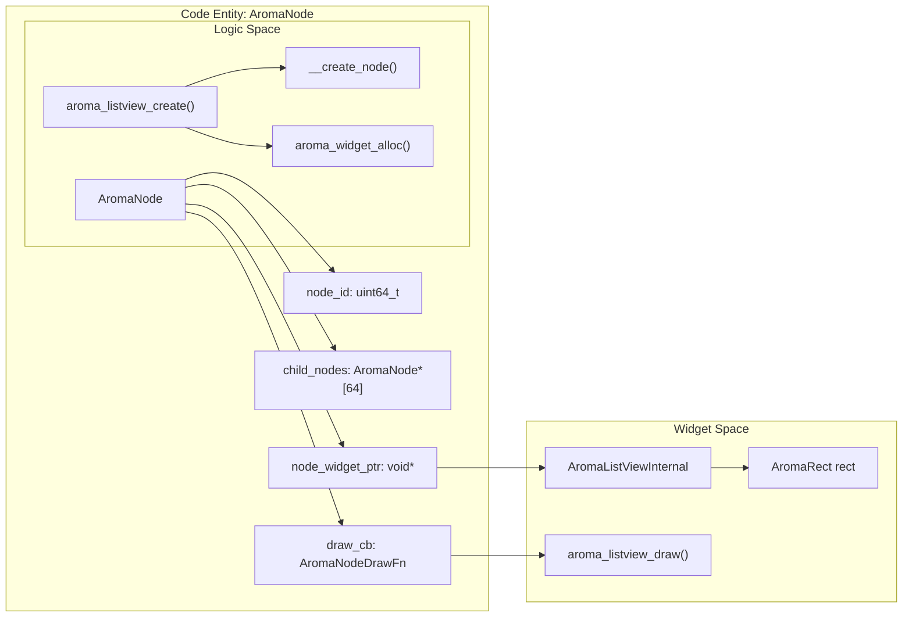
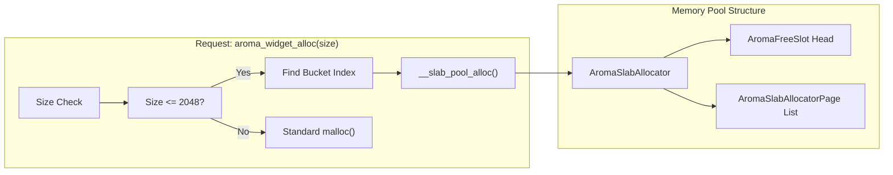

The **Scene Graph** is the foundational structure of AromaUI, representing the visual hierarchy as a tree of `AromaNode` objects. Every element on the screen—from a simple `Label` to a complex `ListView`—is a node within this directed acyclic graph. The system is designed for high performance on embedded hardware through a custom slab allocator, deterministic child limits, and a dual-stage dirty-tracking invalidation system.

## The AromaNode: Base Unit

The `AromaNode` is the atomic unit of the UI tree. It encapsulates identity, hierarchy, visibility, and layout properties.

### Node Structure and Memory Alignment

To ensure compatibility with WebAssembly (WASM) and strict alignment requirements on certain RISC architectures, the `AromaNode` structure includes explicit padding.

| Field | Type | Description |
| --- | --- | --- |
| `node_id` | `uint64_t` | A unique identifier generated via `atomic_fetch_add`. |
| `node_type` | `AromaNodeType` | Categorizes the node as `ROOT`, `CONTAINER`, or `WIDGET`. |
| `z_index` | `int32_t` | Controls the drawing order; higher values are drawn last (on top). |
| `node_widget_ptr` | `void*` | Pointer to widget-specific data (e.g., `AromaListViewInternal`). |
| `_padding` | `uint8_t[4]` | Explicit padding to align the `AromaLayout` struct to an 8-byte boundary. |

**Sources:**[include/aroma_node.h123-148](https://github.com/BinaryInkTN/AromaUI/blob/afd1c6b6/include/aroma_node.h#L123-L148)[src/core/aroma_node.c20-22](https://github.com/BinaryInkTN/AromaUI/blob/afd1c6b6/src/core/aroma_node.c#L20-L22)

### Entity Mapping: Node to Logic

The following diagram illustrates how the `AromaNode` structure bridges the gap between the abstract scene graph and concrete widget implementations.

**Scene Graph Entity Relationship**

**Sources:**[include/aroma_node.h123-148](https://github.com/BinaryInkTN/AromaUI/blob/afd1c6b6/include/aroma_node.h#L123-L148)[src/widgets/aroma_listview.c53-67](https://github.com/BinaryInkTN/AromaUI/blob/afd1c6b6/src/widgets/aroma_listview.c#L53-L67)[src/core/aroma_node.c44-99](https://github.com/BinaryInkTN/AromaUI/blob/afd1c6b6/src/core/aroma_node.c#L44-L99)

---

## Lifecycle Management

### Creation and Destruction

Nodes are created via `__create_node` and unlinked from the tree via `__destroy_node`.

- **Child Limit:** A node can have a maximum of **64 direct children** (`AROMA_MAX_CHILD_NODES`). This fixed size allows for deterministic memory layouts and avoids dynamic array reallocations during tree traversal. [include/aroma_node.h20](https://github.com/BinaryInkTN/AromaUI/blob/afd1c6b6/include/aroma_node.h#L20-L20)
- **Recursive Destruction:** When `__destroy_node` is called, the system first invokes the `destroy_cb` (if present) for widget-specific cleanup, then recursively destroys all children before freeing the node itself. [src/core/aroma_node.c153-195](https://github.com/BinaryInkTN/AromaUI/blob/afd1c6b6/src/core/aroma_node.c#L153-L195)

### Parent-Child Relationships

The hierarchy is maintained through the `parent_node` pointer and the `child_nodes` array.

- **Addition:**`__add_child_node` handles the allocation and links the child to the parent's array. [src/core/aroma_node.c101-123](https://github.com/BinaryInkTN/AromaUI/blob/afd1c6b6/src/core/aroma_node.c#L101-L123)
- **Removal:**`__remove_child_node` performs a linear search for the `node_id`, shifts the array to maintain order, and returns the removed pointer. [src/core/aroma_node.c125-151](https://github.com/BinaryInkTN/AromaUI/blob/afd1c6b6/src/core/aroma_node.c#L125-L151)

---

## Dirty-List Invalidation

AromaUI uses a "Dirty-List" system to avoid re-rendering the entire scene graph every frame.

1. **Node Invalidation:** When a property changes (e.g., text, color, position), `aroma_node_invalidate` is called.
2. **State Flags:**
- `is_dirty`: Indicates the node itself needs a redraw.
- `subtree_dirty`: Indicates a descendant requires a redraw.
3. **Propagation:** Invalidation propagates the `subtree_dirty` flag upwards to the root, allowing the renderer to skip entire branches of the tree during the draw phase if no flags are set.
4. **Dirty List:** Nodes marked `is_dirty` are added to a global `g_dirty_nodes` array (max 1024) to be processed in the next frame.

**Sources:**[include/aroma_node.h137-143](https://github.com/BinaryInkTN/AromaUI/blob/afd1c6b6/include/aroma_node.h#L137-L143)[src/core/aroma_node.c17-18](https://github.com/BinaryInkTN/AromaUI/blob/afd1c6b6/src/core/aroma_node.c#L17-L18)

---

## Memory Management: Slab Allocator

For embedded targets (specifically `ESP32`), AromaUI replaces standard `malloc`/`free` with a high-performance **Slab Allocator** to prevent heap fragmentation.

### Global Memory System

The `AromaMemorySystem` manages multiple pools:

- **Node Pool:** Dedicated specifically to `AromaNode` structures.
- **Widget Pools:** Seven buckets ranging from 32 to 2048 bytes for widget-specific data.

**Allocator Data Flow**

**Sources:**[include/aroma_slab_alloc.h47-64](https://github.com/BinaryInkTN/AromaUI/blob/afd1c6b6/include/aroma_slab_alloc.h#L47-L64)[src/core/aroma_node.c66-70](https://github.com/BinaryInkTN/AromaUI/blob/afd1c6b6/src/core/aroma_node.c#L66-L70)

### Allocation Logic

1. **Initialization:**`aroma_memory_system_init` preallocates static pages in the `preallocated_pages` array. [include/aroma_slab_alloc.h62](https://github.com/BinaryInkTN/AromaUI/blob/afd1c6b6/include/aroma_slab_alloc.h#L62-L62)
2. **Fast Path:** If a `free_list` slot is available, it is popped and returned immediately.
3. **Slow Path:** If no slots exist, a new `AromaSlabAllocatorPage` is carved into objects of the required `object_size`. [include/aroma_slab_alloc.h38-54](https://github.com/BinaryInkTN/AromaUI/blob/afd1c6b6/include/aroma_slab_alloc.h#L38-L54)

---

## WASM and Alignment Requirements

AromaUI enforces strict memory alignment to support WebAssembly and various backend architectures.

- **Pointer Validation:** Before accessing a `node_widget_ptr`, the system checks for 4-byte or 8-byte alignment depending on the platform (Emscripten vs. Native). [src/core/aroma_layout.c18-38](https://github.com/BinaryInkTN/AromaUI/blob/afd1c6b6/src/core/aroma_layout.c#L18-L38)
- **Helper Macros:** The `AROMA_NODE_AS(node, Type)` macro and `aroma_node_get_widget_ptr` function are used to safely cast generic node pointers back to their widget implementations while checking for nulls and alignment. [include/aroma_node.h150-160](https://github.com/BinaryInkTN/AromaUI/blob/afd1c6b6/include/aroma_node.h#L150-L160)
- **Structure Padding:** The `_padding` field in `AromaNode` ensures that the `AromaLayout` struct starts on an 8-byte boundary, preventing bus errors on sensitive hardware when accessing floating-point flex factors. [include/aroma_node.h145-147](https://github.com/BinaryInkTN/AromaUI/blob/afd1c6b6/include/aroma_node.h#L145-L147)

**Sources:**[include/aroma_node.h145-160](https://github.com/BinaryInkTN/AromaUI/blob/afd1c6b6/include/aroma_node.h#L145-L160)[src/core/aroma_layout.c18-38](https://github.com/BinaryInkTN/AromaUI/blob/afd1c6b6/src/core/aroma_layout.c#L18-L38)