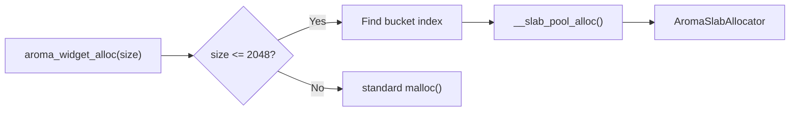

Every UI element in AromaUI is an `AromaNode`. Nodes form a tree, and the framework traverses this tree for layout, hit-testing, and rendering.

## The AromaNode Struct

```c
struct AromaNode {
    AromaNodeType node_type;        // NODE_TYPE_ROOT, NODE_TYPE_CONTAINER, NODE_TYPE_WIDGET
    uint64_t node_id;
    int32_t z_index;
    float opacity;                  // animated by AROMA_ANIM_FADE
    AromaNode *parent_node;
    AromaNode **child_nodes;        // growable array (see limits below)
    void *node_widget_ptr;          // widget-specific data (geometry lives here)
    AromaNodeDrawFn draw_cb;        // void (*)(AromaNode *node, size_t window_id)
    void (*destroy_cb)(struct AromaNode *node);
    uint64_t child_count;
    uint64_t child_capacity;
    bool is_dirty;
    bool subtree_dirty;
    bool is_hidden;                 // set via aroma_node_set_hidden()
    // ... plus AromaLayout layout hints
};
```

**Key limits:**
- **128 children per node** (`AROMA_MAX_CHILD_NODES`) - growable array avoids per-node over-allocation
- **64 properties per widget** - enforced by the Incense loader
- **1024 dirty nodes per frame** (`AROMA_MAX_DIRTY_NODES`) - global dirty list capacity

Geometry (`x, y, width, height`) lives in each widget's own struct and is
reached through `aroma_node_get_rect(node)` - there is no `rect` field on
`AromaNode` itself. Visibility is `is_hidden`, toggled with
`aroma_node_set_hidden()`.

## Node Lifecycle

### Creation

```c
AromaNode *container = aroma_container_create(root, 0, 0, 800, 480);
```

Build nodes with the widget factory functions in `include/aroma_ui.h`
(containers, buttons, labels, …). Nodes are allocated from a slab allocator. For embedded targets (ESP32), this avoids heap fragmentation. For desktop/web, standard `malloc` is used as a fallback.

### Parenting

Factories attach the new node to its parent automatically.

- Child limit is enforced at 128 (`AROMA_MAX_CHILD_NODES`).
- `subtree_dirty` propagates up to the root on invalidation.

### Destruction

```c
aroma_ui_destroy_window(window);
```

Destroying a window recursively destroys its subtree. Widgets can provide a `destroy_cb` to free internal state.

## Dirty-Region Tracking

Only dirty nodes are processed during layout and rendering.

```c
void aroma_node_invalidate(AromaNode *node);
```

Sets `is_dirty = true` on the node and `subtree_dirty = true` on all ancestors. The renderer skips branches where `subtree_dirty` is false.

## Memory Management

### Slab Allocator

For embedded targets, AromaUI uses a slab allocator with pools ranging from 32 bytes to 2048 bytes. Widget data (e.g., `AromaListViewInternal`) is allocated from these pools.



### Alignment

`AromaNode` includes explicit padding to ensure 8-byte alignment, preventing bus errors on RISC architectures and WASM.

## Internal APIs

The framework exposes these lower-level functions for advanced use cases and internal machinery:

| Function | Role |
|---|---|
| `aroma_node_invalidate()` | Marks a node dirty and propagates `subtree_dirty` upward |
| `aroma_node_set_layout_mode()` | Selects NONE, FLEX, or GRID child arrangement |
| `aroma_node_set_layout_fill()` | Match parent bounds |
| `aroma_node_set_layout_center()` | Center within parent |
| `aroma_node_set_layout_anchor()` | Pin to parent edges |
| `aroma_node_set_z_index()` | Controls draw order |
| `aroma_node_set_hidden()` | Toggles visibility without destruction |

Most applications should use the higher-level factory functions in `include/aroma_ui.h` instead of calling these directly.

## What's Next

- Learn how [Events](Event-System.md) are dispatched to nodes.
- Understand [Layout](Layout-Engine.md) calculation.
- See how nodes become pixels in the [Rendering Pipeline](Rendering-Pipeline-and-DrawList.md).
