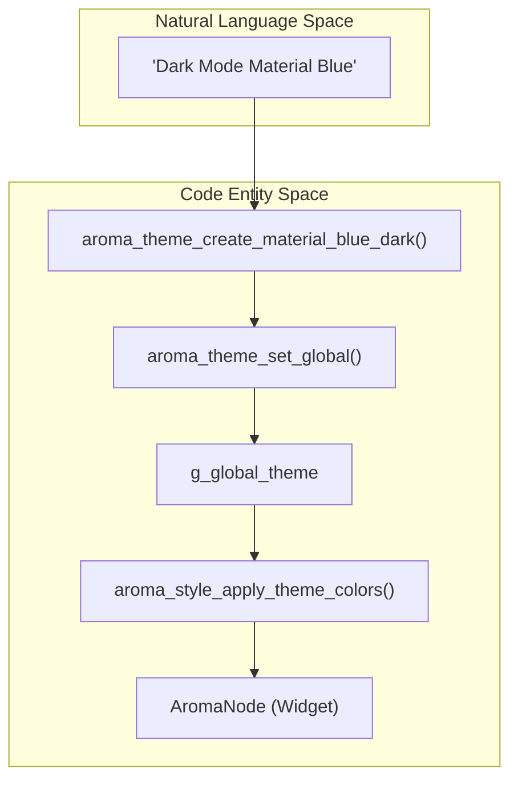
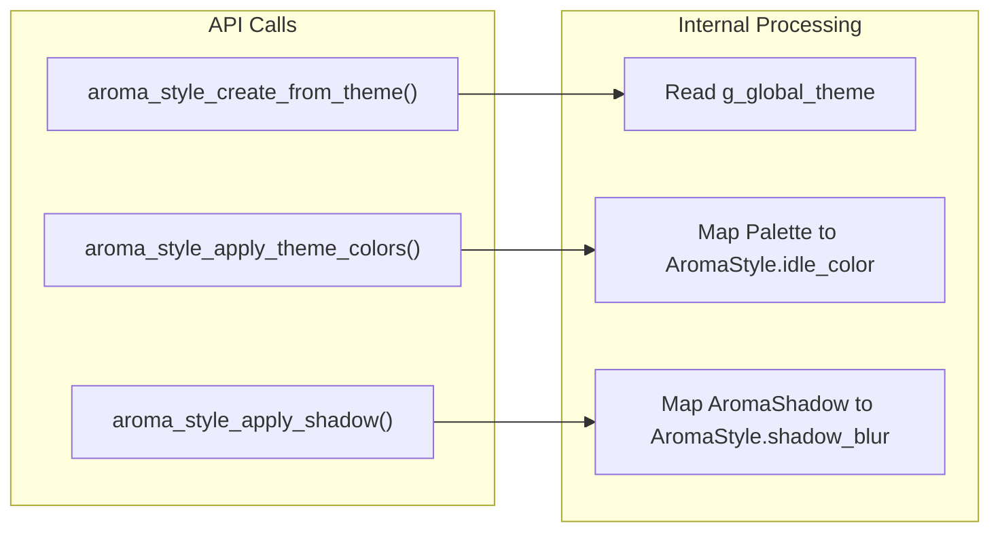

# Theming and Styling
Relevant source files
- [docs/core/core_abi.md](https://github.com/BinaryInkTN/AromaUI/blob/afd1c6b6/docs/core/core_abi.md?plain=1)
- [docs/getting-started/architecture.md](https://github.com/BinaryInkTN/AromaUI/blob/afd1c6b6/docs/getting-started/architecture.md?plain=1)
- [docs/tools/logging.md](https://github.com/BinaryInkTN/AromaUI/blob/afd1c6b6/docs/tools/logging.md?plain=1)
- [docs/ui/layouts.md](https://github.com/BinaryInkTN/AromaUI/blob/afd1c6b6/docs/ui/layouts.md?plain=1)
- [docs/ui/theming.md](https://github.com/BinaryInkTN/AromaUI/blob/afd1c6b6/docs/ui/theming.md?plain=1)
- [examples/car_infotainment/theme_manager.c](https://github.com/BinaryInkTN/AromaUI/blob/afd1c6b6/examples/car_infotainment/theme_manager.c)
- [examples/car_infotainment/theme_manager.h](https://github.com/BinaryInkTN/AromaUI/blob/afd1c6b6/examples/car_infotainment/theme_manager.h)
- [include/aroma_style.h](https://github.com/BinaryInkTN/AromaUI/blob/afd1c6b6/include/aroma_style.h)
- [src/backends/graphics/utils/stb_image.h](https://github.com/BinaryInkTN/AromaUI/blob/afd1c6b6/src/backends/graphics/utils/stb_image.h)
- [src/core/aroma_style.c](https://github.com/BinaryInkTN/AromaUI/blob/afd1c6b6/src/core/aroma_style.c)

The AromaUI theming system provides a centralized mechanism for managing the visual appearance of applications. It is built around the `AromaTheme` and `AromaStyle` structures, allowing for global configuration of color palettes, spacing, typography, and shadows [include/aroma_style.h38-45](https://github.com/BinaryInkTN/AromaUI/blob/afd1c6b6/include/aroma_style.h#L38-L45) The system supports built-in presets (Material, High Contrast, Dark Mode) and granular customization via dedicated utility functions.

## Theme System Architecture

The theme system operates at the core framework level, maintaining a global state that widgets consume to resolve their visual properties [src/core/aroma_style.c25-26](https://github.com/BinaryInkTN/AromaUI/blob/afd1c6b6/src/core/aroma_style.c#L25-L26)

### Core Data Structures

| Structure | Purpose | Key Fields |
| --- | --- | --- |
| `AromaColorPalette` | Defines the color scheme. | `primary`, `background`, `surface`, `text_primary`, `border`[include/aroma_style.h9-20](https://github.com/BinaryInkTN/AromaUI/blob/afd1c6b6/include/aroma_style.h#L9-L20) |
| `AromaSpacing` | Defines layout metrics. | `padding`, `margin`, `border_radius`, `border_width`[include/aroma_style.h22-28](https://github.com/BinaryInkTN/AromaUI/blob/afd1c6b6/include/aroma_style.h#L22-L28) |
| `AromaTypography` | Defines text appearance. | `font_size`, `line_height`, `font_name`, `font_color`[include/aroma_style.h30-36](https://github.com/BinaryInkTN/AromaUI/blob/afd1c6b6/include/aroma_style.h#L30-L36) |
| `AromaTheme` | The top-level theme container. | Combines Palette, Spacing, and Typography [include/aroma_style.h38-45](https://github.com/BinaryInkTN/AromaUI/blob/afd1c6b6/include/aroma_style.h#L38-L45) |
| `AromaStyle` | Component-specific styling. | State-based colors (`idle`, `hover`, `active`) and overrides [include/aroma_style.h56-78](https://github.com/BinaryInkTN/AromaUI/blob/afd1c6b6/include/aroma_style.h#L56-L78) |

### System Flow Diagram

This diagram illustrates the relationship between theme creation, global state management, and component styling.

**Theme Application Pipeline**



**Sources:**[include/aroma_style.h100-116](https://github.com/BinaryInkTN/AromaUI/blob/afd1c6b6/include/aroma_style.h#L100-L116)[src/core/aroma_style.c25-26](https://github.com/BinaryInkTN/AromaUI/blob/afd1c6b6/src/core/aroma_style.c#L25-L26)

## Built-in Presets

AromaUI includes several pre-configured themes accessible via factory functions:

- **Default**: A balanced theme based on Material 3 specifications [src/core/aroma_style.c73-104](https://github.com/BinaryInkTN/AromaUI/blob/afd1c6b6/src/core/aroma_style.c#L73-L104)
- **High Contrast**: Optimized for accessibility with sharp color boundaries [src/core/aroma_style.c138-168](https://github.com/BinaryInkTN/AromaUI/blob/afd1c6b6/src/core/aroma_style.c#L138-L168)
- **Material Presets**: Six color variants (Purple, Blue, Teal, Green, Orange, Pink) in both light and dark modes [include/aroma_style.h47-54](https://github.com/BinaryInkTN/AromaUI/blob/afd1c6b6/include/aroma_style.h#L47-L54)
- **Black OLED**: Pure black backgrounds (`0x000000`) designed for power efficiency on OLED displays [src/core/aroma_style.c202-212](https://github.com/BinaryInkTN/AromaUI/blob/afd1c6b6/src/core/aroma_style.c#L202-L212)

### Preset Factory Functions

| Function | Description |
| --- | --- |
| `aroma_theme_create_default()` | Returns the standard light theme [include/aroma_style.h81](https://github.com/BinaryInkTN/AromaUI/blob/afd1c6b6/include/aroma_style.h#L81-L81) |
| `aroma_theme_create_dark()` | Returns the standard dark theme [include/aroma_style.h94](https://github.com/BinaryInkTN/AromaUI/blob/afd1c6b6/include/aroma_style.h#L94-L94) |
| `aroma_theme_create_material_preset(preset)` | Returns a Material light theme for a specific `AromaMaterialThemePreset`[include/aroma_style.h86](https://github.com/BinaryInkTN/AromaUI/blob/afd1c6b6/include/aroma_style.h#L86-L86) |
| `aroma_theme_create_material_preset_dark(preset)` | Returns a Material dark theme for a specific `AromaMaterialThemePreset`[include/aroma_style.h97](https://github.com/BinaryInkTN/AromaUI/blob/afd1c6b6/include/aroma_style.h#L97-L97) |

**Sources:**[include/aroma_style.h80-104](https://github.com/BinaryInkTN/AromaUI/blob/afd1c6b6/include/aroma_style.h#L80-L104)[src/core/aroma_style.c73-212](https://github.com/BinaryInkTN/AromaUI/blob/afd1c6b6/src/core/aroma_style.c#L73-L212)

## Custom Theme Creation

Developers can create custom themes using `aroma_theme_create_custom()` or by modifying existing presets.

### Example: Customizing via theme_manager

In the Car Infotainment example, the `theme_manager.c` demonstrates creating a theme, blending colors, and applying it globally.

```
// Example from theme_manager.c
state.theme = aroma_theme_create_material_blue();
state.theme.enable_shadows = false;
state.theme.colors.background = aroma_color_blend(
    state.theme.colors.primary, 
    state.theme.colors.background, 
    0.96f
);
aroma_ui_set_theme(&state.theme);
```

**Sources:**[examples/car_infotainment/theme_manager.c14-30](https://github.com/BinaryInkTN/AromaUI/blob/afd1c6b6/examples/car_infotainment/theme_manager.c#L14-L30)

## Color Manipulation Utilities

The system provides several functions for dynamic color adjustment, which are useful for generating hover states or blending transitions.

- **`aroma_color_adjust(color, factor)`**: Adjusts brightness. A positive factor lightens the color; negative darkens it [src/core/aroma_style.c34-43](https://github.com/BinaryInkTN/AromaUI/blob/afd1c6b6/src/core/aroma_style.c#L34-L43)
- **`aroma_color_blend(color1, color2, blend)`**: Linearly interpolates between two colors based on a factor (0.0 to 1.0) [src/core/aroma_style.c45-57](https://github.com/BinaryInkTN/AromaUI/blob/afd1c6b6/src/core/aroma_style.c#L45-L57)
- **`aroma_color_rgb / rgba`**: Packs component bytes into a `uint32_t` (format: `0xAARRGGBB`) [src/core/aroma_style.c59-65](https://github.com/BinaryInkTN/AromaUI/blob/afd1c6b6/src/core/aroma_style.c#L59-L65)

**Sources:**[src/core/aroma_style.c34-71](https://github.com/BinaryInkTN/AromaUI/blob/afd1c6b6/src/core/aroma_style.c#L34-L71)

## Component Styling

While `AromaTheme` defines the global environment, `AromaStyle` defines how specific widgets respond to that environment.

### Applying Theme Colors to Styles

The function `aroma_style_apply_theme_colors(style, theme, is_primary)` maps a theme's palette to a component's state colors (idle, hover, active) [include/aroma_style.h116](https://github.com/BinaryInkTN/AromaUI/blob/afd1c6b6/include/aroma_style.h#L116-L116) If `is_primary` is true, the widget will use the theme's primary color as its base; otherwise, it uses secondary/surface colors.

### Shadow System

Shadows are managed via the `AromaShadow` struct [include/aroma_style.h126-132](https://github.com/BinaryInkTN/AromaUI/blob/afd1c6b6/include/aroma_style.h#L126-L132)

- **Presets**: `aroma_shadow_create_soft()`, `aroma_shadow_create_subtle()`, `aroma_shadow_create_deep()`[include/aroma_style.h134-137](https://github.com/BinaryInkTN/AromaUI/blob/afd1c6b6/include/aroma_style.h#L134-L137)
- **Application**: `aroma_style_apply_shadow(style, shadow)` binds shadow properties to a specific style [include/aroma_style.h141](https://github.com/BinaryInkTN/AromaUI/blob/afd1c6b6/include/aroma_style.h#L141-L141)

### Styling Code Entity Map

This diagram maps the styling functions to their internal logic.

**Style Resolution Map**



**Sources:**[include/aroma_style.h106-141](https://github.com/BinaryInkTN/AromaUI/blob/afd1c6b6/include/aroma_style.h#L106-L141)[src/core/aroma_style.c25-26](https://github.com/BinaryInkTN/AromaUI/blob/afd1c6b6/src/core/aroma_style.c#L25-L26)