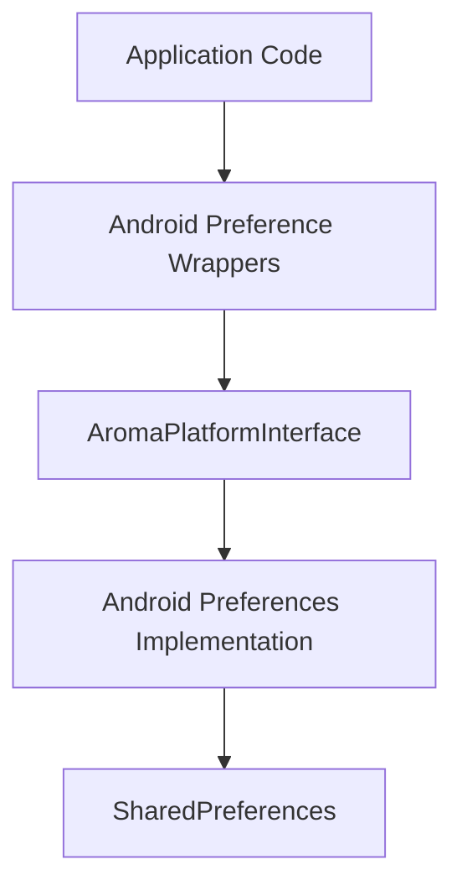

The **Preferences API** provides persistent key-value storage for user settings and application configuration. It offers a lightweight abstraction over platform-specific storage systems.

On Android, the implementation maps directly to **SharedPreferences**, while the public API remains consistent through the **AromaPlatformInterface**.

---

## Features

* Persistent key-value storage
* Lightweight and fast access
* Platform abstraction layer
* Type-safe preference access
* Default value fallback when a key does not exist

Supported types:

* `string`
* `int`
* `float`
* `bool`
* `long`

---

## Architecture

The Preferences system is implemented through the platform abstraction layer. Application calls are routed through the platform interface and handled by the platform-specific implementation.



### Components

**Android Preference Wrappers**
Inline helper functions exposed in the Aroma SDK that provide type-safe access to preferences.

**AromaPlatformInterface**
Platform abstraction layer that allows Aroma to call platform-specific implementations without coupling the core framework to Android APIs.

**Android Preferences Implementation**
Implements preference storage using Android's native storage system.

**SharedPreferences**
Android's built-in persistent key-value storage used to store application settings.

---

## Typed Preferences API

The Android preferences layer exposes **type-safe accessors** for storing and retrieving values. These functions internally forward calls through the **`AromaPlatformInterface`**, which connects the core framework to the Android implementation.

All getters support a **default value**, which is returned when the key does not exist or when the platform interface is unavailable.

---

### String Preferences

```c
const char* aroma_android_get_preference_string(const char* key, const char* default_value);
void aroma_android_set_preference_string(const char* key, const char* value);
```

Example:

```c
aroma_android_set_preference_string("theme", "dark");

const char* theme = aroma_android_get_preference_string("theme", "light");
```

---

### Integer Preferences

```c
int aroma_android_get_preference_int(const char* key, int default_value);
void aroma_android_set_preference_int(const char* key, int value);
```

Example:

```c
aroma_android_set_preference_int("volume", 80);

int volume = aroma_android_get_preference_int("volume", 50);
```

---

### Float Preferences

```c
float aroma_android_get_preference_float(const char* key, float default_value);
void aroma_android_set_preference_float(const char* key, float value);
```

Example:

```c
aroma_android_set_preference_float("ui_scale", 1.25f);

float scale = aroma_android_get_preference_float("ui_scale", 1.0f);
```

---

### Boolean Preferences

```c
bool aroma_android_get_preference_bool(const char* key, bool default_value);
void aroma_android_set_preference_bool(const char* key, bool value);
```

Example:

```c
aroma_android_set_preference_bool("notifications_enabled", true);

bool enabled = aroma_android_get_preference_bool("notifications_enabled", false);
```

---

### Long Preferences

```c
long aroma_android_get_preference_long(const char* key, long default_value);
void aroma_android_set_preference_long(const char* key, long value);
```

Example:

```c
aroma_android_set_preference_long("last_sync", 1710000000);

long timestamp = aroma_android_get_preference_long("last_sync", 0);
```

---

## Implementation Notes

* The functions are implemented as **`static inline` wrappers**.
* They forward calls to the **`AromaPlatformInterface`**.
* If the platform implementation is not available, the **default value is returned**.
* Preference values persist across application restarts.
* Returned strings are **owned by the platform implementation and should not be freed by the caller**.
