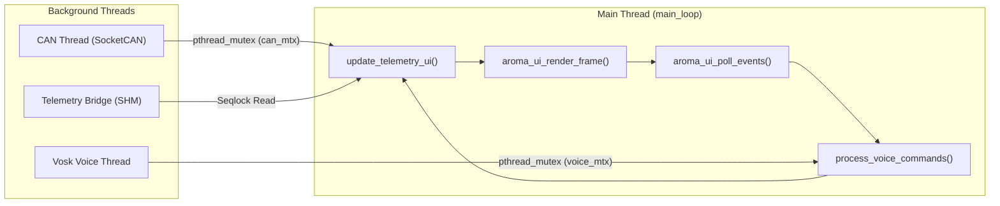
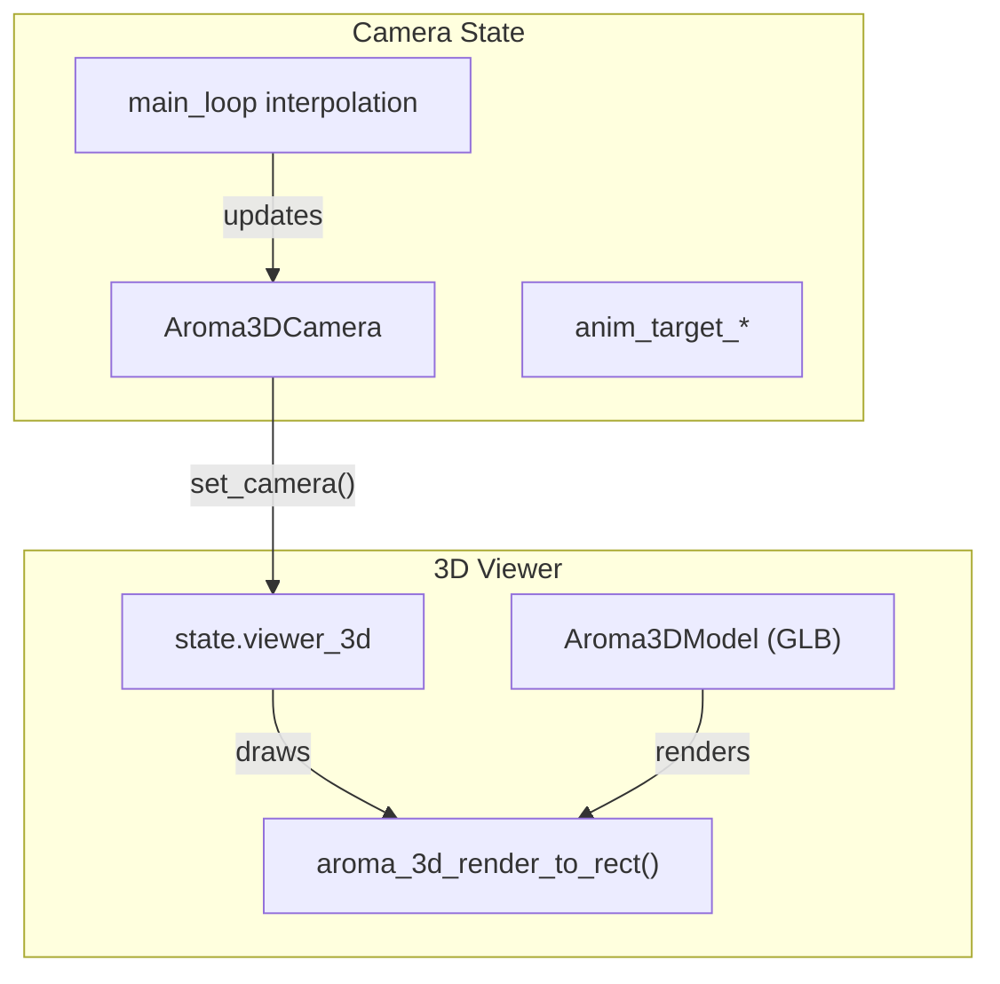
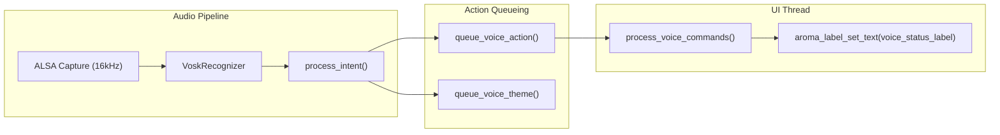

AromaOS serves as the reference automotive Human-Machine Interface (HMI) for the AromaUI framework. It demonstrates a high-performance, multi-layered dashboard featuring real-time telemetry integration, voice control, and a complex Z-order scene graph suitable for 1280x800 infotainment displays.

## Application Lifecycle and Main Loop

The application entry point in `main.c` orchestrates the initialization of global state, resource managers, and asynchronous processing threads.

### Initialization Sequence

1. **Global State**: `init_app_state()` allocates the `AppState` structure and initializes mutexes for thread-safe access to CAN and Voice data [examples/car_infotainment/main.c24-28](https://github.com/BinaryInkTN/AromaUI/blob/afd1c6b6/examples/car_infotainment/main.c#L24-L28)[examples/car_infotainment/app_state.c30-66](https://github.com/BinaryInkTN/AromaUI/blob/afd1c6b6/examples/car_infotainment/app_state.c#L30-L66)
2. **UI & Fonts**: `aroma_ui_init()` starts the core engine, followed by `init_fonts()` which loads multiple Ubuntu and Icon font instances into the `AppState` for specific UI roles (Clock, Settings, Tabs) [examples/car_infotainment/main.c37-52](https://github.com/BinaryInkTN/AromaUI/blob/afd1c6b6/examples/car_infotainment/main.c#L37-L52)[examples/car_infotainment/font_manager.c24-50](https://github.com/BinaryInkTN/AromaUI/blob/afd1c6b6/examples/car_infotainment/font_manager.c#L24-L50)
3. **Telemetry Bridge**: Attempts to open a POSIX shared memory segment for high-speed vehicle data [examples/car_infotainment/main.c68-84](https://github.com/BinaryInkTN/AromaUI/blob/afd1c6b6/examples/car_infotainment/main.c#L68-L84)
4. **UI Construction**: Builds the hierarchical scene graph by calling `build_vehicle_view`, `build_settings_ui`, and `build_tabs`[examples/car_infotainment/main.c85-91](https://github.com/BinaryInkTN/AromaUI/blob/afd1c6b6/examples/car_infotainment/main.c#L85-L91)
5. **Threads**: Spawns `start_voice_control_thread()` and `start_can_thread()` to handle asynchronous I/O [examples/car_infotainment/main.c106-110](https://github.com/BinaryInkTN/AromaUI/blob/afd1c6b6/examples/car_infotainment/main.c#L106-L110)
6. **Main Loop**: Enters `main_loop()` to process events and render frames [examples/car_infotainment/main.c112](https://github.com/BinaryInkTN/AromaUI/blob/afd1c6b6/examples/car_infotainment/main.c#L112-L112)

### Main Loop Diagram

The following diagram illustrates the relationship between the main execution thread and the background data providers.



**Sources:**[examples/car_infotainment/main.c19-125](https://github.com/BinaryInkTN/AromaUI/blob/afd1c6b6/examples/car_infotainment/main.c#L19-L125)[examples/car_infotainment/app_state.h153-155](https://github.com/BinaryInkTN/AromaUI/blob/afd1c6b6/examples/car_infotainment/app_state.h#L153-L155)[examples/car_infotainment/voice_handler.h20](https://github.com/BinaryInkTN/AromaUI/blob/afd1c6b6/examples/car_infotainment/voice_handler.h#L20-L20)

---

## Telemetry Bridge (Seqlock Shared Memory)

AromaOS utilizes a high-performance telemetry bridge defined in `shared_memory_bridge.h` to ingest data from external vehicle simulators or real hardware.

### Seqlock Implementation

The bridge uses a **Seqlock (Sequence Lock)** mechanism to allow lock-free reads from the UI thread while a writer process (like `vehicle_simulator.py`) updates the data.

- **Writer**: Increments `seq_write` to an odd value before writing and an even value after finishing [examples/car_infotainment/shared_memory_bridge.h5-9](https://github.com/BinaryInkTN/AromaUI/blob/afd1c6b6/examples/car_infotainment/shared_memory_bridge.h#L5-L9)
- **Reader**: `telemetry_bridge_read()` performs a spin-lock check. It reads `seq_write`, performs a `memcpy` of the `telemetry_frame_t`, and then re-reads `seq_write`. If the values match and are even, the read is considered atomic [examples/car_infotainment/shared_memory_bridge.h195-203](https://github.com/BinaryInkTN/AromaUI/blob/afd1c6b6/examples/car_infotainment/shared_memory_bridge.h#L195-L203)

### Data Structure

The `telemetry_frame_t` carries critical vehicle metrics:

- `speed_kmh_x10`: Speed in km/h (scaled by 10) [examples/car_infotainment/shared_memory_bridge.h89](https://github.com/BinaryInkTN/AromaUI/blob/afd1c6b6/examples/car_infotainment/shared_memory_bridge.h#L89-L89)
- `battery_soc_pct`: State of Charge percentage [examples/car_infotainment/shared_memory_bridge.h96](https://github.com/BinaryInkTN/AromaUI/blob/afd1c6b6/examples/car_infotainment/shared_memory_bridge.h#L96-L96)
- `flags`: Bitmask for `FLAG_READY_TO_DRIVE`, `FLAG_LOW_BATTERY`, etc [examples/car_infotainment/shared_memory_bridge.h107](https://github.com/BinaryInkTN/AromaUI/blob/afd1c6b6/examples/car_infotainment/shared_memory_bridge.h#L107-L107)

**Sources:**[examples/car_infotainment/shared_memory_bridge.h65-112](https://github.com/BinaryInkTN/AromaUI/blob/afd1c6b6/examples/car_infotainment/shared_memory_bridge.h#L65-L112)[examples/car_infotainment/main.c70-84](https://github.com/BinaryInkTN/AromaUI/blob/afd1c6b6/examples/car_infotainment/main.c#L70-L84)

---

## Vehicle View and Z-Layer Hierarchy

The primary HMI interface is the `vehicle_view`, which manages a complex stack of visual elements using AromaUI's Z-index system.

### Z-Layer Definitions

Layers are defined in `app_state.h` to ensure consistent depth sorting [examples/car_infotainment/app_state.h13-25](https://github.com/BinaryInkTN/AromaUI/blob/afd1c6b6/examples/car_infotainment/app_state.h#L13-L25):

| Layer Constant | Value | Purpose |
| --- | --- | --- |
| `Z_LAYER_BACKGROUND` | 1 | Road and environmental backgrounds |
| `Z_LAYER_VEHICLE_IMAGE` | 2 | The main car sprite (`car.png`) |
| `Z_LAYER_VEHICLE_OVERLAYS` | 3 | Dynamic labels (Speed, Range) |
| `Z_LAYER_STATUS_BAR` | 100 | Top-level system icons |
| `Z_LAYER_VOICE_CARD` | 999998 | Voice assistant modal |

### Key Components

- **Gear Selector**: Uses a two-card system (`gear_bg_card` and `gear_fg_card`). The foreground card is animated to slide over the active gear letter (P, R, N, D) [examples/car_infotainment/vehicle_view.c115-132](https://github.com/BinaryInkTN/AromaUI/blob/afd1c6b6/examples/car_infotainment/vehicle_view.c#L115-L132)
- **Interactive Labels**: Includes "Frunk" and "Trunk" labels that act as touch targets for vehicle actuators [examples/car_infotainment/vehicle_view.c156-170](https://github.com/BinaryInkTN/AromaUI/blob/afd1c6b6/examples/car_infotainment/vehicle_view.c#L156-L170)
- **Battery Diagnostics**: The `battery_diagnostics()` callback triggers a transition that hides standard vehicle info and displays a detailed battery health overlay using `AROMA_ANIM_SLIDE_Y` and `AROMA_ANIM_FADE`[examples/car_infotainment/vehicle_view.c26-60](https://github.com/BinaryInkTN/AromaUI/blob/afd1c6b6/examples/car_infotainment/vehicle_view.c#L26-L60)

**Sources:**[examples/car_infotainment/vehicle_view.c61-170](https://github.com/BinaryInkTN/AromaUI/blob/afd1c6b6/examples/car_infotainment/vehicle_view.c#L61-L170)[examples/car_infotainment/app_state.h13-25](https://github.com/BinaryInkTN/AromaUI/blob/afd1c6b6/examples/car_infotainment/app_state.h#L13-L25)

---

## 3D Vehicle Viewer and Camera System

AromaOS uses the `Aroma3DViewer` widget to render an interactive 3D vehicle model. The camera system supports multiple preset views (exterior, interior, front, rear, tire) with smooth animated transitions.

### 3D Viewer Integration

The viewer is created during `build_vehicle_view` and stored in `state.viewer_3d` [examples/car_infotainment/vehicle_view.c61-90](https://github.com/BinaryInkTN/AromaUI/blob/afd1c6b6/examples/car_infotainment/vehicle_view.c#L61-L90). The model is loaded asynchronously using `aroma_3d_load_model_async`, and a loading spinner is displayed while the GLB file is being parsed [examples/car_infotainment/vehicle_camera.c59-60](https://github.com/BinaryInkTN/AromaUI/blob/afd1c6b6/examples/car_infotainment/vehicle_camera.c#L59-L60).

### Camera Presets

The camera uses spherical coordinates (theta, phi, radius) and a target point. Five preset views are defined in `vehicle_camera.c`:

| View | Theta | Phi | Radius | Purpose |
| --- | --- | --- | --- | --- |
| Exterior | -5.0 | 1.34 | 5.14 | Default overview of the vehicle. |
| Interior | -3.10 | 1.09 | 1.14 | Close-up inside the cabin. |
| Front | +90 deg from exterior | Same | Same | Front bumper / headlight view. |
| Rear | +180 deg from front | Same | Same | Rear bumper / taillight view. |
| Tire | 0.0 | 1.2 | 2.2 | Close-up wheel inspection. |

Each tire view also has a per-wheel target offset (e.g., Front Right at `(-0.85, -0.08, 1.05)`) defined in the `tire_views[]` array [examples/car_infotainment/vehicle_camera.c39-51](https://github.com/BinaryInkTN/AromaUI/blob/afd1c6b6/examples/car_infotainment/vehicle_camera.c#L39-L51).

### Animated Transitions

Camera transitions are driven by the AromaUI animation engine. The `main_loop` interpolates the current camera values toward `state.anim_target_*` each frame:

```c
if (state.camera_animating)
{
    state.camera.theta += (state.anim_target_theta - state.camera.theta) * 0.08f;
    state.camera.phi   += (state.anim_target_phi   - state.camera.phi)   * 0.08f;
    state.camera.radius+= (state.anim_target_radius - state.camera.radius)* 0.08f;
    // ... same for target x, y, z
    aroma_3d_viewer_set_camera(state.viewer_3d, &state.camera);
}
```

The `lock_vehicle_camera()` function snapshots the current camera state so it can be restored after leaving an animated view [examples/car_infotainment/vehicle_camera.c123-129](https://github.com/BinaryInkTN/AromaUI/blob/afd1c6b6/examples/car_infotainment/vehicle_camera.c#L123-L129).

### Lighting and Materials

When a model is loaded, `apply_vehicle_paint_finish()` sets the metallic and clearcoat factors for all non-transparent meshes [examples/car_infainment/vehicle_camera.c72-85](https://github.com/BinaryInkTN/AromaUI/blob/afd1c6b6/examples/car_infotainment/vehicle_camera.c#L72-L85). The light position is configured via `aroma_3d_viewer_set_light_position` to simulate a showroom environment [examples/car_infotainment/vehicle_camera.c120](https://github.com/BinaryInkTN/AromaUI/blob/afd1c6b6/examples/car_infotainment/vehicle_camera.c#L120-L120).

### Vehicle Camera Data Flow



**Sources:**[examples/car_infotainment/vehicle_camera.c1-60](https://github.com/BinaryInkTN/AromaUI/blob/afd1c6b6/examples/car_infotainment/vehicle_camera.c#L1-L60)[examples/car_infotainment/vehicle_camera.c87-121](https://github.com/BinaryInkTN/AromaUI/blob/afd1c6b6/examples/car_infotainment/vehicle_camera.c#L87-L121)[examples/car_infotainment/vehicle_view.c61-90](https://github.com/BinaryInkTN/AromaUI/blob/afd1c6b6/examples/car_infotainment/vehicle_view.c#L61-L90)

---

## Voice Control System (Vosk Integration)

AromaOS features an integrated voice assistant using the Vosk API for offline speech-to-intent processing.

### Intent Processing Pipeline

The voice thread captures audio via ALSA at 16kHz and processes it through `process_intent()`[examples/car_infotainment/voice_control.c39-144](https://github.com/BinaryInkTN/AromaUI/blob/afd1c6b6/examples/car_infotainment/voice_control.c#L39-L144)

1. **Wake Word**: Listens for "hey aroma" or a manual trigger via `trigger_manual_wake()`[examples/car_infotainment/voice_control.c40](https://github.com/BinaryInkTN/AromaUI/blob/afd1c6b6/examples/car_infotainment/voice_control.c#L40-L40)[examples/car_infotainment/voice_control.c35-37](https://github.com/BinaryInkTN/AromaUI/blob/afd1c6b6/examples/car_infotainment/voice_control.c#L35-L37)
2. **Keyword Mapping**: Uses `strstr` to map phrases to UI actions (e.g., "dark mode" calls `queue_voice_theme(1)`) [examples/car_infotainment/voice_control.c66-70](https://github.com/BinaryInkTN/AromaUI/blob/afd1c6b6/examples/car_infotainment/voice_control.c#L66-L70)
3. **UI Feedback**: Commands are queued via `queue_voice_action()`, which the main loop picks up to update `state.voice_status_label`[examples/car_infotainment/voice_control.c14-18](https://github.com/BinaryInkTN/AromaUI/blob/afd1c6b6/examples/car_infotainment/voice_control.c#L14-L18)
4. **TTS**: Uses `pico2wave` and `aplay` to provide audible confirmation [examples/car_infotainment/voice_control.c27-33](https://github.com/BinaryInkTN/AromaUI/blob/afd1c6b6/examples/car_infotainment/voice_control.c#L27-L33)



**Sources:**[examples/car_infotainment/voice_control.c146-160](https://github.com/BinaryInkTN/AromaUI/blob/afd1c6b6/examples/car_infotainment/voice_control.c#L146-L160)[examples/car_infotainment/voice_handler.h14-20](https://github.com/BinaryInkTN/AromaUI/blob/afd1c6b6/examples/car_infotainment/voice_handler.h#L14-L20)

---

## Settings UI and Theme Management

The settings interface demonstrates dynamic layout and theme switching.

### UI Structure

- **Slide Animation**: The settings panel is built into `state.settings_panel_node` and is toggled using `AROMA_ANIM_SLIDE_X` for a smooth transition from the side of the screen [examples/car_infotainment/app_state.h30](https://github.com/BinaryInkTN/AromaUI/blob/afd1c6b6/examples/car_infotainment/app_state.h#L30-L30)
- **System Info**: Displays hardware telemetry by reading from `/proc` (e.g., CPU usage, memory) and formatting it into AromaUI `ListView` widgets.

### Theme Manager

The `theme_manager.c` handles global style shifts. When `state.dark_theme_enabled` is toggled:

1. The `AromaTheme` structure in `state.theme` is updated [examples/car_infotainment/app_state.h141](https://github.com/BinaryInkTN/AromaUI/blob/afd1c6b6/examples/car_infotainment/app_state.h#L141-L141)
2. `aroma_style_apply_theme_colors()` is called recursively on the root window to update all active nodes.
3. The `backroad` image source is swapped between `backroad_blur.png` and `backroad_dark.png`[examples/car_infotainment/vehicle_view.c69-78](https://github.com/BinaryInkTN/AromaUI/blob/afd1c6b6/examples/car_infotainment/vehicle_view.c#L69-L78)

**Sources:**[examples/car_infotainment/main.c44](https://github.com/BinaryInkTN/AromaUI/blob/afd1c6b6/examples/car_infotainment/main.c#L44-L44)[examples/car_infotainment/theme_manager.c1-20](https://github.com/BinaryInkTN/AromaUI/blob/afd1c6b6/examples/car_infotainment/theme_manager.c#L1-L20)[examples/car_infotainment/app_state.h145](https://github.com/BinaryInkTN/AromaUI/blob/afd1c6b6/examples/car_infotainment/app_state.h#L145-L145)

---

## Tabs and Navigation

The application uses a specialized tab manager to switch between the high-level views.

- **Tab Bar**: Located at the bottom of the screen (`WIN_H - 80`), it uses `aroma_ui_tabs_with_icons` to provide navigation between "Vehicle View" and "Settings" [examples/car_infotainment/tabs_manager.c6-10](https://github.com/BinaryInkTN/AromaUI/blob/afd1c6b6/examples/car_infotainment/tabs_manager.c#L6-L10)
- **Content Switching**: `aroma_tabs_set_content()` associates specific container nodes (like `state.vehicle_view_root`) with tab indices [examples/car_infotainment/tabs_manager.c15-16](https://github.com/BinaryInkTN/AromaUI/blob/afd1c6b6/examples/car_infotainment/tabs_manager.c#L15-L16)
- **Z-Index**: The tab bar is kept at `Z_LAYER_MAP_BUTTON` (15) to remain visible above the vehicle background but below top-level overlays [examples/car_infotainment/tabs_manager.c13](https://github.com/BinaryInkTN/AromaUI/blob/afd1c6b6/examples/car_infotainment/tabs_manager.c#L13-L13)

**Sources:**[examples/car_infotainment/tabs_manager.c4-25](https://github.com/BinaryInkTN/AromaUI/blob/afd1c6b6/examples/car_infotainment/tabs_manager.c#L4-L25)[examples/car_infotainment/app_state.h13-25](https://github.com/BinaryInkTN/AromaUI/blob/afd1c6b6/examples/car_infotainment/app_state.h#L13-L25)

---

## Easter Egg: Developer Mode

AromaOS includes a hidden "Developer Mode" triggered by a specific interaction sequence (the "Easter Egg").

- **Trigger**: Usually activated by multiple taps on a specific UI element (e.g., the build info version string).
- **Functionality**: When active, `build_easter_egg_ui()` injects an overlay (`state.easter_egg_overlay`) that provides raw CAN bus logs and advanced rendering statistics [examples/car_infotainment/main.c90](https://github.com/BinaryInkTN/AromaUI/blob/afd1c6b6/examples/car_infotainment/main.c#L90-L90)
- **Implementation**: It utilizes `aroma_node_set_hidden()` to toggle visibility of the debug console without rebuilding the scene graph [examples/car_infotainment/app_state.h136-137](https://github.com/BinaryInkTN/AromaUI/blob/afd1c6b6/examples/car_infotainment/app_state.h#L136-L137)

**Sources:**[examples/car_infotainment/main.c90](https://github.com/BinaryInkTN/AromaUI/blob/afd1c6b6/examples/car_infotainment/main.c#L90-L90)[examples/car_infotainment/app_state.h136-137](https://github.com/BinaryInkTN/AromaUI/blob/afd1c6b6/examples/car_infotainment/app_state.h#L136-L137)[examples/car_infotainment/easter_egg.c1-50](https://github.com/BinaryInkTN/AromaUI/blob/afd1c6b6/examples/car_infotainment/easter_egg.c#L1-L50)