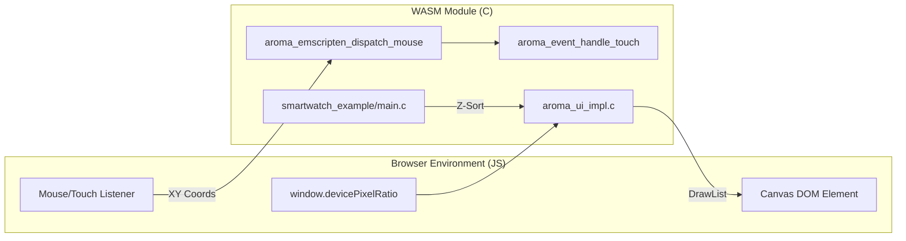
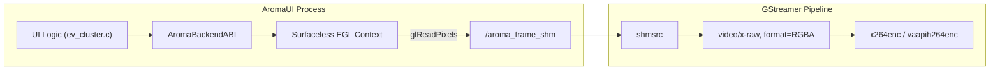

This page documents specialized reference applications and integration examples within the AromaUI ecosystem. These examples demonstrate the framework's versatility across WebAssembly (WASM), headless rendering for multimedia pipelines (GStreamer), and complex widget integrations like the Map system.

## WebAssembly Smartwatch Demo

The Smartwatch example is a high-fidelity reference for wearable HMI design. It leverages the Emscripten platform backend to run in modern web browsers while maintaining high performance through a specialized JS bridge and Z-index management.

### Implementation Details

The demo utilizes a fixed-size canvas of 380x380 pixels [examples/smartwatch_example/main.c14-15](https://github.com/BinaryInkTN/AromaUI/blob/afd1c6b6/examples/smartwatch_example/main.c#L14-L15) It manages complex UI depth using a hierarchical Z-index system to ensure elements like notifications and app panels appear above the watch face.

| Layer Name | Z-Index | Purpose |
| --- | --- | --- |
| `Z_WATCH_FACE` | 1 | Base layer for time and date [examples/smartwatch_example/main.c21](https://github.com/BinaryInkTN/AromaUI/blob/afd1c6b6/examples/smartwatch_example/main.c#L21-L21) |
| `Z_STATS` | 2 | Activity data (steps, heart rate) [examples/smartwatch_example/main.c22](https://github.com/BinaryInkTN/AromaUI/blob/afd1c6b6/examples/smartwatch_example/main.c#L22-L22) |
| `Z_NOTIFICATION` | 10 | Overlay for incoming messages [examples/smartwatch_example/main.c25](https://github.com/BinaryInkTN/AromaUI/blob/afd1c6b6/examples/smartwatch_example/main.c#L25-L25) |
| `Z_APPS_PANEL` | 15 | Full-screen application launcher [examples/smartwatch_example/main.c26](https://github.com/BinaryInkTN/AromaUI/blob/afd1c6b6/examples/smartwatch_example/main.c#L26-L26) |

### JavaScript Bridge and Event Dispatch

To handle input on the web, AromaUI provides a specialized bridge between the browser's DOM events and the C core.

- **`aroma_emscripten_dispatch_mouse`**: A JS-exported function that translates browser mouse/touch coordinates into the framework's internal event system [docs/website/smartwatch_example.js58](https://github.com/BinaryInkTN/AromaUI/blob/afd1c6b6/docs/website/smartwatch_example.js#L58-L58)
- **WASM Heap Management**: The project is compiled with `ALLOW_MEMORY_GROWTH=1` and an initial memory of 128MB to accommodate the font caches and high-resolution assets [examples/map_example/CMakeLists.txt43-44](https://github.com/BinaryInkTN/AromaUI/blob/afd1c6b6/examples/map_example/CMakeLists.txt#L43-L44)
- **DPR Scaling**: The function `aroma_emscripten_device_pixel_ratio`[src/core/aroma_ui_impl.c85-88](https://github.com/BinaryInkTN/AromaUI/blob/afd1c6b6/src/core/aroma_ui_impl.c#L85-L88) queries the browser's `window.devicePixelRatio` to ensure crisp rendering on Retina/High-DPI displays.

### Smartwatch Component Architecture

The following diagram illustrates the relationship between the C state management and the WASM/JS environment.

**WASM Integration and Event Flow**

**Sources:**[examples/smartwatch_example/main.c21-28](https://github.com/BinaryInkTN/AromaUI/blob/afd1c6b6/examples/smartwatch_example/main.c#L21-L28)[src/core/aroma_ui_impl.c84-88](https://github.com/BinaryInkTN/AromaUI/blob/afd1c6b6/src/core/aroma_ui_impl.c#L84-L88)[docs/website/smartwatch_example.js58](https://github.com/BinaryInkTN/AromaUI/blob/afd1c6b6/docs/website/smartwatch_example.js#L58-L58)[examples/map_example/CMakeLists.txt34-45](https://github.com/BinaryInkTN/AromaUI/blob/afd1c6b6/examples/map_example/CMakeLists.txt#L34-L45)

---

## Headless Rendering (GStreamer Example)

The GStreamer example demonstrates how to use AromaUI as a graphics overlay engine for video pipelines. This is achieved by rendering the UI into a shared memory buffer without an active windowing system (headless).

### Surfaceless EGL

The example uses the `AROMA_USE_EGL_SURFACELESS` flag [examples/gstreamer_example/ev_cluster.c1](https://github.com/BinaryInkTN/AromaUI/blob/afd1c6b6/examples/gstreamer_example/ev_cluster.c#L1-L1) to initialize the GLFW/GLES3 backend without a native window.

- **Initialization**: The `initialize_egl_surfaceless` function [src/backends/platforms/aroma_platform_glfw.c63-182](https://github.com/BinaryInkTN/AromaUI/blob/afd1c6b6/src/backends/platforms/aroma_platform_glfw.c#L63-L182) creates an EGL context using `EGL_PBUFFER_BIT` and the `EGL_KHR_surfaceless_context` extension.
- **Pixel Readback**: Instead of `swap_buffers`, the system can use `aroma_ui_read_pixels` (implemented via `glReadPixels`) to extract the frame into a Shared Memory (SHM) segment [examples/gstreamer_example/ev_cluster.c15](https://github.com/BinaryInkTN/AromaUI/blob/afd1c6b6/examples/gstreamer_example/ev_cluster.c#L15-L15)

### Data Flow: Headless Overlay

**Sources:**[examples/gstreamer_example/ev_cluster.c1-18](https://github.com/BinaryInkTN/AromaUI/blob/afd1c6b6/examples/gstreamer_example/ev_cluster.c#L1-L18)[src/backends/platforms/aroma_platform_glfw.c63-172](https://github.com/BinaryInkTN/AromaUI/blob/afd1c6b6/src/backends/platforms/aroma_platform_glfw.c#L63-L172)

---

## Map Widget Example

The Map example demonstrates the `AromaMap` widget, which provides a high-performance interactive map with tile-based rendering.

### Technical Implementation

- **Tile Fetching**: Uses `libcurl` for native platforms and `emscripten_fetch` for the web [examples/map_example/CMakeLists.txt56-67](https://github.com/BinaryInkTN/AromaUI/blob/afd1c6b6/examples/map_example/CMakeLists.txt#L56-L67)
- **Projection**: Implements Spherical Mercator (EPSG:3857) to map geographic coordinates to pixel space.
- **Integration**: Created via the factory function `aroma_ui_map(parent, x, y, w, h)`[include/aroma_ui.h153-158](https://github.com/BinaryInkTN/AromaUI/blob/afd1c6b6/include/aroma_ui.h#L153-L158)
- **Build Configuration**: Requires Vulkan or GLES3 and specifically links `curl` and `pthread` for asynchronous tile loading [examples/map_example/CMakeLists.txt51-69](https://github.com/BinaryInkTN/AromaUI/blob/afd1c6b6/examples/map_example/CMakeLists.txt#L51-L69)

**Sources:**[include/aroma_ui.h153-158](https://github.com/BinaryInkTN/AromaUI/blob/afd1c6b6/include/aroma_ui.h#L153-L158)[examples/map_example/CMakeLists.txt1-71](https://github.com/BinaryInkTN/AromaUI/blob/afd1c6b6/examples/map_example/CMakeLists.txt#L1-L71)

---

## Buzzer Quiz-Game App

The Buzzer project serves as a standalone example of an AromaUI consumer. It showcases:

1. **Custom Styling**: Heavy use of `aroma_iconbutton_create`[src/widgets/aroma_iconbutton.c89](https://github.com/BinaryInkTN/AromaUI/blob/afd1c6b6/src/widgets/aroma_iconbutton.c#L89-L89) and `aroma_card_create` to build a game-show aesthetic.
2. **State Synchronization**: Uses the event system to synchronize "buzzer" presses across multiple simulated clients.
3. **Animation Transitions**: Utilizes `aroma_animation_start`[examples/smartwatch_example/main.c75](https://github.com/BinaryInkTN/AromaUI/blob/afd1c6b6/examples/smartwatch_example/main.c#L75-L75) for sliding scoreboards and pulsing feedback icons.

### Key Widget: IconButton

The Buzzer app relies on the `AromaIconButton` for its main interface [src/widgets/aroma_iconbutton.c13](https://github.com/BinaryInkTN/AromaUI/blob/afd1c6b6/src/widgets/aroma_iconbutton.c#L13-L13)

- **Variants**: Supports `ICON_BUTTON_FILLED`, `ICON_BUTTON_TONAL`, and `ICON_BUTTON_OUTLINED`[src/widgets/aroma_iconbutton.c102-107](https://github.com/BinaryInkTN/AromaUI/blob/afd1c6b6/src/widgets/aroma_iconbutton.c#L102-L107)
- **Interactivity**: Implements internal hit-testing and state tracking (`is_hovered`, `is_pressed`) to trigger visual updates via `aroma_node_invalidate`[src/widgets/aroma_iconbutton.c46-68](https://github.com/BinaryInkTN/AromaUI/blob/afd1c6b6/src/widgets/aroma_iconbutton.c#L46-L68)

**Sources:**[src/widgets/aroma_iconbutton.c13-138](https://github.com/BinaryInkTN/AromaUI/blob/afd1c6b6/src/widgets/aroma_iconbutton.c#L13-L138)[examples/smartwatch_example/main.c71-108](https://github.com/BinaryInkTN/AromaUI/blob/afd1c6b6/examples/smartwatch_example/main.c#L71-L108)