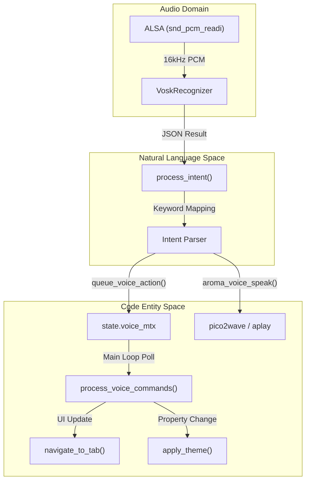
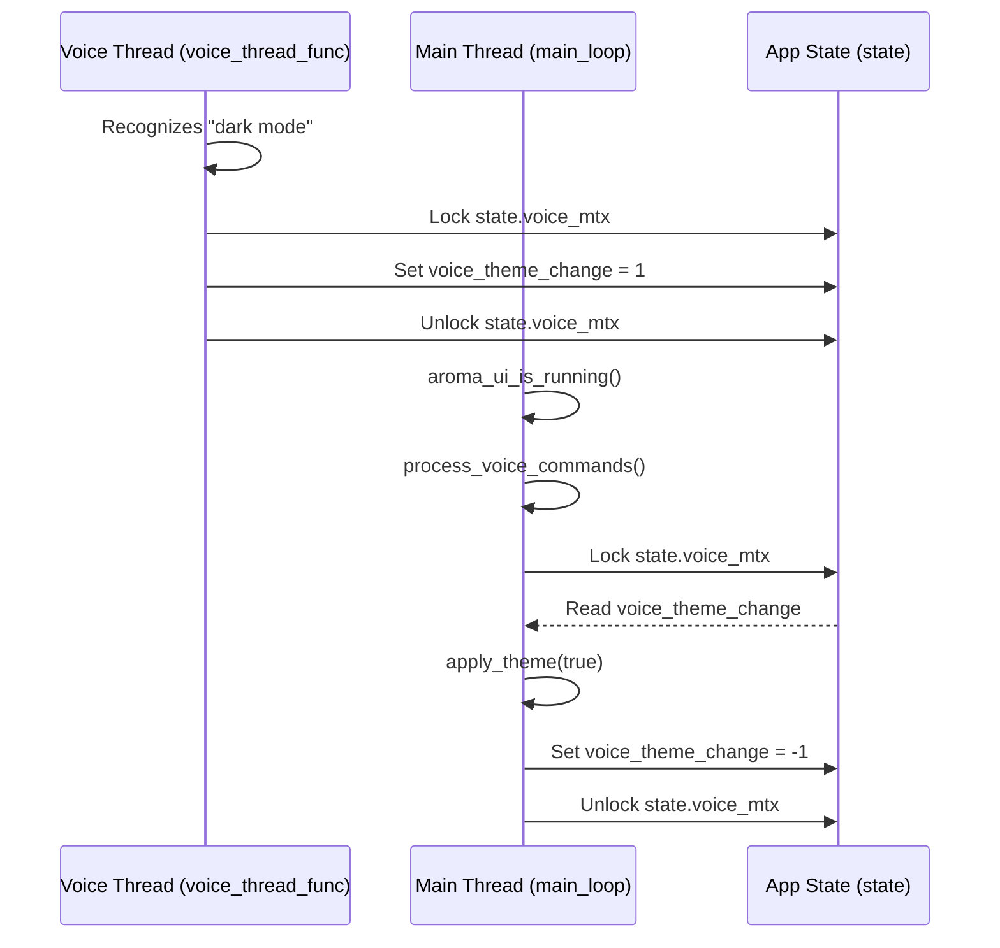

# Voice Control System
Relevant source files
- [docs/ui/animations.md](https://github.com/BinaryInkTN/AromaUI/blob/afd1c6b6/docs/ui/animations.md?plain=1)
- [examples/car_infotainment/assets/backroad_dark.png](https://github.com/BinaryInkTN/AromaUI/blob/afd1c6b6/examples/car_infotainment/assets/backroad_dark.png)
- [examples/car_infotainment/cJSON.c](https://github.com/BinaryInkTN/AromaUI/blob/afd1c6b6/examples/car_infotainment/cJSON.c)
- [examples/car_infotainment/cJSON.h](https://github.com/BinaryInkTN/AromaUI/blob/afd1c6b6/examples/car_infotainment/cJSON.h)
- [examples/car_infotainment/main.c](https://github.com/BinaryInkTN/AromaUI/blob/afd1c6b6/examples/car_infotainment/main.c)
- [examples/car_infotainment/main_loop.c](https://github.com/BinaryInkTN/AromaUI/blob/afd1c6b6/examples/car_infotainment/main_loop.c)
- [examples/car_infotainment/model/README](https://github.com/BinaryInkTN/AromaUI/blob/afd1c6b6/examples/car_infotainment/model/README)
- [examples/car_infotainment/model/am/final.mdl](https://github.com/BinaryInkTN/AromaUI/blob/afd1c6b6/examples/car_infotainment/model/am/final.mdl)
- [examples/car_infotainment/model/conf/mfcc.conf](https://github.com/BinaryInkTN/AromaUI/blob/afd1c6b6/examples/car_infotainment/model/conf/mfcc.conf)
- [examples/car_infotainment/model/graph/disambig_tid.int](https://github.com/BinaryInkTN/AromaUI/blob/afd1c6b6/examples/car_infotainment/model/graph/disambig_tid.int)
- [examples/car_infotainment/model/graph/phones/word_boundary.int](https://github.com/BinaryInkTN/AromaUI/blob/afd1c6b6/examples/car_infotainment/model/graph/phones/word_boundary.int)
- [examples/car_infotainment/model/ivector/final.dubm](https://github.com/BinaryInkTN/AromaUI/blob/afd1c6b6/examples/car_infotainment/model/ivector/final.dubm)
- [examples/car_infotainment/model/ivector/final.ie](https://github.com/BinaryInkTN/AromaUI/blob/afd1c6b6/examples/car_infotainment/model/ivector/final.ie)
- [examples/car_infotainment/model/ivector/final.mat](https://github.com/BinaryInkTN/AromaUI/blob/afd1c6b6/examples/car_infotainment/model/ivector/final.mat)
- [examples/car_infotainment/voice_control.c](https://github.com/BinaryInkTN/AromaUI/blob/afd1c6b6/examples/car_infotainment/voice_control.c)
- [examples/car_infotainment/voice_control.h](https://github.com/BinaryInkTN/AromaUI/blob/afd1c6b6/examples/car_infotainment/voice_control.h)
- [examples/car_infotainment/voice_handler.c](https://github.com/BinaryInkTN/AromaUI/blob/afd1c6b6/examples/car_infotainment/voice_handler.c)
- [examples/car_infotainment/vosk_lib/vosk_api.h](https://github.com/BinaryInkTN/AromaUI/blob/afd1c6b6/examples/car_infotainment/vosk_lib/vosk_api.h)

The AromaUI Voice Control System is a high-performance, offline-capable voice assistant integrated into the AromaOS reference application. It leverages the **Vosk** speech recognition engine and **ALSA** for low-latency audio capture on Linux-based systems. The system provides a natural language interface for vehicle functions such as climate control, media playback, navigation, and system settings.

## System Architecture

The voice control system operates in a dedicated background thread to ensure that audio processing and neural network inference do not block the UI rendering pipeline. It communicates with the main UI thread via an asynchronous action queue protected by mutexes.

### Audio Pipeline and Recognition

Audio is captured via ALSA at a 16kHz sample rate, mono, 16-bit PCM format [examples/car_infotainment/voice_control.c146-152](https://github.com/BinaryInkTN/AromaUI/blob/afd1c6b6/examples/car_infotainment/voice_control.c#L146-L152) The raw audio buffer is fed into a `VoskRecognizer` which utilizes a pre-trained Kaldi-based model located in the `../model` directory [examples/car_infotainment/voice_control.c153-160](https://github.com/BinaryInkTN/AromaUI/blob/afd1c6b6/examples/car_infotainment/voice_control.c#L153-L160)

### Data Flow Diagram

The following diagram illustrates the flow from raw audio capture to UI state updates.

**Audio Processing to UI Action Flow**

Sources: [examples/car_infotainment/voice_control.c39-144](https://github.com/BinaryInkTN/AromaUI/blob/afd1c6b6/examples/car_infotainment/voice_control.c#L39-L144)[examples/car_infotainment/voice_handler.c170-240](https://github.com/BinaryInkTN/AromaUI/blob/afd1c6b6/examples/car_infotainment/voice_handler.c#L170-L240)[examples/car_infotainment/main_loop.c208-211](https://github.com/BinaryInkTN/AromaUI/blob/afd1c6b6/examples/car_infotainment/main_loop.c#L208-L211)

## Wake Word and Activation

The system supports two activation methods:

1. **Wake Word Detection:** The recognizer constantly listens for "hey aroma" or "aroma" [examples/car_infotainment/voice_control.c40-41](https://github.com/BinaryInkTN/AromaUI/blob/afd1c6b6/examples/car_infotainment/voice_control.c#L40-L41)
2. **Manual Wake Window:** A physical or UI button (e.g., the voice icon in the status bar) can call `trigger_manual_wake()`. This sets `manual_wake_time` to the current timestamp [examples/car_infotainment/voice_control.c35-37](https://github.com/BinaryInkTN/AromaUI/blob/afd1c6b6/examples/car_infotainment/voice_control.c#L35-L37) The system remains in an "active listening" state for a 6-second window, allowing commands to be issued without the wake word [examples/car_infotainment/voice_control.c23-25](https://github.com/BinaryInkTN/AromaUI/blob/afd1c6b6/examples/car_infotainment/voice_control.c#L23-L25)

## Intent Parsing and Mapping

The `process_intent` function acts as the primary bridge between recognized text and system logic. It uses keyword matching to map speech to specific functions.

| Intent Category | Keywords | Code Entity / Action |
| --- | --- | --- |
| **Navigation** | "navigate to [city]" | `queue_voice_navigation(dest)`[examples/car_infotainment/voice_control.c103-111](https://github.com/BinaryInkTN/AromaUI/blob/afd1c6b6/examples/car_infotainment/voice_control.c#L103-L111) |
| **Climate** | "ac up", "hotter", "colder" | `queue_voice_ac_action(delta)`[examples/car_infotainment/voice_control.c71-78](https://github.com/BinaryInkTN/AromaUI/blob/afd1c6b6/examples/car_infotainment/voice_control.c#L71-L78) |
| **Media** | "play music", "pause song" | `queue_voice_action(-1, ...)`[examples/car_infotainment/voice_control.c44-50](https://github.com/BinaryInkTN/AromaUI/blob/afd1c6b6/examples/car_infotainment/voice_control.c#L44-L50) |
| **Theming** | "dark mode", "light theme" | `queue_voice_theme(1/0)`[examples/car_infotainment/voice_control.c61-70](https://github.com/BinaryInkTN/AromaUI/blob/afd1c6b6/examples/car_infotainment/voice_control.c#L61-L70) |
| **App Switching** | "settings", "phone", "home" | `queue_voice_action(tab_index, ...)`[examples/car_infotainment/voice_control.c91-102](https://github.com/BinaryInkTN/AromaUI/blob/afd1c6b6/examples/car_infotainment/voice_control.c#L91-L102) |

### Implementation Detail: Navigation Parsing

When "navigate to" is detected, the system extracts the destination string by offsetting the pointer [examples/car_infotainment/voice_control.c104-105](https://github.com/BinaryInkTN/AromaUI/blob/afd1c6b6/examples/car_infotainment/voice_control.c#L104-L105) This string is passed to `queue_voice_navigation`, which later performs a lookup against a `CityMap` (containing coordinates for Paris, London, New York, etc.) during the UI thread's processing phase [examples/car_infotainment/voice_handler.c179-203](https://github.com/BinaryInkTN/AromaUI/blob/afd1c6b6/examples/car_infotainment/voice_handler.c#L179-L203)

## UI Thread Synchronization

Voice actions are queued into the global `state` object using thread-safe "queue" functions. These functions lock `state.voice_mtx` before modifying command flags [examples/car_infotainment/voice_handler.c112-126](https://github.com/BinaryInkTN/AromaUI/blob/afd1c6b6/examples/car_infotainment/voice_handler.c#L112-L126)

**Voice Action Synchronization**

Sources: [examples/car_infotainment/voice_control.c66-70](https://github.com/BinaryInkTN/AromaUI/blob/afd1c6b6/examples/car_infotainment/voice_control.c#L66-L70)[examples/car_infotainment/voice_handler.c88-94](https://github.com/BinaryInkTN/AromaUI/blob/afd1c6b6/examples/car_infotainment/voice_handler.c#L88-L94)[examples/car_infotainment/voice_handler.c233-240](https://github.com/BinaryInkTN/AromaUI/blob/afd1c6b6/examples/car_infotainment/voice_handler.c#L233-L240)

## Text-to-Speech (TTS)

Feedback is provided via the `aroma_voice_speak` function. It utilizes `pico2wave` to generate a temporary WAV file and `aplay` for playback [examples/car_infotainment/voice_control.c27-33](https://github.com/BinaryInkTN/AromaUI/blob/afd1c6b6/examples/car_infotainment/voice_control.c#L27-L33)

- **Command:**`pico2wave -w /tmp/aroma_tts.wav "%s" && aplay -q /tmp/aroma_tts.wav &`
- The process is spawned as a background shell command to prevent audio playback from stalling the voice recognition thread [examples/car_infotainment/voice_control.c30](https://github.com/BinaryInkTN/AromaUI/blob/afd1c6b6/examples/car_infotainment/voice_control.c#L30-L30)

## Visual Feedback (Voice Status UI)

The UI provides real-time feedback of the voice assistant's state through a "Voice Status Card."

- **Partial Results:** As the user speaks, `queue_voice_partial` updates the UI with intermediate transcriptions [examples/car_infotainment/voice_handler.c74-86](https://github.com/BinaryInkTN/AromaUI/blob/afd1c6b6/examples/car_infotainment/voice_handler.c#L74-L86)
- **Animations:** When the assistant activates, the `voice_status_card` slides into view from the top of the screen (`AROMA_ANIM_SLIDE_Y`) and a `loading_spinner` is revealed [examples/car_infotainment/voice_handler.c45-52](https://github.com/BinaryInkTN/AromaUI/blob/afd1c6b6/examples/car_infotainment/voice_handler.c#L45-L52)
- **Timeouts:** If no command is finalized, the status label clears after a timeout (approx. 180 frames) [examples/car_infotainment/voice_handler.c221-230](https://github.com/BinaryInkTN/AromaUI/blob/afd1c6b6/examples/car_infotainment/voice_handler.c#L221-L230)

Sources: [examples/car_infotainment/voice_handler.c31-61](https://github.com/BinaryInkTN/AromaUI/blob/afd1c6b6/examples/car_infotainment/voice_handler.c#L31-L61)[examples/car_infotainment/voice_handler.c217-230](https://github.com/BinaryInkTN/AromaUI/blob/afd1c6b6/examples/car_infotainment/voice_handler.c#L217-L230)