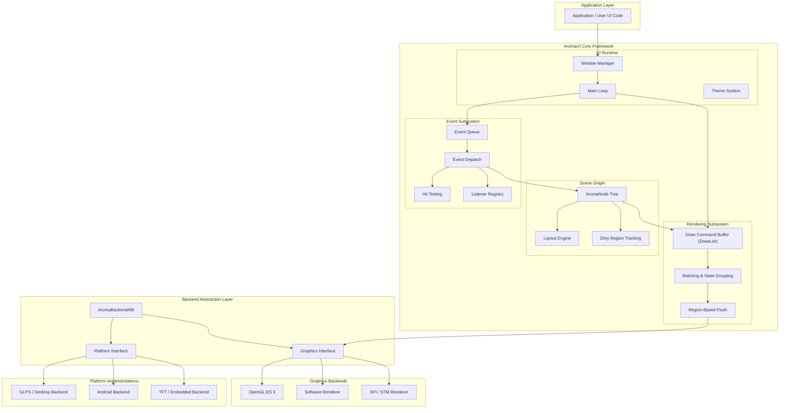

## Overview

AromaUI is a modular, cross-platform retained-mode UI framework designed for embedded systems, Android environments, desktop platforms, and software-rendered targets.

The architecture follows a strict layered design to ensure:

* Clear separation of concerns
* Backend independence
* Deterministic memory behavior (embedded-friendly)
* Scalable rendering performance
* Maintainable subsystem boundaries

## High-Level Architecture Diagram

## Layer Breakdown

### 1. Application Layer

The application layer contains user-defined UI components and business logic. Applications interact with AromaUI through the Window Manager and Scene Graph APIs.

Responsibilities:

* Create windows and UI trees
* Register event listeners
* Trigger state updates
* Drive application-specific logic

### 2. AromaUI Core Framework

The core framework is divided into four primary subsystems.

#### UI Runtime

Manages lifecycle and execution.

* Window Manager - controls window instances and root nodes
* Main Loop - drives update and render cycles
* Theme System - centralized styling and visual configuration

#### Scene Graph

A retained tree of UI nodes.

* AromaNode Tree - hierarchical UI structure
* Layout Engine - computes size and position
* Dirty Region Tracking - tracks areas requiring redraw

#### Event Subsystem

Handles input and dispatch.

* Event Queue - buffered input events
* Event Dispatch - hierarchical propagation
* Hit Testing - resolves target node
* Listener Registry - efficient listener lookup

#### Rendering Subsystem

Command-buffer-based rendering pipeline.

* DrawList - records draw commands
* Batching & State Grouping - minimizes backend calls
* Region-Based Flush - partial screen updates

### 3. Backend Abstraction Layer

Provides strict decoupling between the core engine and platform-specific implementations.

* AromaBackendABI - entry point binding runtime to platform
* Platform Interface - OS/window/input abstraction
* Graphics Interface - rendering abstraction

This design allows the core to remain platform-agnostic.

### 4. Platform Implementations

Platform-specific bindings provide:

* Window creation
* Input integration
* System lifecycle hooks

Examples:

* Desktop (GLPS)
* Android
* Embedded (TFT/SPI devices)

### 5. Graphics Backends

Rendering backends implement the Graphics Interface.

Supported targets:

* OpenGL ES 3
* Software rasterizer
* SPI/STM display renderer

Each backend receives pre-batched draw commands from the DrawList.

## Data Flow Summary

1. Application triggers state changes.
2. Runtime processes input events.
3. Events are dispatched through the scene graph.
4. Dirty regions are marked.
5. Draw commands are recorded.
6. Commands are batched.
7. Dirty regions are flushed to the active graphics backend.

## Architectural Principles

* Layered separation of concerns
* Retained-mode scene graph
* Command-buffer rendering
* Backend abstraction
* Embedded-first determinism
* Region-based redraw optimization

## Intended Evolution

The architecture supports future expansion including:

* Multi-window compositing
* Threaded rendering pipelines
* GPU resource management layers
* Advanced animation systems
* Custom layout strategies

