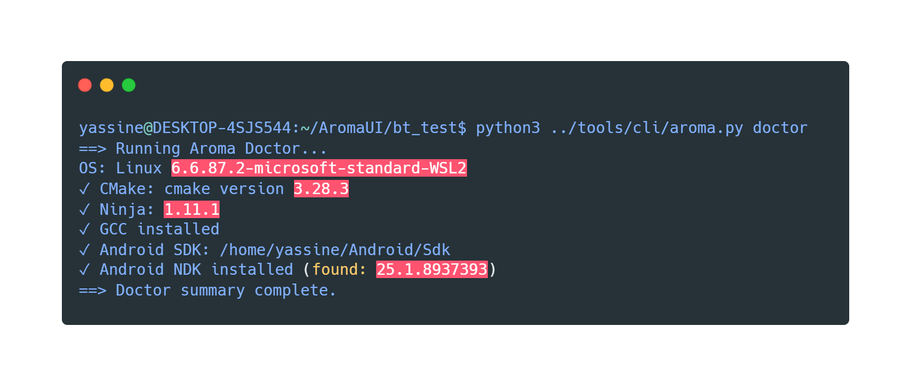
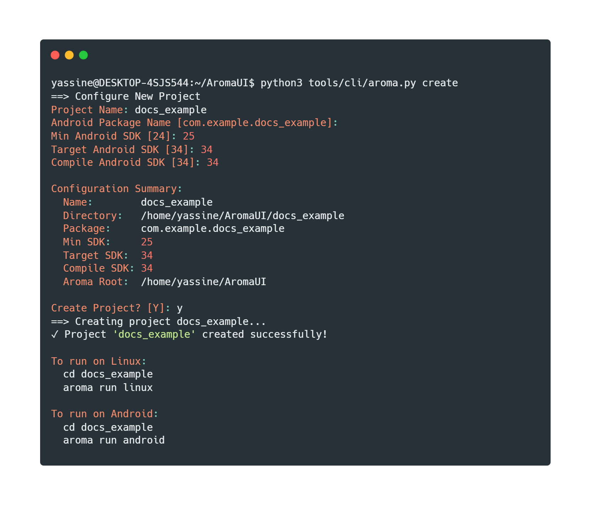

# Getting Started with AromaUI CLI

AromaUI CLI is a command-line tool for creating, building, and running cross-platform C applications using AromaUI. It supports:

* Linux (native desktop builds using CMake)
* Android (NDK + NativeActivity via Gradle)

This guide walks you through installation, project creation, building, and running your first application.

---

# 1. Prerequisites

## Linux Requirements

Make sure the following tools are installed:

* GCC
* CMake
* Make
* Ninja (optional but recommended)
* Java (required for Android builds)

You can verify your environment using:

```
aroma doctor
```



The doctor command checks:

* CMake installation
* Ninja installation
* GCC availability
* Android SDK and NDK setup

If Android SDK or NDK is missing, the tool can install it automatically.

---

# 2. Installing Android SDK & NDK (Optional)

If you plan to build for Android, you must install:

* Android SDK
* Android NDK
* Platform tools
* Build tools
* CMake (Android version)

You can install everything automatically:

```
aroma install-sdk
```

Or allow the CLI to install it automatically during:

```
aroma doctor
```

or

```
aroma build android
```

The SDK will be installed in:

```
~/Android/Sdk
```

unless ANDROID_HOME is already defined.

---

# 3. Creating a New Project

To create a new project:

```
aroma create MyApp
```

If no name is provided:

```
aroma create
```

You will be prompted for:

* Project name
* Android package name (e.g. com.example.myapp)
* Minimum SDK version
* Target SDK version
* Compile SDK version




## Project Structure

After creation:

```
MyApp/
├── CMakeLists.txt
├── src/
│   ├── main.c
│   └── logo.h
└── android/
    ├── app/
    ├── gradlew
    └── build.gradle
```

The project is immediately ready to build.

---

# 4. Building the Project

Navigate into your project directory:

```
cd MyApp
```

## Build for Linux

```
aroma build linux
```

This will:

* Create a build/ directory
* Run CMake configuration
* Compile using make

Output binary will be inside:

```
build/
```

---

## Build for Android

```
aroma build android
```

This will:

* Validate SDK/NDK
* Configure Gradle project
* Build debug APK

Generated APK location:

```
android/app/build/outputs/apk/debug/app-debug.apk
```

---

# 5. Running the Project

## Run on Linux

```
aroma run linux
```

This will:

* Build the project
* Locate the executable
* Launch it automatically

---

## Run on Android (Connected Device)

Connect a device via USB with USB debugging enabled, then:

```
aroma run android
```

This will:

* Build the APK
* Install it using adb
* Launch the NativeActivity

---

## Run on Android Emulator

You can automatically create and launch an emulator:

```
aroma run android --emu
```

This will:

* Install missing emulator components
* Create an AVD if needed
* Boot the emulator
* Wait for full boot completion
* Install and launch the app

---

# 6. Useful Commands Overview

Check environment:

```
aroma doctor
```

Install Android SDK & NDK:

```
aroma install-sdk
```

Create new project:

```
aroma create MyApp
```

Build project:

```
aroma build linux
aroma build android
```

Run project:

```
aroma run linux
aroma run android
aroma run android --emu
```

---

# 7. Environment Variables

The following variables may be used:

ANDROID_HOME
ANDROID_NDK_HOME
JAVA_HOME

If not defined, the CLI attempts to auto-detect common locations.

---

# 8. Troubleshooting

If builds fail:

1. Run:

   ```
   aroma doctor
   ```

2. Ensure Java is installed.

3. Ensure ANDROID_HOME is correctly set.

4. Verify adb works:

   ```
   adb devices
   ```

5. If Android SDK is missing, run:

   ```
   aroma install-sdk
   ```

---

# 9. Next Steps

* Modify src/main.c to build your UI.
* Extend CMakeLists.txt if needed.
* Customize the Android Gradle project inside android/.

Your AromaUI project is now ready for cross-platform development.
