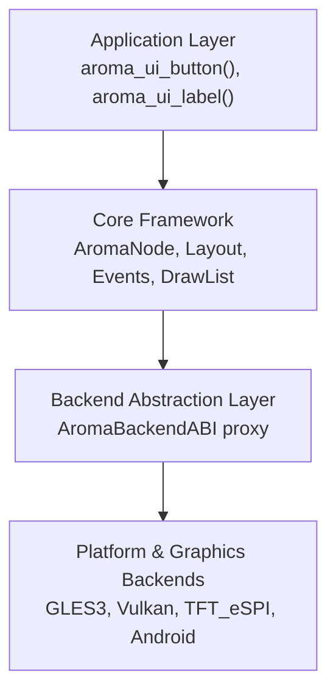

AromaUI has four layers. Learn these layers once and the rest of the framework makes sense.

## System Layers

1. **Application Layer**: your code. Call factory functions from `include/aroma_ui.h` to build the scene graph.
2. **Core Framework**: shared logic. It owns the `AromaNode` tree, layout, events, and rendering.
3. **ABI**: a switchboard. It sends generic draw calls to the active backend.
4. **Backends**: platform code. It handles windows, input, and GPU output.

## Key Concepts

### AromaNode

Each visible item is an `AromaNode`. Nodes form a tree. Each parent holds up to 64 children. Each node stores:

* Geometry (`AromaRect`)
* Layout hints (`AromaLayout`)
* Visibility and Z-index
* A `draw_cb` function for rendering

### Dirty Region Tracking

Only changed nodes redraw. After you change a property, call `aroma_node_invalidate()`. The framework tracks dirty nodes and skips the rest.

### DrawList

Widgets do not draw at once. They record commands into an `AromaDrawList`. On flush, the list sorts by Z-index and sends batches to the GPU. This gives you:

* Correct Z order in any tree order
* Skipped offscreen nodes
* Fast batches on small hardware

## Data Flow: A Button Click

```mermaid
flowchart LR
    Touch["User Touch"] --> Platform["Platform Backend<br/>captures event"]
    Platform --> EventSys["Event System<br/>queues + hit-tests"]
    EventSys --> Button["Button listener fires"]
    Button --> Callback["Your callback runs"]
    Callback --> Invalidate["aroma_node_invalidate(button)"]
    Invalidate --> Frame["Next frame:<br/>layout + draw"]
    Frame --> DrawList["DrawList records commands"]
    DrawList --> ABI["ABI routes to<br/>GLES3/Vulkan/TFT"]
    ABI --> Screen["Screen updates"]
```

## File Map

| Area | Key Files |
|---|---|
| Entry points | `include/aroma_ui.h`, `src/core/aroma_ui_impl.c` |
| Node system | `include/aroma_node.h`, `src/core/aroma_node.c` |
| Layout | `src/core/aroma_layout.c` |
| Events | `src/core/aroma_event.c` |
| Rendering | `src/core/aroma_drawlist.c`, `src/backends/aroma_abi.c` |
| Graphics | `src/backends/graphics/aroma_graphics_gles3.c` |
| Platforms | `src/backends/platforms/aroma_platform_glfw.c` |

## What's Next

* Read [Scene Graph](Scene-Graph-and-Node-System.md) for node lifecycle.
* Read [Events](Event-System.md) for input flow.
* Read [Rendering Pipeline](Rendering-Pipeline-and-DrawList.md) for draw details.
