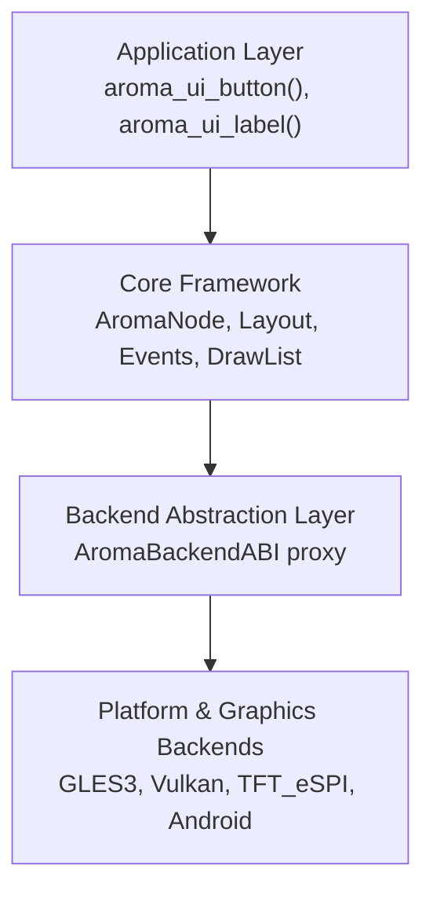

AromaUI is structured in four layers. Understanding these layers helps you write efficient, portable UI code.

## System Layers

1. **Application Layer** - Your code. Uses factory functions from `include/aroma_ui.h` to build the scene graph.
2. **Core Framework** - Platform-agnostic logic: `AromaNode` tree, recursive layout, event dispatch, deferred rendering.
3. **ABI** - A switchboard that routes generic draw calls to the active backend.
4. **Backends** - Hardware-specific implementations for windowing, input, and GPU rendering.

## Key Concepts

### AromaNode

Every visible element is an `AromaNode`. Nodes form a tree with a 64-child limit per parent. Each node stores:
- Geometry (`AromaRect`)
- Layout hints (`AromaLayout`)
- Visibility and Z-index
- A `draw_cb` function pointer for rendering

### Dirty-Region Tracking

Only changed nodes are redrawn. When you update a property, call `aroma_node_invalidate()`. The framework tracks dirty nodes in a global array and re-renders only what changed.

### DrawList (Deferred Rendering)

Instead of drawing immediately, widgets record commands into an `AromaDrawList`. On flush, commands are sorted by Z-index and batched for the GPU. This enables:
- Correct Z-ordering regardless of tree position
- Frustum culling (skip offscreen nodes)
- Efficient batching on embedded hardware

## Data Flow: A Button Click

```mermaid
flowchart LR
    Touch["User Touch"] --> Platform["Platform Backend<br/>captures event"]
    Platform --> EventSys["Event System<br/>queues + hit-tests"]
    EventSys --> Button["Button listener fires"]
    Button --> Callback["Your callback runs"]
    Callback --> Invalidate["aroma_node_invalidate(button)"]
    Invalidate --> Frame["Next frame:<br/>layout + draw"]
    Frame --> DrawList["DrawList records commands"]
    DrawList --> ABI["ABI routes to<br/>GLES3/Vulkan/TFT"]
    ABI --> Screen["Screen updates"]
```

## File Map

| Concern | Key Files |
|---|---|
| Entry points | `include/aroma_ui.h`, `src/core/aroma_ui_impl.c` |
| Node system | `include/aroma_node.h`, `src/core/aroma_node.c` |
| Layout | `src/core/aroma_layout.c` |
| Events | `src/core/aroma_event.c` |
| Rendering | `src/core/aroma_drawlist.c`, `src/backends/aroma_abi.c` |
| Graphics | `src/backends/graphics/aroma_graphics_gles3.c` |
| Platforms | `src/backends/platforms/aroma_platform_glfw.c` |

## What's Next

- Dive into the [Scene Graph](Scene-Graph-and-Node-System.md) to understand node lifecycle.
- Learn how [Events](Event-System.md) flow through the system.
- Explore the [Rendering Pipeline](Rendering-Pipeline-and-DrawList.md) for draw optimization details.
