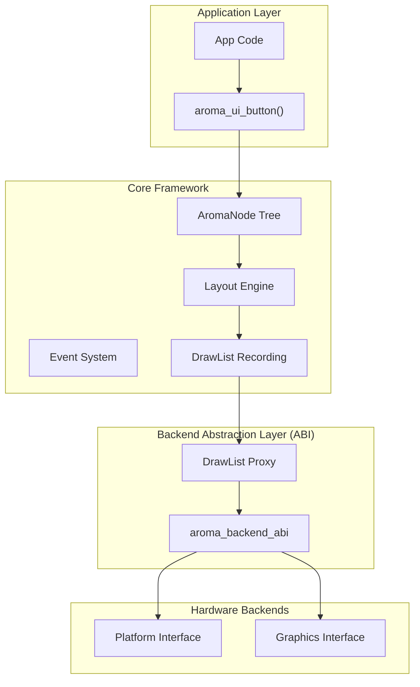
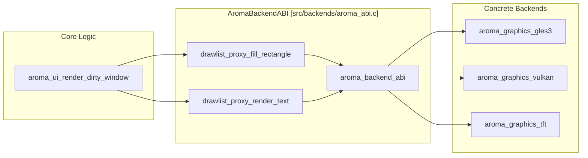

# Architecture Overview
Relevant source files
- [docs-config.json](https://github.com/BinaryInkTN/AromaUI/blob/afd1c6b6/docs-config.json)
- [docs/docs.pdf](https://github.com/BinaryInkTN/AromaUI/blob/afd1c6b6/docs/docs.pdf)
- [docs/index.html](https://github.com/BinaryInkTN/AromaUI/blob/afd1c6b6/docs/index.html)
- [examples/gstreamer_example/ev_cluster.c](https://github.com/BinaryInkTN/AromaUI/blob/afd1c6b6/examples/gstreamer_example/ev_cluster.c)
- [include/aroma_ui.h](https://github.com/BinaryInkTN/AromaUI/blob/afd1c6b6/include/aroma_ui.h)
- [include/widgets/aroma_window.h](https://github.com/BinaryInkTN/AromaUI/blob/afd1c6b6/include/widgets/aroma_window.h)
- [src/backends/aroma_abi.c](https://github.com/BinaryInkTN/AromaUI/blob/afd1c6b6/src/backends/aroma_abi.c)
- [src/backends/aroma_abi.h](https://github.com/BinaryInkTN/AromaUI/blob/afd1c6b6/src/backends/aroma_abi.h)
- [src/backends/platforms/aroma_platform_glfw.c](https://github.com/BinaryInkTN/AromaUI/blob/afd1c6b6/src/backends/platforms/aroma_platform_glfw.c)
- [src/backends/platforms/aroma_platform_interface.h](https://github.com/BinaryInkTN/AromaUI/blob/afd1c6b6/src/backends/platforms/aroma_platform_interface.h)
- [src/core/aroma_ui_impl.c](https://github.com/BinaryInkTN/AromaUI/blob/afd1c6b6/src/core/aroma_ui_impl.c)
- [src/widgets/aroma_window.c](https://github.com/BinaryInkTN/AromaUI/blob/afd1c6b6/src/widgets/aroma_window.c)
- [tools/cli/aroma_docsgen.py](https://github.com/BinaryInkTN/AromaUI/blob/afd1c6b6/tools/cli/aroma_docsgen.py)

AromaUI is built on a strict four-layer architecture designed to provide native performance while maintaining high portability across desktop (Linux), mobile (Android), and resource-constrained embedded systems (ESP32/TFT). The framework enforces a clear separation between application logic, UI state management, platform services, and hardware-accelerated rendering.

### System Hierarchy

The system is organized into the following layers:

1. **Application Layer**: Consumer code using the `aroma_ui_*` factory functions and high-level widget APIs [include/aroma_ui.h135-158](https://github.com/BinaryInkTN/AromaUI/blob/afd1c6b6/include/aroma_ui.h#L135-L158)
2. **Core Framework**: Manages the `AromaNode` scene graph, the recursive layout engine, the event dispatch system, and the deferred rendering pipeline [src/core/aroma_ui_impl.c165-166](https://github.com/BinaryInkTN/AromaUI/blob/afd1c6b6/src/core/aroma_ui_impl.c#L165-L166)
3. **Backend Abstraction Layer (ABI)**: A proxy layer (`AromaBackendABI`) that routes generic draw and platform commands to the appropriate backend [src/backends/aroma_abi.c27-35](https://github.com/BinaryInkTN/AromaUI/blob/afd1c6b6/src/backends/aroma_abi.c#L27-L35)
4. **Platform & Graphics Backends**: Hardware-specific implementations for input, windowing (GLPS, GLFW, Android), and rendering (GLES3, Vulkan, TFT_eSPI) [src/backends/aroma_abi.h6-20](https://github.com/BinaryInkTN/AromaUI/blob/afd1c6b6/src/backends/aroma_abi.h#L6-L20)

### Architectural Flow

The following diagram illustrates the data flow from a high-level widget creation to low-level hardware execution.

**Diagram: System Layer Interaction**

**Sources:**[src/core/aroma_ui_impl.c1-15](https://github.com/BinaryInkTN/AromaUI/blob/afd1c6b6/src/core/aroma_ui_impl.c#L1-L15)[src/backends/aroma_abi.h27-35](https://github.com/BinaryInkTN/AromaUI/blob/afd1c6b6/src/backends/aroma_abi.h#L27-L35)[include/aroma_ui.h1-23](https://github.com/BinaryInkTN/AromaUI/blob/afd1c6b6/include/aroma_ui.h#L1-L23)

---

### Core Concepts

#### AromaNode (The Scene Graph)

Every UI element in AromaUI is an `AromaNode`. It is the base unit of the scene graph, holding geometric data, visibility states, and parent-child relationships [include/aroma_ui.h36-62](https://github.com/BinaryInkTN/AromaUI/blob/afd1c6b6/include/aroma_ui.h#L36-L62) Nodes are allocated via a slab allocator to ensure deterministic performance on embedded targets [src/core/aroma_ui_impl.c7-8](https://github.com/BinaryInkTN/AromaUI/blob/afd1c6b6/src/core/aroma_ui_impl.c#L7-L8)

#### Dirty-Region Tracking

AromaUI employs an invalidation-based rendering model. When a node's state changes (e.g., a button is pressed), it is marked as "dirty" [src/core/aroma_ui_impl.c221-222](https://github.com/BinaryInkTN/AromaUI/blob/afd1c6b6/src/core/aroma_ui_impl.c#L221-L222) The framework tracks these regions and only re-renders windows that have entries in the global dirty list [src/core/aroma_ui_impl.c225-229](https://github.com/BinaryInkTN/AromaUI/blob/afd1c6b6/src/core/aroma_ui_impl.c#L225-L229)

#### DrawList and Deferred Rendering

To optimize batching, AromaUI does not issue immediate draw calls. Instead, it records commands into an `AromaDrawList`[src/core/aroma_ui_impl.c62](https://github.com/BinaryInkTN/AromaUI/blob/afd1c6b6/src/core/aroma_ui_impl.c#L62-L62) During the render phase, these commands are sorted (e.g., by Z-index) and then flushed to the graphics backend through the ABI [src/core/aroma_ui_impl.c71-75](https://github.com/BinaryInkTN/AromaUI/blob/afd1c6b6/src/core/aroma_ui_impl.c#L71-L75)

---

### Backend Abstraction Layer (ABI)

The `AromaBackendABI` acts as a central switchboard. It allows the Core Framework to remain platform-agnostic while supporting diverse environments like Android or surfaceless EGL clusters [src/backends/aroma_abi.c13-32](https://github.com/BinaryInkTN/AromaUI/blob/afd1c6b6/src/backends/aroma_abi.c#L13-L32)

**Diagram: ABI Proxy Pattern**

**Sources:**[src/backends/aroma_abi.c51-63](https://github.com/BinaryInkTN/AromaUI/blob/afd1c6b6/src/backends/aroma_abi.c#L51-L63)[src/backends/aroma_abi.c93-104](https://github.com/BinaryInkTN/AromaUI/blob/afd1c6b6/src/backends/aroma_abi.c#L93-L104)[src/backends/aroma_abi.h27-35](https://github.com/BinaryInkTN/AromaUI/blob/afd1c6b6/src/backends/aroma_abi.h#L27-L35)

---

### Data Flow: Frame Lifecycle

The frame lifecycle is managed by the platform's event loop (e.g., GLFW or Android's `Choreographer`) [src/backends/platforms/aroma_platform_interface.h99-103](https://github.com/BinaryInkTN/AromaUI/blob/afd1c6b6/src/backends/platforms/aroma_platform_interface.h#L99-L103)

| Phase | Description | Key Functions |
| --- | --- | --- |
| **Input** | Platform captures raw input and sends to Event System. | `run_event_loop`[src/backends/platforms/aroma_platform_interface.h103](https://github.com/BinaryInkTN/AromaUI/blob/afd1c6b6/src/backends/platforms/aroma_platform_interface.h#L103-L103) |
| **Layout** | Recursive pass to calculate node bounds. | `aroma_node_update_layout`[src/widgets/aroma_window.c38](https://github.com/BinaryInkTN/AromaUI/blob/afd1c6b6/src/widgets/aroma_window.c#L38-L38) |
| **Record** | Nodes record draw commands into the `AromaDrawList`. | `aroma_drawlist_cmd_fill_rect`[src/backends/aroma_abi.c56](https://github.com/BinaryInkTN/AromaUI/blob/afd1c6b6/src/backends/aroma_abi.c#L56-L56) |
| **Batch** | Sort tasks by Z-index and apply frustum culling. | `collect_draw_tasks`[src/core/aroma_ui_impl.c71-73](https://github.com/BinaryInkTN/AromaUI/blob/afd1c6b6/src/core/aroma_ui_impl.c#L71-L73) |
| **Flush** | ABI routes batched commands to the Graphics Backend. | `swap_buffers`[src/backends/platforms/aroma_platform_interface.h108](https://github.com/BinaryInkTN/AromaUI/blob/afd1c6b6/src/backends/platforms/aroma_platform_interface.h#L108-L108) |

**Sources:**[src/core/aroma_ui_impl.c68-75](https://github.com/BinaryInkTN/AromaUI/blob/afd1c6b6/src/core/aroma_ui_impl.c#L68-L75)[src/backends/platforms/aroma_platform_interface.h35-108](https://github.com/BinaryInkTN/AromaUI/blob/afd1c6b6/src/backends/platforms/aroma_platform_interface.h#L35-L108)[src/widgets/aroma_window.c32-42](https://github.com/BinaryInkTN/AromaUI/blob/afd1c6b6/src/widgets/aroma_window.c#L32-L42)