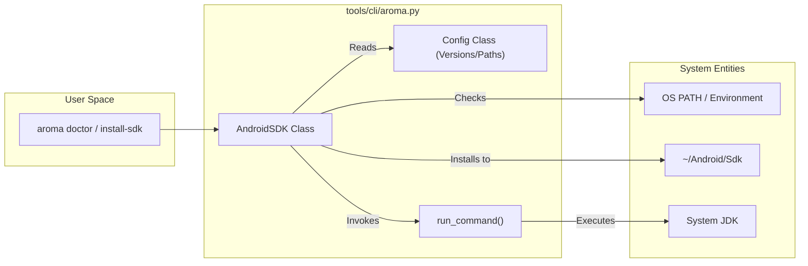
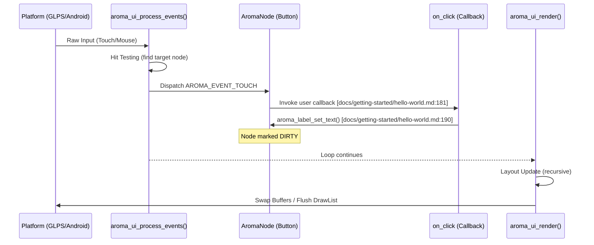

This page provides a comprehensive guide for new developers to set up the AromaUI environment, create a new project, and deploy a "Hello World" application across Linux, Android, and Web platforms.

## 1. Environment Setup

The AromaUI toolchain is centered around a Python-based CLI utility named `aroma`. This tool abstracts complex build systems like CMake, Gradle, and Emscripten to provide a unified developer experience.

### 1.1. Cloning the Repository

To begin, clone the repository and its submodules. The `--recursive` flag is mandatory as AromaUI relies on several vendor dependencies (e.g., FreeType, GLES headers) located in submodules [docs/getting-started/installation.md3-9](https://github.com/BinaryInkTN/AromaUI/blob/afd1c6b6/docs/getting-started/installation.md?plain=1#L3-L9)

```
git clone https://github.com/BinaryInkTN/AromaUI.git --recursive
```

### 1.2. Installing the CLI

The `aroma` command is a wrapper script located at `bin/aroma`[bin/aroma1-10](https://github.com/BinaryInkTN/AromaUI/blob/afd1c6b6/bin/aroma#L1-L10) which invokes the core logic in `tools/cli/aroma.py`[tools/cli/aroma.py1-138](https://github.com/BinaryInkTN/AromaUI/blob/afd1c6b6/tools/cli/aroma.py#L1-L138) To use it globally:

1. Locate the `bin/` directory within the cloned repository.
2. Add this directory to your system's `PATH` environment variable [docs/getting-started/installation.md11-12](https://github.com/BinaryInkTN/AromaUI/blob/afd1c6b6/docs/getting-started/installation.md?plain=1#L11-L12)

### 1.3. Dependency Validation (`aroma doctor`)

The `aroma doctor` command validates your local environment, checking for essential tools such as CMake, GCC, Java, and the Android SDK/NDK [docs/getting-started/installation.md18-31](https://github.com/BinaryInkTN/AromaUI/blob/afd1c6b6/docs/getting-started/installation.md?plain=1#L18-L31)

**Toolchain Validation Logic**
The `aroma doctor` command executes the `AndroidSDK` class methods to locate existing installations in common paths like `~/Android/Sdk` or `/usr/lib/android-sdk`[tools/cli/aroma.py144-164](https://github.com/BinaryInkTN/AromaUI/blob/afd1c6b6/tools/cli/aroma.py#L144-L164)

**Sources:**`bin/aroma`, `tools/cli/aroma.py`, `docs/getting-started/installation.md`

---

## 2. Toolchain Management

AromaUI provides automated installation for mobile development dependencies to ensure version compatibility with the framework's internal requirements (e.g., NDK 25.1.8937393) [tools/cli/aroma.py19](https://github.com/BinaryInkTN/AromaUI/blob/afd1c6b6/tools/cli/aroma.py#L19-L19)

### 2.1. Android SDK Installation

If `aroma doctor` reports missing Android components, run:

```
aroma install-sdk
```

This triggers the `AndroidSDK.install()` method, which performs the following:

1. **Downloads Command Line Tools**: Fetches the platform-specific zip from Google's repositories [tools/cli/aroma.py183-215](https://github.com/BinaryInkTN/AromaUI/blob/afd1c6b6/tools/cli/aroma.py#L183-L215)
2. **Accepts Licenses**: Automatically handles the `sdkmanager --licenses` handshake [tools/cli/aroma.py175](https://github.com/BinaryInkTN/AromaUI/blob/afd1c6b6/tools/cli/aroma.py#L175-L175)
3. **Installs Packages**: Downloads specific versions of `platform-tools`, `platforms;android-34`, `build-tools`, `ndk`, and `cmake` as defined in the `Config` class [tools/cli/aroma.py18-29](https://github.com/BinaryInkTN/AromaUI/blob/afd1c6b6/tools/cli/aroma.py#L18-L29)

### 2.2. CLI Data Flow: Setup to Execution

The following diagram illustrates how the `aroma` CLI interacts with the system to prepare the development environment.

**CLI Environment Initialization**



**Sources:**`tools/cli/aroma.py`, `docs/getting-started/installation.md`

---

## 3. Creating a Project (`aroma create`)

The `aroma create` command initializes a new project using the `ProjectCreator` engine. It scaffolds a directory structure compatible with all supported backends.

### 3.1. Scaffolding Process

When you run `aroma create`, the CLI prompts for a project name and package name (e.g., `com.example.hello`) [tools/cli/aroma.py124-125](https://github.com/BinaryInkTN/AromaUI/blob/afd1c6b6/tools/cli/aroma.py#L124-L125) It then performs placeholder substitution using templates:

- **Android**: Generates `AndroidManifest.xml`, `build.gradle`, and the `AromaHelper.java` JNI bridge [tools/cli/templates/android/app/build.gradle1-34](https://github.com/BinaryInkTN/AromaUI/blob/afd1c6b6/tools/cli/templates/android/app/build.gradle#L1-L34)
- **CMake**: Configures `CMakeLists.txt` to link against the AromaUI core and appropriate backends.

### 3.2. Project Structure

| Path | Description |
| --- | --- |
| `src/main.c` | Entry point for the application. |
| `src/main/cpp/` | Native C code and CMake configuration for Android. |
| `src/main/java/` | Java source for Android lifecycle and JNI helpers. |
| `CMakeLists.txt` | Root build configuration for Linux and Web. |

**Sources:**`tools/cli/aroma.py`, `tools/cli/templates/android/app/build.gradle`

---

## 4. Running the Hello World Example

A minimal AromaUI application follows a strict lifecycle: initialization, window creation, scene graph construction, and the main execution loop.

### 4.1. Implementation Detail (`main.c`)

The application state is typically managed in a central `AppState` struct [docs/getting-started/hello-world.md22-33](https://github.com/BinaryInkTN/AromaUI/blob/afd1c6b6/docs/getting-started/hello-world.md?plain=1#L22-L33)

1. **Initialization**: `aroma_ui_init()` must be the first call to set up internal slab allocators and global state [docs/getting-started/hello-world.md51-57](https://github.com/BinaryInkTN/AromaUI/blob/afd1c6b6/docs/getting-started/hello-world.md?plain=1#L51-L57)
2. **Windowing**: `aroma_ui_create_window()` initializes the platform backend (e.g., GLPS for Linux or ANativeWindow for Android) [docs/getting-started/hello-world.md76-81](https://github.com/BinaryInkTN/AromaUI/blob/afd1c6b6/docs/getting-started/hello-world.md?plain=1#L76-L81)
3. **UI Construction**: Widgets are created using factory functions like `aroma_ui_container()` and `aroma_ui_button()`, which append nodes to the `AromaNode` tree [docs/getting-started/hello-world.md119-172](https://github.com/BinaryInkTN/AromaUI/blob/afd1c6b6/docs/getting-started/hello-world.md?plain=1#L119-L172)
4. **Main Loop**: The application enters a loop calling `aroma_ui_process_events()` to handle input and `aroma_ui_render()` to trigger the layout/draw pipeline [docs/getting-started/hello-world.md204-210](https://github.com/BinaryInkTN/AromaUI/blob/afd1c6b6/docs/getting-started/hello-world.md?plain=1#L204-L210)

### 4.2. Platform Deployment Commands

Once the code is written, use the CLI to run it on various targets:

- **Linux**:

```
aroma run linux
```

Compiles using the local GCC/Clang and runs the binary using the GLPS (OpenGL Linux Platform Services) backend.
- **Android**:

```
aroma run android --emu
```

Compiles the native code via NDK, builds the APK via Gradle, and deploys it to a running Android Virtual Device (AVD). It uses the `android_main` entry point to bridge with `android_native_app_glue`[docs/getting-started/hello-world.md249-261](https://github.com/BinaryInkTN/AromaUI/blob/afd1c6b6/docs/getting-started/hello-world.md?plain=1#L249-L261)
- **Web (WASM)**:

```
aroma run web
```

Uses Emscripten to compile the C code into WebAssembly, targeting the HTML5 Canvas via the Emscripten platform backend.

### 4.3. Data Flow: From Event to Screen

The following diagram bridges the high-level application logic to the internal code entities that process a button click in the Hello World example.

**Event Handling and Rendering Flow**



**Sources:**`docs/getting-started/hello-world.md`, `docs/getting-started/architecture.md`, `docs/ui/layouts.md`