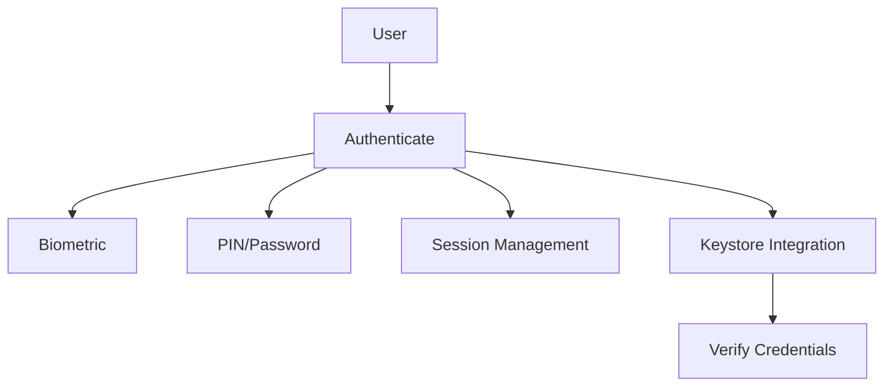

# Authentication

AromaUI provides secure user authentication via biometrics, PIN/password, and session management. It also integrates with keystore systems for credential storage and verification.

## Features
- Biometric authentication (fingerprint, face)
- PIN/password verification
- Session management
- Keystore integration for secure credential storage

## Architecture



## Example Usage
```c
// Biometric authentication
aroma_auth_biometric();

// PIN authentication
aroma_auth_pin("1234");

// Start a user session
aroma_auth_session_start(user_id);

// Store credentials securely
aroma_keystore_store("user_pin", "1234");

// Verify keystore password
aroma_keystore_verify("user_pin", "1234");
```

## API Reference
- aroma_auth_biometric()
- aroma_auth_pin(pin)
- aroma_auth_session_start(user_id)
- aroma_keystore_store(key, value)
- aroma_keystore_verify(key, value)

## Notes
- Biometric and PIN authentication can be combined for multi-factor security.
- Keystore integration ensures credentials are encrypted and protected.
- Session management APIs help track authenticated users and manage access.
