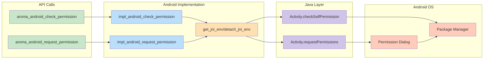

<br/>


The Permissions API provides runtime permission management in compliance with Android's security model. It supports permission grouping, Android version-specific behavior, and asynchronous permission handling.




# 1. Permission Checking

## `bool aroma_android_check_permission(const char* permission_name);`

Checks whether a specific permission has been granted to the application.

### Parameters

| Parameter         | Description                               | Example                       |
| ----------------- | ----------------------------------------- | ----------------------------- |
| `permission_name` | Fully qualified Android permission string | `"android.permission.CAMERA"` |

### Returns

| Value   | Description                               |
| ------- | ----------------------------------------- |
| `true`  | Permission is granted                     |
| `false` | Permission is denied or not yet requested |

### Example

```c
if (!aroma_android_check_permission("android.permission.CAMERA")) {
    const char* permissions[] = {"android.permission.CAMERA"};
    aroma_android_request_permissions(permissions, 1);
}
```

# 2. Permission Requesting

## `void aroma_android_request_permissions(const char** permissions, int permCount);`

Requests one or more permissions from the user.


## Parameters

| Parameter     | Description                        | Example                                                              |
| ------------- | ---------------------------------- | -------------------------------------------------------------------- |
| `permissions` | Array of permission strings        | `{ "android.permission.CAMERA", "android.permission.RECORD_AUDIO" }` |
| `permCount`   | Number of permissions in the array | `2`                                                                  |


## Example

```c
// Request camera and microphone permissions
const char* permissions[] = {
    "android.permission.CAMERA",
    "android.permission.RECORD_AUDIO"
};

aroma_android_request_permissions(permissions, 2);
```


# 3. Android Version Behavior

| Android Version | Behavior                                                           |
| --------------- | ------------------------------------------------------------------ |
| API < 23        | Permissions granted at install time. Function returns immediately. |
| API 23+         | Runtime permission dialog(s) shown to user.                        |
| API 31+         | Automatically handles Bluetooth-Location dependency.               |

# 4. Automatic Permission Grouping

Permissions are grouped to comply with Android system requirements.

| Group          | Permissions                                                                                          |
| -------------- | ---------------------------------------------------------------------------------------------------- |
| NEARBY_DEVICES | BLUETOOTH_SCAN, BLUETOOTH_ADVERTISE, BLUETOOTH_CONNECT                                               |
| LOCATION       | ACCESS_FINE_LOCATION, ACCESS_COARSE_LOCATION, ACCESS_BACKGROUND_LOCATION                             |
| NOTIFICATIONS  | POST_NOTIFICATIONS                                                                                   |
| STORAGE        | READ_EXTERNAL_STORAGE, WRITE_EXTERNAL_STORAGE, READ_MEDIA_IMAGES, READ_MEDIA_VIDEO, READ_MEDIA_AUDIO |
| CAMERA         | CAMERA                                                                                               |
| MICROPHONE     | RECORD_AUDIO                                                                                         |


# 5. Common Permission Strings

| Permission         | String Constant                           |
| ------------------ | ----------------------------------------- |
| Camera             | android.permission.CAMERA                 |
| Fine Location      | android.permission.ACCESS_FINE_LOCATION   |
| Coarse Location    | android.permission.ACCESS_COARSE_LOCATION |
| Bluetooth Scan     | android.permission.BLUETOOTH_SCAN         |
| Bluetooth Connect  | android.permission.BLUETOOTH_CONNECT      |
| Record Audio       | android.permission.RECORD_AUDIO           |
| Read Storage       | android.permission.READ_EXTERNAL_STORAGE  |
| Write Storage      | android.permission.WRITE_EXTERNAL_STORAGE |
| Post Notifications | android.permission.POST_NOTIFICATIONS     |

