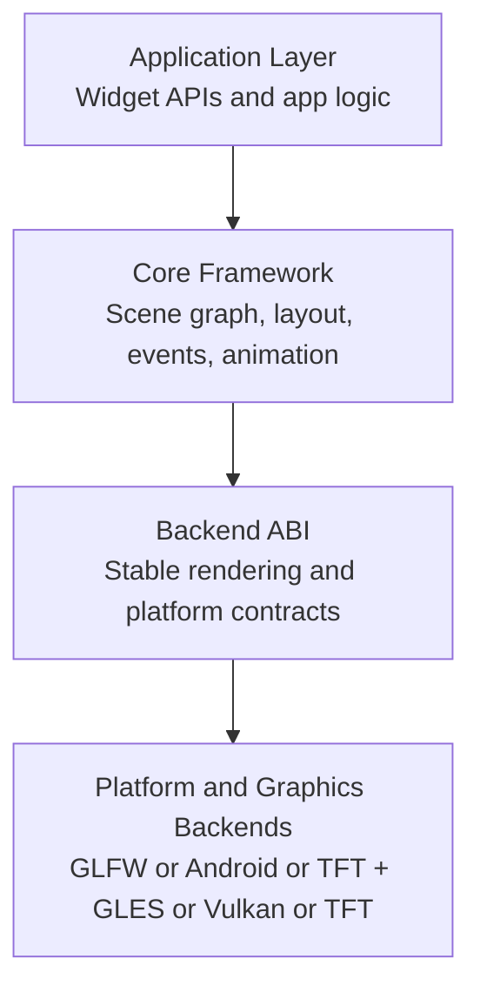
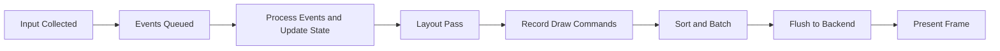
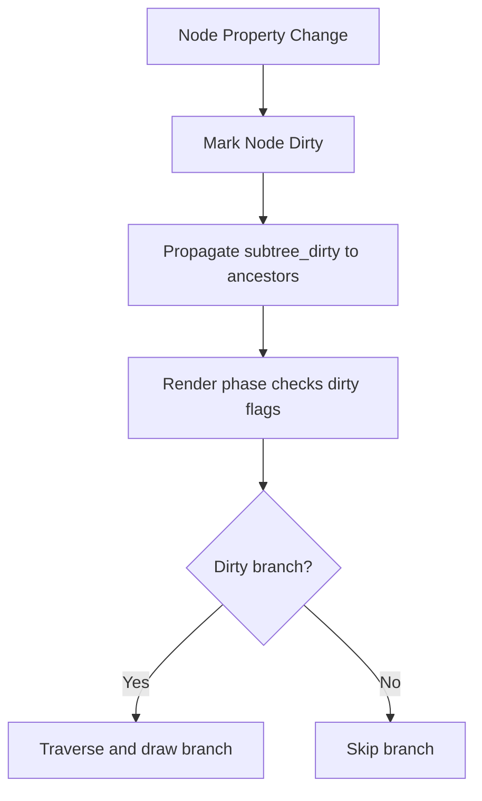
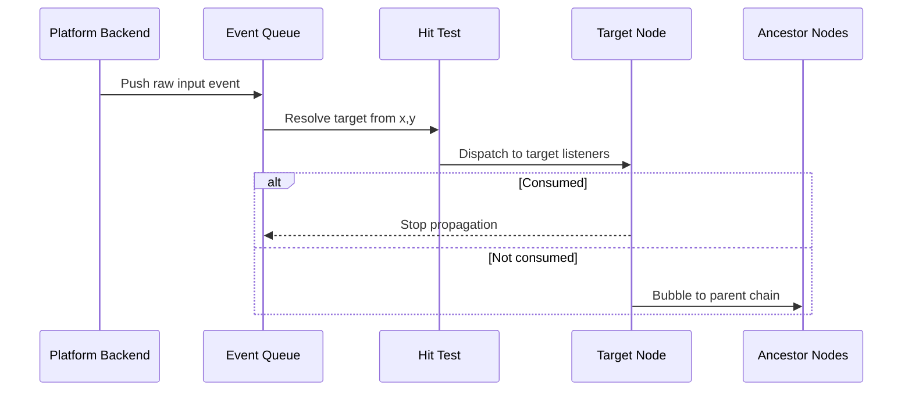
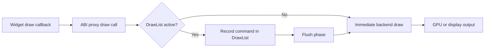
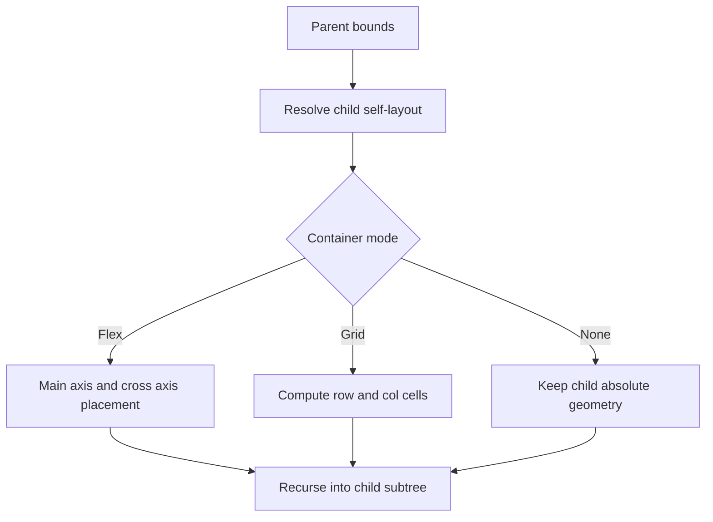
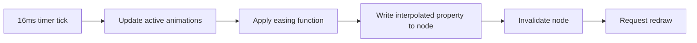
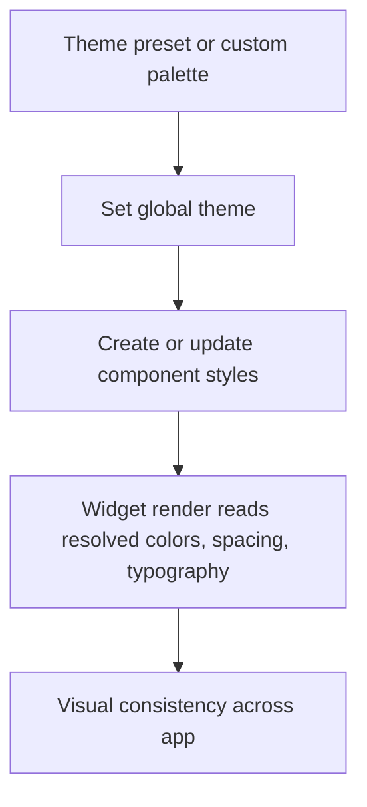
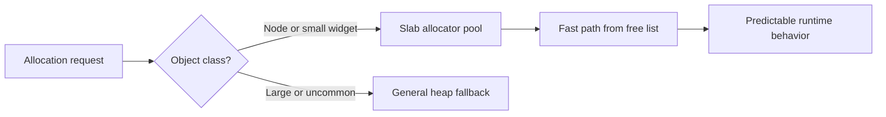
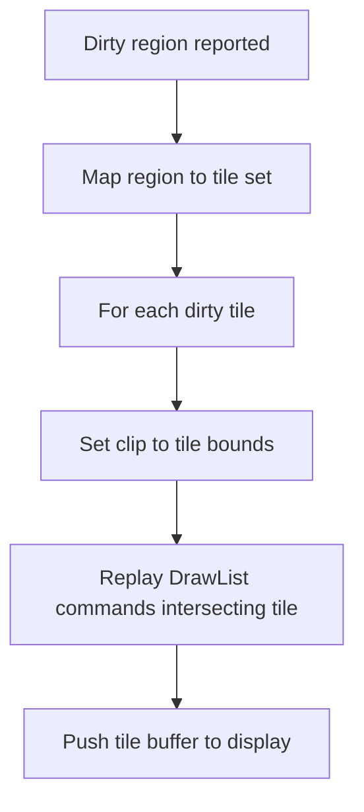

# AromaUI Thesis Diagrams

This document collects Mermaid diagrams for the main AromaUI framework mechanisms.

## 1) Four-Layer Architecture

## 2) Frame Lifecycle (Retained Mode)

## 3) Scene Graph + Dirty Propagation

## 4) Event Dispatch with Bubbling

## 5) Deferred Rendering via DrawList + ABI

## 6) Layout Engine: Self-Layout + Container Modes

## 7) Animation Engine Integrated with Redraw

## 8) Theme and Style Resolution

## 9) Deterministic Memory Strategy

## 10) Embedded Smart Flush (Tile-Based Rendering)

