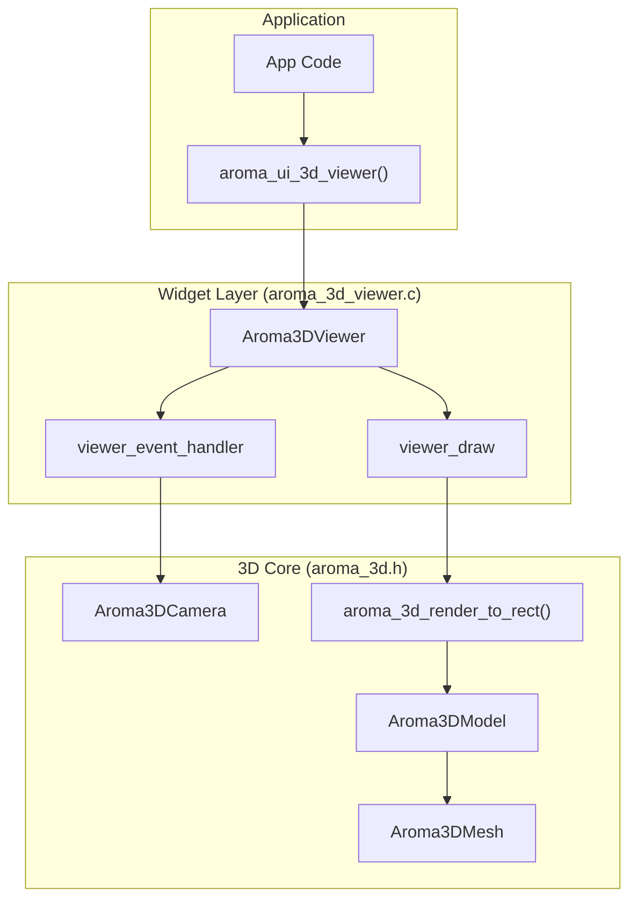
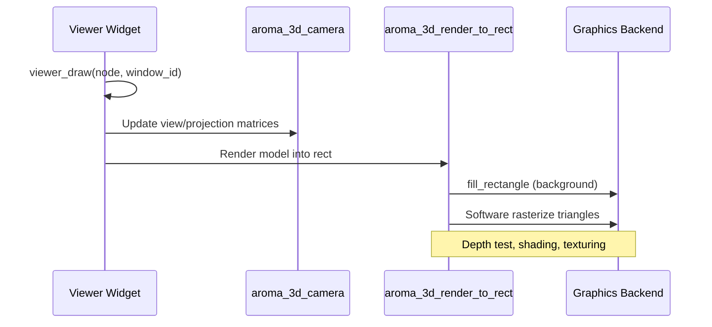

The `Aroma3DViewer` widget provides an interactive viewport for rendering 3D models using AromaUI's built-in software rasterizer. It supports camera orbit, zoom, pan, and auto-rotation, making it suitable for product visualization, automotive configurators, and diagnostic overlays.

## Widget Architecture

The 3D viewer is built on two layers: the `Aroma3DViewer` widget (which handles input, layout, and draw callbacks) and the `aroma_3d` core library (which manages models, meshes, cameras, and rasterization).

### Component Interaction



**Sources:**[include/widgets/aroma_3d_viewer.h12-30](https://github.com/BinaryInkTN/AromaUI/blob/afd1c6b6/include/widgets/aroma_3d_viewer.h#L12-L30)[src/widgets/aroma_3d_viewer.c13-23](https://github.com/BinaryInkTN/AromaUI/blob/afd1c6b6/src/widgets/aroma_3d_viewer.c#L13-L23)[include/aroma_3d.h16-25](https://github.com/BinaryInkTN/AromaUI/blob/afd1c6b6/include/aroma_3d.h#L16-L25)

---

## Camera System

The `Aroma3DCamera` structure defines the viewpoint using spherical coordinates and supports orbit, zoom, and pan operations.

### Camera Structure

| Field | Type | Description |
| --- | --- | --- |
| `theta` | `float` | Horizontal angle in radians. |
| `phi` | `float` | Vertical angle in radians. |
| `radius` | `float` | Distance from the target point. |
| `target[3]` | `float[3]` | The (x, y, z) point the camera looks at. |
| `fov` | `float` | Field of view in degrees. |
| `near_plane` | `float` | Near clipping plane distance. |
| `far_plane` | `float` | Far clipping plane distance. |

### Camera Operations

| Function | Description |
| --- | --- |
| `aroma_3d_camera_init` | Resets camera to default position looking at origin. |
| `aroma_3d_camera_orbit` | Adjusts theta/phi by delta values (used for drag rotation). |
| `aroma_3d_camera_zoom` | Changes radius by delta (used for scroll wheel). |
| `aroma_3d_camera_pan` | Moves the target point in screen space. |
| `aroma_3d_camera_update_view` | Computes the 4x4 view matrix. |
| `aroma_3d_camera_update_proj` | Computes the 4x4 projection matrix. |

**Sources:**[include/aroma_3d.h16-25](https://github.com/BinaryInkTN/AromaUI/blob/afd1c6b6/include/aroma_3d.h#L16-L25)[src/core/aroma_3d.c1-80](https://github.com/BinaryInkTN/AromaUI/blob/afd1c6b6/src/core/aroma_3d.c#L1-L80)

---

## Model Management

Models are loaded from disk or memory and contain one or more meshes. Each mesh can have material properties such as metallic and clearcoat.

### Loading Models

```c
// Synchronous loading
Aroma3DModel *model = aroma_3d_load_model("/path/to/car.glb");

// Asynchronous loading (non-blocking)
Aroma3DLoadJob *job = aroma_3d_load_model_async("/path/to/car.glb");
while (!aroma_3d_load_model_poll(job)) {
    // Process other UI frames while loading
    aroma_ui_process_events();
    aroma_ui_render(window);
}
Aroma3DModel *model = aroma_3d_load_model_finish(job);
```

### Model API

| Function | Description |
| --- | --- |
| `aroma_3d_load_model` | Loads a model from a filesystem path. |
| `aroma_3d_load_model_from_memory` | Loads a model from a memory buffer. |
| `aroma_3d_create_cube` | Creates a simple colored cube for testing. |
| `aroma_3d_destroy_model` | Frees all meshes and model data. |
| `aroma_3d_get_mesh_count` | Returns the number of meshes in the model. |
| `aroma_3d_get_mesh` | Returns a specific mesh by index. |
| `aroma_3d_set_mesh_metallic` | Sets the metallic factor of a mesh. |
| `aroma_3d_set_mesh_clearcoat` | Sets the clearcoat factor of a mesh. |
| `aroma_3d_get_model_bounds` | Retrieves the bounding box (min/max) of the model. |

**Sources:**[include/aroma_3d.h13-39](https://github.com/BinaryInkTN/AromaUI/blob/afd1c6b6/include/aroma_3d.h#L13-L39)[src/core/aroma_3d.c200-260](https://github.com/BinaryInkTN/AromaUI/blob/afd1c6b6/src/core/aroma_3d.c#L200-L260)

---

## Viewer Widget API

The `Aroma3DViewer` widget wraps the 3D core into an `AromaNode` with built-in event handling and rendering.

### Creation and Destruction

| Function | Description |
| --- | --- |
| `aroma_3d_viewer_create` | Creates a new viewer node as a child of `parent`. |
| `aroma_3d_viewer_set_model` | Assigns a model to the viewer; auto-fits camera to bounds. |
| `aroma_3d_viewer_get_model` | Retrieves the currently assigned model. |

### Camera Control

| Function | Description |
| --- | --- |
| `aroma_3d_viewer_set_camera` | Overrides the camera with a specific configuration. |
| `aroma_3d_viewer_get_camera` | Reads the current camera state into `out_camera`. |
| `aroma_3d_viewer_reset_camera` | Resets camera to default orbit position and radius. |
| `aroma_3d_viewer_set_auto_rotate` | Enables/disables continuous horizontal rotation. |
| `aroma_3d_viewer_set_light_position` | Sets the directional light position for shading. |

### Interaction Control

| Function | Description |
| --- | --- |
| `aroma_3d_viewer_set_interactive` | Enables/disables user input (drag, scroll). |
| `aroma_3d_viewer_get_interactive` | Returns whether the viewer accepts input. |
| `aroma_3d_viewer_update` | Requests a redraw of the viewer node. |

### Input Handling

The viewer subscribes to the following events with high priority to ensure smooth interaction:

- `EVENT_TYPE_MOUSE_MOVE` / `EVENT_TYPE_TOUCH_MOVE` - Orbit camera when dragging.
- `EVENT_TYPE_MOUSE_CLICK` / `EVENT_TYPE_TOUCH_DOWN` - Start drag.
- `EVENT_TYPE_MOUSE_RELEASE` / `EVENT_TYPE_TOUCH_UP` - End drag.
- `EVENT_TYPE_MOUSE_SCROLL` - Zoom camera.
- `EVENT_TYPE_MOUSE_EXIT` - Cancel drag if cursor leaves window.

**Sources:**[src/widgets/aroma_3d_viewer.c31-79](https://github.com/BinaryInkTN/AromaUI/blob/afd1c6b6/src/widgets/aroma_3d_viewer.c#L31-L79)[include/widgets/aroma_3d_viewer.h14-25](https://github.com/BinaryInkTN/AromaUI/blob/afd1c6b6/include/widgets/aroma_3d_viewer.h#L14-L25)

---

## Rendering Pipeline

The viewer does not use the standard DrawList for 3D content. Instead, it renders directly to the framebuffer via `aroma_3d_render_to_rect`, which performs software rasterization into the widget's bounding rectangle.

### Render Flow



**Sources:**[src/widgets/aroma_3d_viewer.c81-114](https://github.com/BinaryInkTN/AromaUI/blob/afd1c6b6/src/widgets/aroma_3d_viewer.c#L81-L114)[src/core/aroma_3d.c300-400](https://github.com/BinaryInkTN/AromaUI/blob/afd1c6b6/src/core/aroma_3d.c#L300-L400)

---

## Usage Example: Automotive Camera

The Car Infotainment example (`AromaOS`) uses the 3D viewer for the vehicle exterior and interior views. The camera is animated between predefined states to simulate orbit, pan, and zoom transitions.

```c
// Exterior camera state
state.camera.theta = VEHICLE_CAM_EXTERIOR_THETA;
state.camera.phi   = VEHICLE_CAM_EXTERIOR_PHI;
state.camera.radius = VEHICLE_CAM_EXTERIOR_RADIUS;
state.camera.target[0] = VEHICLE_CAM_EXTERIOR_TARGET_X;
state.camera.target[1] = VEHICLE_CAM_EXTERIOR_TARGET_Y;
state.camera.target[2] = VEHICLE_CAM_EXTERIOR_TARGET_Z;

// Animate to interior view
state.anim_target_theta = VEHICLE_CAM_INTERIOR_THETA;
state.anim_target_phi   = VEHICLE_CAM_INTERIOR_PHI;
state.anim_target_radius = VEHICLE_CAM_INTERIOR_RADIUS;
state.camera_animating = true;

// Apply camera each frame
aroma_3d_viewer_set_camera(state.viewer_3d, &state.camera);
```

**Sources:**[examples/car_infotainment/vehicle_camera.c15-60](https://github.com/BinaryInkTN/AromaUI/blob/afd1c6b6/examples/car_infotainment/vehicle_camera.c#L15-L60)[examples/car_infotainment/vehicle_camera.c164-168](https://github.com/BinaryInkTN/AromaUI/blob/afd1c6b6/examples/car_infotainment/vehicle_camera.c#L164-L168)

---

## Implementation Details

### Widget Lifecycle

1. **Allocation**: `aroma_3d_viewer_create` allocates the `Aroma3DViewer` struct via `aroma_widget_alloc` and attaches it to a new `AromaNode` [src/widgets/aroma_3d_viewer.c116-130](https://github.com/BinaryInkTN/AromaUI/blob/afd1c6b6/src/widgets/aroma_3d_viewer.c#L116-L130).
2. **Event Subscription**: The widget registers high-priority listeners for mouse and touch events to intercept drag and scroll before child nodes [src/widgets/aroma_3d_viewer.c139-146](https://github.com/BinaryInkTN/AromaUI/blob/afd1c6b6/src/widgets/aroma_3d_viewer.c#L139-L146).
3. **Draw Registration**: `aroma_node_set_draw_cb` binds `viewer_draw`, which is called during the frame render phase [src/widgets/aroma_3d_viewer.c137](https://github.com/BinaryInkTN/AromaUI/blob/afd1c6b6/src/widgets/aroma_3d_viewer.c#L137-L137).

### Auto-Fit on Model Change

When a new model is assigned via `aroma_3d_viewer_set_model`, the widget automatically:

1. Destroys the previous model.
2. Initializes the camera to a default orbit.
3. Computes the model's bounding box using `aroma_3d_get_model_bounds`.
4. Sets the camera target to the bounding box center.
5. Adjusts the camera radius to 1.5x the largest bounding dimension (minimum 1.0 unit).

**Sources:**[src/widgets/aroma_3d_viewer.c151-180](https://github.com/BinaryInkTN/AromaUI/blob/afd1c6b6/src/widgets/aroma_3d_viewer.c#L151-L180)[include/aroma_3d.h36](https://github.com/BinaryInkTN/AromaUI/blob/afd1c6b6/include/aroma_3d.h#L36-L36)
