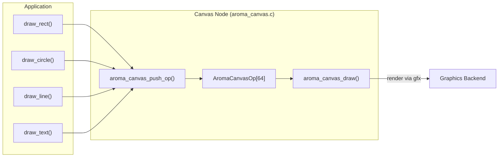

<br />
```c
AromaNode *canvas = aroma_canvas_create((AromaNode *)window, 0, 0, 400, 300);
aroma_canvas_clear(canvas, 0xFF1A1A2E);
aroma_canvas_draw_rect(canvas, 20, 20, 360, 260, 16, true, 0xFF3366FF);
aroma_canvas_draw_circle(canvas, 200, 150, 60, 0xFFFF5533);
aroma_canvas_draw_line(canvas, 20, 20, 200, 150, 0xFFFFFFFF, 2);
aroma_canvas_draw_text(canvas, "Hello", 40, 40, 0xFFFFFFFF, font);
```
<br />

The `AromaCanvas` widget provides a retained-mode 2D drawing surface. Instead of issuing immediate draw calls, you queue drawing operations onto the canvas node, and the framework renders them during the normal frame update. This makes it suitable for custom visualizations, graphs, and decorative elements.

## Architecture

The canvas stores up to `AROMA_CANVAS_MAX_OPS` (64) `AromaCanvasOp` structures in a fixed-size array. Each `draw_*` call appends a new operation rather than replacing the previous one, allowing complex scenes to be built incrementally.

### Data Flow



**Sources:**[include/widgets/aroma_canvas.h46-88](https://github.com/BinaryInkTN/AromaUI/blob/afd1c6b6/include/widgets/aroma_canvas.h#L46-L88)[src/widgets/aroma_canvas.c1-60](https://github.com/BinaryInkTN/AromaUI/blob/afd1c6b6/src/widgets/aroma_canvas.c#L1-L60)

---

## Supported Operations

| Operation | Function | Description |
| --- | --- | --- |
| Rectangle | `aroma_canvas_draw_rect` | Filled or hollow rounded rectangle. |
| Circle | `aroma_canvas_draw_circle` | Filled circle at center (x, y). |
| Line | `aroma_canvas_draw_line` | Thick line from (x1, y1) to (x2, y2). |
| Text | `aroma_canvas_draw_text` | Rendered text string at (x, y). |
| Arc | `aroma_canvas_draw_arc` | Stroked arc segment with start/end angles in radians. |
| Clear | `aroma_canvas_clear` | Resets the op list and records a background clear. |

### Arc Angle Convention

Arcs use radians with the +x-axis as the origin (0 radians). This matches the existing `CIRCLE` mode convention in the canvas implementation [include/widgets/aroma_canvas.h113-143](https://github.com/BinaryInkTN/AromaUI/blob/afd1c6b6/include/widgets/aroma_canvas.h#L113-L143).

---

## Capacity and Limits

- **Maximum Operations**: `AROMA_CANVAS_MAX_OPS` (64). Once reached, further draw calls are dropped and logged.
- **Text Buffer**: Each text op stores up to 256 characters inline.
- **Options**: The dropdown widget limits options to 32 strings of 128 characters each.

Because the canvas is allocated via the slab allocator, it cannot dynamically grow. If you need more operations, call `aroma_canvas_clear` to reclaim slots between frames.

**Sources:**[include/widgets/aroma_canvas.h70-88](https://github.com/BinaryInkTN/AromaUI/blob/afd1c6b6/include/widgets/aroma_canvas.h#L70-L88)[src/widgets/aroma_canvas.c20-40](https://github.com/BinaryInkTN/AromaUI/blob/afd1c6b6/src/widgets/aroma_canvas.c#L20-L40)

---

## API Reference

### Factory Function

```c
AromaNode *aroma_canvas_create(
    AromaNode *parent,
    int x, int y,
    int width, int height
);
```

### Drawing Functions

| Function | Description |
| --- | --- |
| `aroma_canvas_clear` | Clears all queued ops and sets background color. |
| `aroma_canvas_draw_rect` | Queues a rounded rectangle (filled or hollow). |
| `aroma_canvas_draw_circle` | Queues a filled circle. |
| `aroma_canvas_draw_line` | Queues a thick line. |
| `aroma_canvas_draw_text` | Queues a text string with a specific font. |
| `aroma_canvas_draw_arc` | Queues a stroked arc segment. |

**Sources:**[include/widgets/aroma_canvas.h90-143](https://github.com/BinaryInkTN/AromaUI/blob/afd1c6b6/include/widgets/aroma_canvas.h#L90-L143)
