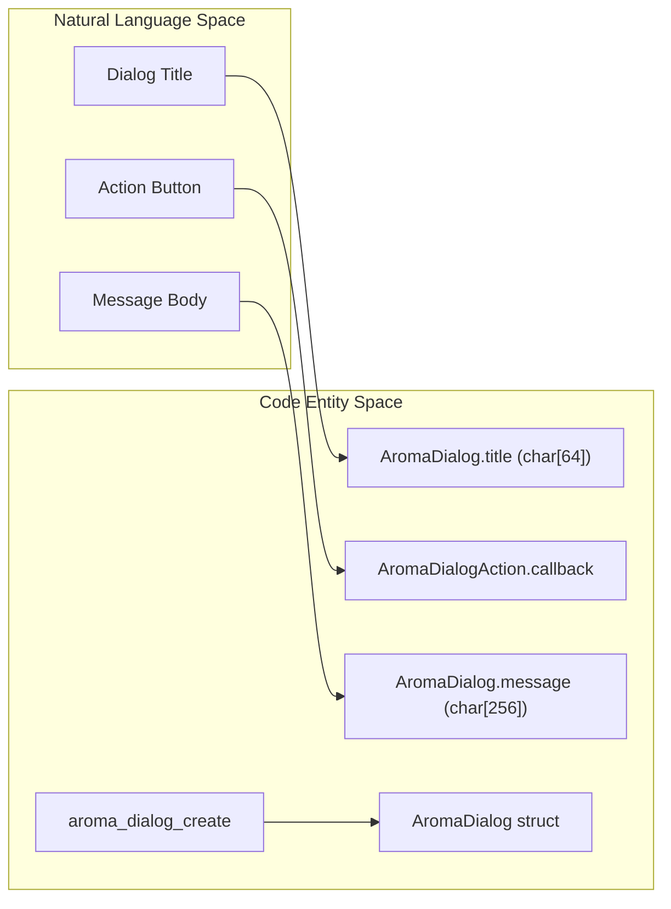
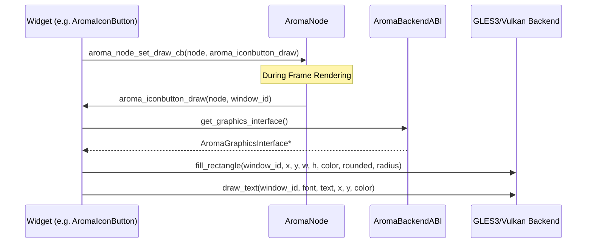

# Display and Feedback Widgets
Relevant source files
- [docs/hmi_commands.md](https://github.com/BinaryInkTN/AromaUI/blob/afd1c6b6/docs/hmi_commands.md?plain=1)
- [docs/website/index.html](https://github.com/BinaryInkTN/AromaUI/blob/afd1c6b6/docs/website/index.html)
- [docs/website/smartwatch.html](https://github.com/BinaryInkTN/AromaUI/blob/afd1c6b6/docs/website/smartwatch.html)
- [docs/website/smartwatch_example.js](https://github.com/BinaryInkTN/AromaUI/blob/afd1c6b6/docs/website/smartwatch_example.js)
- [docs/website/smartwatch_example.wasm](https://github.com/BinaryInkTN/AromaUI/blob/afd1c6b6/docs/website/smartwatch_example.wasm)
- [examples/car_infotainment/assets/Ubuntu-Light.ttf](https://github.com/BinaryInkTN/AromaUI/blob/afd1c6b6/examples/car_infotainment/assets/Ubuntu-Light.ttf)
- [examples/car_infotainment/vehicle_simulator.py](https://github.com/BinaryInkTN/AromaUI/blob/afd1c6b6/examples/car_infotainment/vehicle_simulator.py)
- [examples/smartwatch_example/main.c](https://github.com/BinaryInkTN/AromaUI/blob/afd1c6b6/examples/smartwatch_example/main.c)
- [include/aroma_font.h](https://github.com/BinaryInkTN/AromaUI/blob/afd1c6b6/include/aroma_font.h)
- [include/widgets/aroma_card.h](https://github.com/BinaryInkTN/AromaUI/blob/afd1c6b6/include/widgets/aroma_card.h)
- [include/widgets/aroma_dialog.h](https://github.com/BinaryInkTN/AromaUI/blob/afd1c6b6/include/widgets/aroma_dialog.h)
- [include/widgets/aroma_divider.h](https://github.com/BinaryInkTN/AromaUI/blob/afd1c6b6/include/widgets/aroma_divider.h)
- [include/widgets/aroma_gauge.h](https://github.com/BinaryInkTN/AromaUI/blob/afd1c6b6/include/widgets/aroma_gauge.h)
- [include/widgets/aroma_iconbutton.h](https://github.com/BinaryInkTN/AromaUI/blob/afd1c6b6/include/widgets/aroma_iconbutton.h)
- [src/backends/graphics/aroma_graphics_vulkan.c](https://github.com/BinaryInkTN/AromaUI/blob/afd1c6b6/src/backends/graphics/aroma_graphics_vulkan.c)
- [src/backends/graphics/utils/aroma_gles3_text.c](https://github.com/BinaryInkTN/AromaUI/blob/afd1c6b6/src/backends/graphics/utils/aroma_gles3_text.c)
- [src/backends/graphics/utils/helpers_gles3.h](https://github.com/BinaryInkTN/AromaUI/blob/afd1c6b6/src/backends/graphics/utils/helpers_gles3.h)
- [src/core/aroma_font.c](https://github.com/BinaryInkTN/AromaUI/blob/afd1c6b6/src/core/aroma_font.c)
- [src/widgets/aroma_card.c](https://github.com/BinaryInkTN/AromaUI/blob/afd1c6b6/src/widgets/aroma_card.c)
- [src/widgets/aroma_dialog.c](https://github.com/BinaryInkTN/AromaUI/blob/afd1c6b6/src/widgets/aroma_dialog.c)
- [src/widgets/aroma_divider.c](https://github.com/BinaryInkTN/AromaUI/blob/afd1c6b6/src/widgets/aroma_divider.c)
- [src/widgets/aroma_dropdown.c](https://github.com/BinaryInkTN/AromaUI/blob/afd1c6b6/src/widgets/aroma_dropdown.c)
- [src/widgets/aroma_gauge.c](https://github.com/BinaryInkTN/AromaUI/blob/afd1c6b6/src/widgets/aroma_gauge.c)
- [src/widgets/aroma_gif.c](https://github.com/BinaryInkTN/AromaUI/blob/afd1c6b6/src/widgets/aroma_gif.c)
- [src/widgets/aroma_icon.c](https://github.com/BinaryInkTN/AromaUI/blob/afd1c6b6/src/widgets/aroma_icon.c)
- [src/widgets/aroma_iconbutton.c](https://github.com/BinaryInkTN/AromaUI/blob/afd1c6b6/src/widgets/aroma_iconbutton.c)
- [src/widgets/aroma_image.c](https://github.com/BinaryInkTN/AromaUI/blob/afd1c6b6/src/widgets/aroma_image.c)
- [src/widgets/aroma_label.c](https://github.com/BinaryInkTN/AromaUI/blob/afd1c6b6/src/widgets/aroma_label.c)
- [src/widgets/aroma_loading.c](https://github.com/BinaryInkTN/AromaUI/blob/afd1c6b6/src/widgets/aroma_loading.c)
- [src/widgets/aroma_progressbar.c](https://github.com/BinaryInkTN/AromaUI/blob/afd1c6b6/src/widgets/aroma_progressbar.c)
- [src/widgets/aroma_snackbar.c](https://github.com/BinaryInkTN/AromaUI/blob/afd1c6b6/src/widgets/aroma_snackbar.c)
- [src/widgets/aroma_tooltip.c](https://github.com/BinaryInkTN/AromaUI/blob/afd1c6b6/src/widgets/aroma_tooltip.c)

This page documents the non-interactive and feedback-oriented widgets within the AromaUI library. These widgets are primarily used for information visualization, status reporting, and transient user notifications.

## Core Display Widgets

### Label and Icon

Labels and Icons are the fundamental building blocks for text and symbolic display. They rely heavily on the `AromaFont` system for rendering.

- **Label**: Displays a single line of text. It uses the `AromaFont` to calculate text metrics like line width and height for proper positioning [src/widgets/aroma_label.c1-50](https://github.com/BinaryInkTN/AromaUI/blob/afd1c6b6/src/widgets/aroma_label.c#L1-L50)
- **Icon**: Renders a single glyph from an icon font (typically Material Symbols). It is essentially a specialized Label where the text is a UTF-8 character code representing an icon [src/widgets/aroma_icon.c1-40](https://github.com/BinaryInkTN/AromaUI/blob/afd1c6b6/src/widgets/aroma_icon.c#L1-L40)

### Image and GIF

AromaUI supports image rendering from both file paths and memory buffers.

- **Image**: Created via `aroma_image_create`[src/widgets/aroma_image.c117-164](https://github.com/BinaryInkTN/AromaUI/blob/afd1c6b6/src/widgets/aroma_image.c#L117-L164) or `aroma_image_create_from_memory`[src/widgets/aroma_image.c166-200](https://github.com/BinaryInkTN/AromaUI/blob/afd1c6b6/src/widgets/aroma_image.c#L166-L200) The widget stores a `texture_id` generated by the graphics backend [src/widgets/aroma_image.c34-39](https://github.com/BinaryInkTN/AromaUI/blob/afd1c6b6/src/widgets/aroma_image.c#L34-L39)
- **GIF**: Handles animated image sequences by maintaining a frame timer and updating the displayed texture periodically [src/widgets/aroma_gif.c1-80](https://github.com/BinaryInkTN/AromaUI/blob/afd1c6b6/src/widgets/aroma_gif.c#L1-L80)

### Card

The `AromaCard` is a container widget that provides a visual grouping with various styling options.

| Card Type | Description |
| --- | --- |
| `CARD_TYPE_FILLED` | Uses a solid background color blended with the primary theme color [src/widgets/aroma_card.c90-91](https://github.com/BinaryInkTN/AromaUI/blob/afd1c6b6/src/widgets/aroma_card.c#L90-L91) |
| `CARD_TYPE_TONAL` | A subtle variant of the filled card. |
| `CARD_TYPE_GLASS` | Implements a translucent background with a glossy thin edge [src/widgets/aroma_card.c101-105](https://github.com/BinaryInkTN/AromaUI/blob/afd1c6b6/src/widgets/aroma_card.c#L101-L105) |
| `CARD_TYPE_OUTLINED` | Renders a hollow rectangle with a border [src/widgets/aroma_card.c121-127](https://github.com/BinaryInkTN/AromaUI/blob/afd1c6b6/src/widgets/aroma_card.c#L121-L127) |

**Data Flow: Card Rendering**

1. `aroma_card_create` allocates an `AromaCard` struct and registers it in the `s_card_registry`[src/widgets/aroma_card.c130-180](https://github.com/BinaryInkTN/AromaUI/blob/afd1c6b6/src/widgets/aroma_card.c#L130-L180)
2. During the draw phase, `aroma_card_draw` retrieves the card data using the node's ID [src/widgets/aroma_card.c73-75](https://github.com/BinaryInkTN/AromaUI/blob/afd1c6b6/src/widgets/aroma_card.c#L73-L75)
3. The backend `gfx->fill_rectangle` is called to render the body and shadow [src/widgets/aroma_card.c110-119](https://github.com/BinaryInkTN/AromaUI/blob/afd1c6b6/src/widgets/aroma_card.c#L110-L119)

**Sources**: [src/widgets/aroma_card.c13-24](https://github.com/BinaryInkTN/AromaUI/blob/afd1c6b6/src/widgets/aroma_card.c#L13-L24)[src/widgets/aroma_card.c130-180](https://github.com/BinaryInkTN/AromaUI/blob/afd1c6b6/src/widgets/aroma_card.c#L130-L180)[src/widgets/aroma_image.c34-39](https://github.com/BinaryInkTN/AromaUI/blob/afd1c6b6/src/widgets/aroma_image.c#L34-L39)

---

## Feedback and Status Widgets

### ProgressBar and Gauge

These widgets visualize numerical progress or scalar values.

- **ProgressBar**: A linear bar that fills from left to right based on a 0.0 to 1.0 value.
- **Gauge**: A circular or semi-circular indicator. It calculates vertex positions along an arc to draw the gauge needle and progress track [src/widgets/aroma_gauge.c1-100](https://github.com/BinaryInkTN/AromaUI/blob/afd1c6b6/src/widgets/aroma_gauge.c#L1-L100)

### Loading Spinner

The loading widget provides a continuous animation to indicate background processing. It typically uses the `AromaAnimation` engine to rotate a partial circle or pulse an icon [src/widgets/aroma_loading.c1-50](https://github.com/BinaryInkTN/AromaUI/blob/afd1c6b6/src/widgets/aroma_loading.c#L1-L50)

---

## Transient Feedback (Overlays)

### Snackbar

Snackbars provide brief messages at the bottom of the screen. They are designed to automatically dismiss after a set duration.

- **Implementation**: Uses an `AromaTimer` to trigger the `__snackbar_dismiss_cb`[src/widgets/aroma_snackbar.c166-176](https://github.com/BinaryInkTN/AromaUI/blob/afd1c6b6/src/widgets/aroma_snackbar.c#L166-L176)
- **Interaction**: Supports an optional action button (e.g., "UNDO"). Hit testing for the action is calculated based on the font width of the action label [src/widgets/aroma_snackbar.c62-70](https://github.com/BinaryInkTN/AromaUI/blob/afd1c6b6/src/widgets/aroma_snackbar.c#L62-L70)

### Dialog

Dialogs are modal windows that interrupt the user. They consist of a title, a message, and up to 3 action buttons [src/widgets/aroma_dialog.c13-20](https://github.com/BinaryInkTN/AromaUI/blob/afd1c6b6/src/widgets/aroma_dialog.c#L13-L20)

**Entity Association: Dialog Component Mapping**

**Sources**: [src/widgets/aroma_dialog.c15-47](https://github.com/BinaryInkTN/AromaUI/blob/afd1c6b6/src/widgets/aroma_dialog.c#L15-L47)[src/widgets/aroma_snackbar.c19-39](https://github.com/BinaryInkTN/AromaUI/blob/afd1c6b6/src/widgets/aroma_snackbar.c#L19-L39)

---

## Layout Support Widgets

### Divider

A simple widget used to separate content. It renders a thin line (horizontal or vertical) using the theme's border color [src/widgets/aroma_divider.c1-30](https://github.com/BinaryInkTN/AromaUI/blob/afd1c6b6/src/widgets/aroma_divider.c#L1-L30)

### Tooltip

Tooltips are transient labels that appear near a target node. They are typically managed by the global event system, appearing on `EVENT_TYPE_MOUSE_ENTER` after a short delay [src/widgets/aroma_tooltip.c1-60](https://github.com/BinaryInkTN/AromaUI/blob/afd1c6b6/src/widgets/aroma_tooltip.c#L1-L60)

---

## Rendering Integration

Display widgets interface with the `AromaGraphicsInterface` via the `AromaBackendABI`.

**Component Interaction: Widget to Backend**

**Implementation Details**:

- **Rounded Rectangles**: Most display widgets (Cards, IconButtons, Snackbars) utilize the backend's ability to render rounded rectangles. In the GLES3 backend, this is implemented via a Signed Distance Field (SDF) shader [src/backends/graphics/utils/helpers_gles3.h62-70](https://github.com/BinaryInkTN/AromaUI/blob/afd1c6b6/src/backends/graphics/utils/helpers_gles3.h#L62-L70)
- **Z-Index**: Feedback widgets like Snackbars and Dialogs explicitly set a high Z-index (e.g., `INT_MAX`) to ensure they appear above all other UI elements [src/widgets/aroma_snackbar.c129](https://github.com/BinaryInkTN/AromaUI/blob/afd1c6b6/src/widgets/aroma_snackbar.c#L129-L129)

**Sources**: [src/widgets/aroma_iconbutton.c185-210](https://github.com/BinaryInkTN/AromaUI/blob/afd1c6b6/src/widgets/aroma_iconbutton.c#L185-L210)[src/widgets/aroma_snackbar.c199-220](https://github.com/BinaryInkTN/AromaUI/blob/afd1c6b6/src/widgets/aroma_snackbar.c#L199-L220)[src/backends/graphics/utils/helpers_gles3.h181-189](https://github.com/BinaryInkTN/AromaUI/blob/afd1c6b6/src/backends/graphics/utils/helpers_gles3.h#L181-L189)[src/widgets/aroma_card.c66-128](https://github.com/BinaryInkTN/AromaUI/blob/afd1c6b6/src/widgets/aroma_card.c#L66-L128)