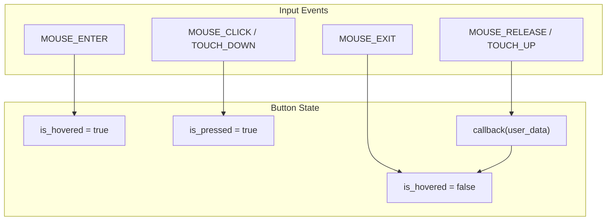

<br />
```c
AromaNode *fab = aroma_ui_iconbutton(
    (AromaNode *)window,
    AROMA_ICON_ADD,
    340, 600, 56,
    ICON_BUTTON_FILLED,
    on_add_clicked, NULL,
    state.icon_font
);
```
<br />

The `AromaIconButton` widget is a compact, icon-only touch target commonly used for floating action buttons (FABs), navigation rail items, and toolbar actions. It supports four visual variants and integrates with the global theme for consistent styling.

## Widget Structure

The `AromaIconButton` stores its state in a flat structure containing geometry, theme colors, and interaction flags. It does not support text labels; only a single icon codepoint (typically from the Material Symbols font).

| Field | Type | Description |
| --- | --- | --- |
| `rect` | `AromaRect` | Position and size of the button. |
| `icon_text[16]` | `char[]` | UTF-8 icon codepoint (e.g., `AROMA_ICON_HOME`). |
| `font` | `AromaFont*` | Font containing the icon glyphs. |
| `variant` | `AromaIconButtonVariant` | Visual style: STANDARD, FILLED, TONAL, or OUTLINED. |
| `bg_color` | `uint32_t` | Background fill color. |
| `icon_color` | `uint32_t` | Icon tint color. |
| `border_color` | `uint32_t` | Border color for OUTLINED variant. |
| `corner_radius` | `float` | Corner radius (auto-computed as `height / 2`). |
| `is_hovered` | `bool` | True when the pointer is over the button. |
| `is_pressed` | `bool` | True while the button is actively pressed. |

**Sources:**[src/widgets/aroma_iconbutton.c17-43](https://github.com/BinaryInkTN/AromaUI/blob/afd1c6b6/src/widgets/aroma_iconbutton.c#L17-L43)[include/widgets/aroma_iconbutton.h12-17](https://github.com/BinaryInkTN/AromaUI/blob/afd1c6b6/include/widgets/aroma_iconbutton.h#L12-L17)

---

## Visual Variants

The widget supports four Material Design-inspired variants:

| Variant | Background | Icon Color | Border |
| --- | --- | --- | --- |
| `ICON_BUTTON_STANDARD` | Theme surface | Theme text_primary | None |
| `ICON_BUTTON_FILLED` | Theme primary | Theme surface | None |
| `ICON_BUTTON_TONAL` | Theme primary (low opacity) | Theme primary | None |
| `ICON_BUTTON_OUTLINED` | Theme surface | Theme text_primary | 1px theme border |

When `use_theme_colors` is true (the default), colors are resolved from the global `AromaTheme` on every draw call, allowing theme switches to propagate instantly without explicit updates.

**Sources:**[src/widgets/aroma_iconbutton.c158-179](https://github.com/BinaryInkTN/AromaUI/blob/afd1c6b6/src/widgets/aroma_iconbutton.c#L158-L179)[src/widgets/aroma_iconbutton.c278-288](https://github.com/BinaryInkTN/AromaUI/blob/afd1c6b6/src/widgets/aroma_iconbutton.c#L278-L288)

---

## Interaction Model

The icon button handles hover, press, and release states. It accounts for parent container scroll offsets when hit-testing.

### Event Flow



**Sources:**[src/widgets/aroma_iconbutton.c45-131](https://github.com/BinaryInkTN/AromaUI/blob/afd1c6b6/src/widgets/aroma_iconbutton.c#L45-L131)

### Scroll-Aware Hit Testing

When the button is inside a scrollable container, the event handler walks up the parent chain and accumulates scroll offsets before performing bounds checking [src/widgets/aroma_iconbutton.c55-67](https://github.com/BinaryInkTN/AromaUI/blob/afd1c6b6/src/widgets/aroma_iconbutton.c#L55-L67).

---

## API Reference

### Factory Function

```c
AromaNode *aroma_iconbutton_create(
    AromaNode *parent,
    const char *icon_text,
    int x, int y,
    int size,
    AromaIconButtonVariant variant
);
```

Creates an icon button node. On Android, `x`, `y`, and `size` are converted from DP to physical pixels.

**Sources:**[src/widgets/aroma_iconbutton.c143-217](https://github.com/BinaryInkTN/AromaUI/blob/afd1c6b6/src/widgets/aroma_iconbutton.c#L143-L217)

### Configuration Functions

| Function | Description |
| --- | --- |
| `aroma_iconbutton_set_callback` | Sets the click callback and user data. |
| `aroma_iconbutton_set_colors` | Overrides background and icon colors; disables theme resolution. |
| `aroma_iconbutton_set_icon` | Updates the displayed icon codepoint. |
| `aroma_iconbutton_set_font` | Sets the icon font and recalculates text centering. |

### Helper Wrapper

The framework also provides `aroma_ui_iconbutton` in `aroma_ui.h` as a convenience wrapper that creates the node, sets the callback, and assigns the font in one call [include/aroma_ui.h888-907](https://github.com/BinaryInkTN/AromaUI/blob/afd1c6b6/include/aroma_ui.h#L888-L907).

**Sources:**[include/widgets/aroma_iconbutton.h22-34](https://github.com/BinaryInkTN/AromaUI/blob/afd1c6b6/include/widgets/aroma_iconbutton.h#L22-L34)[src/widgets/aroma_iconbutton.c219-263](https://github.com/BinaryInkTN/AromaUI/blob/afd1c6b6/src/widgets/aroma_iconbutton.c#L219-L263)

---

## Rendering

The draw function renders the button in three steps:

1. **Background**: A filled rounded rectangle using the computed background color. The color is adjusted by `aroma_color_adjust` for hover (+8% brightness) and press (-10% brightness) states [src/widgets/aroma_iconbutton.c290-297](https://github.com/BinaryInkTN/AromaUI/blob/afd1c6b6/src/widgets/aroma_iconbutton.c#L290-L297).
2. **Border**: For `ICON_BUTTON_OUTLINED`, a hollow rounded rectangle is drawn with a 1px border [src/widgets/aroma_iconbutton.c299-303](https://github.com/BinaryInkTN/AromaUI/blob/afd1c6b6/src/widgets/aroma_iconbutton.c#L299-L303).
3. **Icon**: The icon glyph is rendered centered within the button bounds using `gfx->render_text` [src/widgets/aroma_iconbutton.c305-311](https://github.com/BinaryInkTN/AromaUI/blob/afd1c6b6/src/widgets/aroma_iconbutton.c#L305-L311).

---

## Usage in AromaOS

In the Car Infotainment example, icon buttons are used extensively for the status bar (Bluetooth, Wi-Fi, voice), tab navigation icons, and the settings panel. They are created with `aroma_ui_iconbutton` and styled using the global theme.

```c
state.bt_btn = aroma_ui_iconbutton(
    state.status_bar_node,
    AROMA_ICON_BLUETOOTH,
    10, 10, 40,
    ICON_BUTTON_STANDARD,
    on_bluetooth_toggle, NULL,
    state.icon_font
);
```

**Sources:**[examples/car_infotainment/status_bar.c1-40](https://github.com/BinaryInkTN/AromaUI/blob/afd1c6b6/examples/car_infotainment/status_bar.c#L1-L40)
