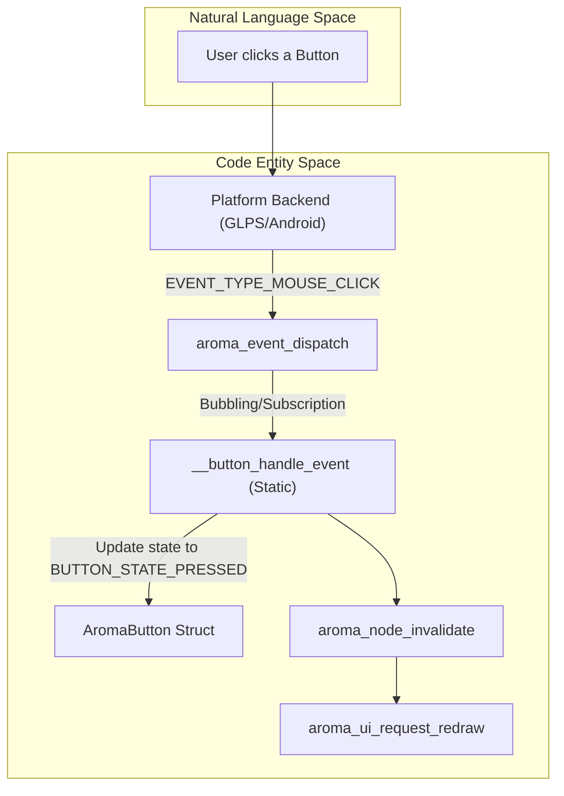
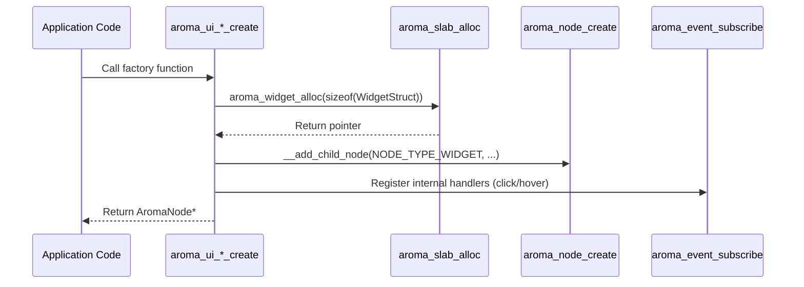

# Input and Control Widgets
Relevant source files
- [examples/map_example/CMakeLists.txt](https://github.com/BinaryInkTN/AromaUI/blob/afd1c6b6/examples/map_example/CMakeLists.txt)
- [examples/smartwatch_example/CMakeLists.txt](https://github.com/BinaryInkTN/AromaUI/blob/afd1c6b6/examples/smartwatch_example/CMakeLists.txt)
- [include/widgets/aroma_button.h](https://github.com/BinaryInkTN/AromaUI/blob/afd1c6b6/include/widgets/aroma_button.h)
- [include/widgets/aroma_canvas.h](https://github.com/BinaryInkTN/AromaUI/blob/afd1c6b6/include/widgets/aroma_canvas.h)
- [include/widgets/aroma_checkbox.h](https://github.com/BinaryInkTN/AromaUI/blob/afd1c6b6/include/widgets/aroma_checkbox.h)
- [include/widgets/aroma_dropdown.h](https://github.com/BinaryInkTN/AromaUI/blob/afd1c6b6/include/widgets/aroma_dropdown.h)
- [include/widgets/aroma_fab.h](https://github.com/BinaryInkTN/AromaUI/blob/afd1c6b6/include/widgets/aroma_fab.h)
- [include/widgets/aroma_slider.h](https://github.com/BinaryInkTN/AromaUI/blob/afd1c6b6/include/widgets/aroma_slider.h)
- [include/widgets/aroma_switch.h](https://github.com/BinaryInkTN/AromaUI/blob/afd1c6b6/include/widgets/aroma_switch.h)
- [include/widgets/aroma_textbox.h](https://github.com/BinaryInkTN/AromaUI/blob/afd1c6b6/include/widgets/aroma_textbox.h)
- [src/widgets/aroma_button.c](https://github.com/BinaryInkTN/AromaUI/blob/afd1c6b6/src/widgets/aroma_button.c)
- [src/widgets/aroma_canvas.c](https://github.com/BinaryInkTN/AromaUI/blob/afd1c6b6/src/widgets/aroma_canvas.c)
- [src/widgets/aroma_checkbox.c](https://github.com/BinaryInkTN/AromaUI/blob/afd1c6b6/src/widgets/aroma_checkbox.c)
- [src/widgets/aroma_chip.c](https://github.com/BinaryInkTN/AromaUI/blob/afd1c6b6/src/widgets/aroma_chip.c)
- [src/widgets/aroma_fab.c](https://github.com/BinaryInkTN/AromaUI/blob/afd1c6b6/src/widgets/aroma_fab.c)
- [src/widgets/aroma_menu.c](https://github.com/BinaryInkTN/AromaUI/blob/afd1c6b6/src/widgets/aroma_menu.c)
- [src/widgets/aroma_radiobutton.c](https://github.com/BinaryInkTN/AromaUI/blob/afd1c6b6/src/widgets/aroma_radiobutton.c)
- [src/widgets/aroma_slider.c](https://github.com/BinaryInkTN/AromaUI/blob/afd1c6b6/src/widgets/aroma_slider.c)
- [src/widgets/aroma_switch.c](https://github.com/BinaryInkTN/AromaUI/blob/afd1c6b6/src/widgets/aroma_switch.c)
- [src/widgets/aroma_textbox.c](https://github.com/BinaryInkTN/AromaUI/blob/afd1c6b6/src/widgets/aroma_textbox.c)

Input and control widgets form the interactive layer of AromaUI, allowing users to manipulate data and trigger application logic. These widgets are implemented as specialized `AromaNode` objects where the `node_widget_ptr` links to a widget-specific data structure [src/widgets/aroma_button.c85](https://github.com/BinaryInkTN/AromaUI/blob/afd1c6b6/src/widgets/aroma_button.c#L85-L85)

## Widget Architecture and Event Flow

Widgets in AromaUI follow a factory pattern for creation and use a subscription-based model for event handling. Most widgets encapsulate their internal state (e.g., `is_pressed`, `is_hovered`) and expose callbacks for application-level logic [include/widgets/aroma_button.h44-46](https://github.com/BinaryInkTN/AromaUI/blob/afd1c6b6/include/widgets/aroma_button.h#L44-L46)

### Data Flow: Interaction to Redraw

The following diagram illustrates how a physical interaction (like a mouse click) transitions through the system to update a widget's visual state.

**Interaction Pipeline**

Sources: [src/widgets/aroma_button.c31-42](https://github.com/BinaryInkTN/AromaUI/blob/afd1c6b6/src/widgets/aroma_button.c#L31-L42)[src/widgets/aroma_button.c139-158](https://github.com/BinaryInkTN/AromaUI/blob/afd1c6b6/src/widgets/aroma_button.c#L139-L158)[src/widgets/aroma_switch.c135-182](https://github.com/BinaryInkTN/AromaUI/blob/afd1c6b6/src/widgets/aroma_switch.c#L135-L182)

---

## Core Input Widgets

### Button and Icon Button

Buttons support labels, icons, and custom color states. They utilize the `AromaTheme` for default styling but allow per-instance overrides [src/widgets/aroma_button.c104-109](https://github.com/BinaryInkTN/AromaUI/blob/afd1c6b6/src/widgets/aroma_button.c#L104-L109)

- **Factory**: `aroma_button_create(parent, label, x, y, w, h)`[src/widgets/aroma_button.c70](https://github.com/BinaryInkTN/AromaUI/blob/afd1c6b6/src/widgets/aroma_button.c#L70-L70)
- **Icons**: Supports prepending an icon using `aroma_button_set_icon`[include/widgets/aroma_button.h63](https://github.com/BinaryInkTN/AromaUI/blob/afd1c6b6/include/widgets/aroma_button.h#L63-L63)
- **Callback**: `bool (*on_click)(AromaNode*, void*)`[include/widgets/aroma_button.h44](https://github.com/BinaryInkTN/AromaUI/blob/afd1c6b6/include/widgets/aroma_button.h#L44-L44)

### Checkbox and RadioButton

These widgets manage boolean or mutually exclusive states.

- **Checkbox**: Managed via `aroma_checkbox_set_state`[src/widgets/aroma_checkbox.c152](https://github.com/BinaryInkTN/AromaUI/blob/afd1c6b6/src/widgets/aroma_checkbox.c#L152-L152)
- **RadioButton**: Requires an `AromaRadioGroup` to manage mutual exclusivity among multiple buttons [src/widgets/aroma_radiobutton.c17-22](https://github.com/BinaryInkTN/AromaUI/blob/afd1c6b6/src/widgets/aroma_radiobutton.c#L17-L22)
- **Group Logic**: When a button in a group is selected, the group automatically deselects other members [src/widgets/aroma_radiobutton.c119-132](https://github.com/BinaryInkTN/AromaUI/blob/afd1c6b6/src/widgets/aroma_radiobutton.c#L119-L132)

### Switch and Slider

Used for binary toggles and range-based input.

- **Switch**: Features a sliding thumb animation. State is toggled via `aroma_switch_set_state`[src/widgets/aroma_switch.c63](https://github.com/BinaryInkTN/AromaUI/blob/afd1c6b6/src/widgets/aroma_switch.c#L63-L63)
- **Slider**: Maps horizontal coordinates to a value range (`min_value` to `max_value`) [src/widgets/aroma_slider.c19-20](https://github.com/BinaryInkTN/AromaUI/blob/afd1c6b6/src/widgets/aroma_slider.c#L19-L20) It handles dragging events internally to update the `current_value`[src/widgets/aroma_slider.c149-156](https://github.com/BinaryInkTN/AromaUI/blob/afd1c6b6/src/widgets/aroma_slider.c#L149-L156)

### Textbox

The `AromaTextbox` supports single-line text entry, placeholder text, and cursor management.

- **Focus**: Integration with `aroma_ui_set_focused_node` ensures only one textbox receives keyboard events [src/widgets/aroma_textbox.c194](https://github.com/BinaryInkTN/AromaUI/blob/afd1c6b6/src/widgets/aroma_textbox.c#L194-L194)
- **Keyboard**: On supported platforms (Android), focusing a textbox triggers `platform->show_keyboard()`[src/widgets/aroma_textbox.c195-197](https://github.com/BinaryInkTN/AromaUI/blob/afd1c6b6/src/widgets/aroma_textbox.c#L195-L197)
- **Cursor**: Includes logic for cursor blinking and calculating cursor position from mouse clicks [src/widgets/aroma_textbox.c62-83](https://github.com/BinaryInkTN/AromaUI/blob/afd1c6b6/src/widgets/aroma_textbox.c#L62-L83)

---

## Specialized Controls

### Floating Action Button (FAB)

A Material Design inspired button typically used for primary actions.

- **Sizes**: Supports `FAB_SIZE_SMALL`, `NORMAL`, `LARGE`, and `EXTENDED`[src/widgets/aroma_fab.c86-94](https://github.com/BinaryInkTN/AromaUI/blob/afd1c6b6/src/widgets/aroma_fab.c#L86-L94)
- **Extended Mode**: Automatically adjusts width based on provided text [src/widgets/aroma_fab.c182-184](https://github.com/BinaryInkTN/AromaUI/blob/afd1c6b6/src/widgets/aroma_fab.c#L182-L184)

### Chip

Used for filtering or choice selection.

- **Types**: `CHIP_TYPE_ACTION`, `CHIP_TYPE_CHOICE`, `CHIP_TYPE_FILTER`, and `CHIP_TYPE_INPUT`[src/widgets/aroma_chip.c15](https://github.com/BinaryInkTN/AromaUI/blob/afd1c6b6/src/widgets/aroma_chip.c#L15-L15)
- **Interaction**: Filter chips toggle their `selected` state upon clicking [src/widgets/aroma_chip.c80-82](https://github.com/BinaryInkTN/AromaUI/blob/afd1c6b6/src/widgets/aroma_chip.c#L80-L82)

---

## Implementation Summary

### Widget Factory and Event Setup

The lifecycle of an input widget involves allocation, node attachment, and event subscription.

**Widget Lifecycle Diagram**

Sources: [src/widgets/aroma_button.c78-93](https://github.com/BinaryInkTN/AromaUI/blob/afd1c6b6/src/widgets/aroma_button.c#L78-L93)[src/widgets/aroma_switch.c19-51](https://github.com/BinaryInkTN/AromaUI/blob/afd1c6b6/src/widgets/aroma_switch.c#L19-L51)[src/widgets/aroma_textbox.c92-139](https://github.com/BinaryInkTN/AromaUI/blob/afd1c6b6/src/widgets/aroma_textbox.c#L92-L139)

### Styling and Themes

Widgets default to the global theme colors but provide explicit setter functions to override appearance.

| Widget | Color Properties | Scaling/Sizing |
| --- | --- | --- |
| **Button** | `idle`, `hover`, `pressed`, `text`[src/widgets/aroma_button.c180-181](https://github.com/BinaryInkTN/AromaUI/blob/afd1c6b6/src/widgets/aroma_button.c#L180-L181) | `text_scale`, `corner_radius`[include/widgets/aroma_button.h36-38](https://github.com/BinaryInkTN/AromaUI/blob/afd1c6b6/include/widgets/aroma_button.h#L36-L38) |
| **Slider** | `track_color`, `thumb_color`[src/widgets/aroma_slider.c43-44](https://github.com/BinaryInkTN/AromaUI/blob/afd1c6b6/src/widgets/aroma_slider.c#L43-L44) | `track_height`, `thumb_size`[src/widgets/aroma_slider.c52-54](https://github.com/BinaryInkTN/AromaUI/blob/afd1c6b6/src/widgets/aroma_slider.c#L52-L54) |
| **Textbox** | `bg`, `border`, `focused_border`[src/widgets/aroma_textbox.c110-118](https://github.com/BinaryInkTN/AromaUI/blob/afd1c6b6/src/widgets/aroma_textbox.c#L110-L118) | `text_scale`, `padding_x`[src/widgets/aroma_textbox.c16-125](https://github.com/BinaryInkTN/AromaUI/blob/afd1c6b6/src/widgets/aroma_textbox.c#L16-L125) |
| **Switch** | `color_on`, `color_off`[src/widgets/aroma_switch.c31-32](https://github.com/BinaryInkTN/AromaUI/blob/afd1c6b6/src/widgets/aroma_switch.c#L31-L32) | `track_radius`, `toggle_size`[src/widgets/aroma_switch.c35-36](https://github.com/BinaryInkTN/AromaUI/blob/afd1c6b6/src/widgets/aroma_switch.c#L35-L36) |

Sources: [src/widgets/aroma_button.c180-203](https://github.com/BinaryInkTN/AromaUI/blob/afd1c6b6/src/widgets/aroma_button.c#L180-L203)[src/widgets/aroma_slider.c42-56](https://github.com/BinaryInkTN/AromaUI/blob/afd1c6b6/src/widgets/aroma_slider.c#L42-L56)[src/widgets/aroma_textbox.c109-131](https://github.com/BinaryInkTN/AromaUI/blob/afd1c6b6/src/widgets/aroma_textbox.c#L109-L131)[src/widgets/aroma_switch.c30-41](https://github.com/BinaryInkTN/AromaUI/blob/afd1c6b6/src/widgets/aroma_switch.c#L30-L41)