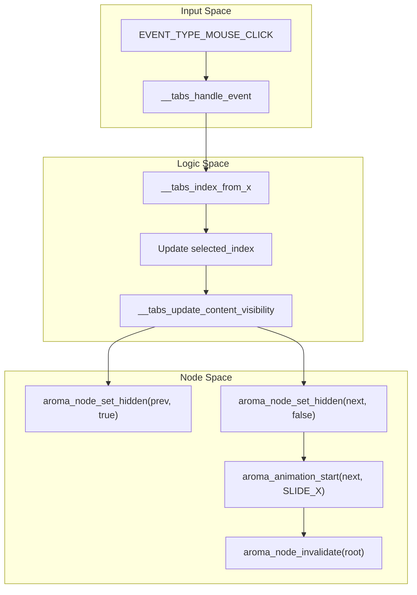

# Layout and Navigation Widgets
Relevant source files
- [examples/map_example/CMakeLists.txt](https://github.com/BinaryInkTN/AromaUI/blob/afd1c6b6/examples/map_example/CMakeLists.txt)
- [examples/smartwatch_example/CMakeLists.txt](https://github.com/BinaryInkTN/AromaUI/blob/afd1c6b6/examples/smartwatch_example/CMakeLists.txt)
- [include/aroma_animation.h](https://github.com/BinaryInkTN/AromaUI/blob/afd1c6b6/include/aroma_animation.h)
- [include/aroma_node.h](https://github.com/BinaryInkTN/AromaUI/blob/afd1c6b6/include/aroma_node.h)
- [include/widgets/aroma_chip.h](https://github.com/BinaryInkTN/AromaUI/blob/afd1c6b6/include/widgets/aroma_chip.h)
- [include/widgets/aroma_container.h](https://github.com/BinaryInkTN/AromaUI/blob/afd1c6b6/include/widgets/aroma_container.h)
- [include/widgets/aroma_listview.h](https://github.com/BinaryInkTN/AromaUI/blob/afd1c6b6/include/widgets/aroma_listview.h)
- [include/widgets/aroma_menu.h](https://github.com/BinaryInkTN/AromaUI/blob/afd1c6b6/include/widgets/aroma_menu.h)
- [include/widgets/aroma_sidebar.h](https://github.com/BinaryInkTN/AromaUI/blob/afd1c6b6/include/widgets/aroma_sidebar.h)
- [include/widgets/aroma_tabs.h](https://github.com/BinaryInkTN/AromaUI/blob/afd1c6b6/include/widgets/aroma_tabs.h)
- [src/core/aroma_animation.c](https://github.com/BinaryInkTN/AromaUI/blob/afd1c6b6/src/core/aroma_animation.c)
- [src/core/aroma_layout.c](https://github.com/BinaryInkTN/AromaUI/blob/afd1c6b6/src/core/aroma_layout.c)
- [src/core/aroma_node.c](https://github.com/BinaryInkTN/AromaUI/blob/afd1c6b6/src/core/aroma_node.c)
- [src/widgets/aroma_chip.c](https://github.com/BinaryInkTN/AromaUI/blob/afd1c6b6/src/widgets/aroma_chip.c)
- [src/widgets/aroma_container.c](https://github.com/BinaryInkTN/AromaUI/blob/afd1c6b6/src/widgets/aroma_container.c)
- [src/widgets/aroma_fab.c](https://github.com/BinaryInkTN/AromaUI/blob/afd1c6b6/src/widgets/aroma_fab.c)
- [src/widgets/aroma_listview.c](https://github.com/BinaryInkTN/AromaUI/blob/afd1c6b6/src/widgets/aroma_listview.c)
- [src/widgets/aroma_menu.c](https://github.com/BinaryInkTN/AromaUI/blob/afd1c6b6/src/widgets/aroma_menu.c)
- [src/widgets/aroma_sidebar.c](https://github.com/BinaryInkTN/AromaUI/blob/afd1c6b6/src/widgets/aroma_sidebar.c)
- [src/widgets/aroma_table.c](https://github.com/BinaryInkTN/AromaUI/blob/afd1c6b6/src/widgets/aroma_table.c)
- [src/widgets/aroma_tabs.c](https://github.com/BinaryInkTN/AromaUI/blob/afd1c6b6/src/widgets/aroma_tabs.c)

This page documents the structural and navigational components of AromaUI. These widgets manage the arrangement of child nodes, handle complex scrolling physics, and provide high-level UI patterns like tabbed interfaces, sidebars, and hierarchical lists.

## The Container System

The `AromaContainer` is the primary structural widget in AromaUI. It provides a viewport-based clipping region for child nodes and implements a sophisticated scrolling engine.

### Scrolling Physics and Viewport

AromaUI uses a "shift subtree" technique for scrolling. Instead of moving the container itself, the `AromaContainer` maintains a scroll offset (`scroll_fx`, `scroll_fy`) which is subtracted from the coordinates of all child nodes during the layout and rendering phases [src/widgets/aroma_container.c119-121](https://github.com/BinaryInkTN/AromaUI/blob/afd1c6b6/src/widgets/aroma_container.c#L119-L121)

Key features include:

- **Velocity Tracking**: The `VelocityTracker` records the last 8 input samples within a 150ms horizon to calculate exit velocity for flings [src/widgets/aroma_container.c34-77](https://github.com/BinaryInkTN/AromaUI/blob/afd1c6b6/src/widgets/aroma_container.c#L34-L77)
- **Fling Physics**: Implements a spline-based deceleration curve that mimics physical friction and gravity [src/widgets/aroma_container.c227-246](https://github.com/BinaryInkTN/AromaUI/blob/afd1c6b6/src/widgets/aroma_container.c#L227-L246)
- **Overscroll and Bounce**: Supports "rubber-band" overscrolling. When a user scrolls past bounds, resistance is applied (`OVERSCROLL_RESIST = 0.35f`). Upon release, a `bouncing` state triggers a 250ms animation back to valid bounds [src/widgets/aroma_container.c30-272](https://github.com/BinaryInkTN/AromaUI/blob/afd1c6b6/src/widgets/aroma_container.c#L30-L272)

### Scroll Interception

The container participates in the event pipeline by subscribing to touch events with a specific priority. It intercepts `EVENT_TYPE_TOUCH_DOWN` to stop active flings and monitors `EVENT_TYPE_TOUCH_MOVE` to determine if the movement exceeds `SCROLL_SLOP` (8 pixels) before claiming exclusive focus of the event stream [src/widgets/aroma_container.c21-155](https://github.com/BinaryInkTN/AromaUI/blob/afd1c6b6/src/widgets/aroma_container.c#L21-L155)

**Entity Mapping: Container System**

| Concept | Code Entity | Role |
| --- | --- | --- |
| **Viewport State** | `AromaContainer` | Struct holding offsets and physics state [src/widgets/aroma_container.c106-163](https://github.com/BinaryInkTN/AromaUI/blob/afd1c6b6/src/widgets/aroma_container.c#L106-L163) |
| **Physics Tick** | `fling_tick_cb` | Timer callback that updates offsets based on velocity [src/widgets/aroma_container.c270](https://github.com/BinaryInkTN/AromaUI/blob/afd1c6b6/src/widgets/aroma_container.c#L270-L270) |
| **Velocity Logic** | `vt_get_velocity` | Computes pixels-per-second from `VTSample` history [src/widgets/aroma_container.c75](https://github.com/BinaryInkTN/AromaUI/blob/afd1c6b6/src/widgets/aroma_container.c#L75-L75) |
| **Layout Sync** | `aroma_container_update_auto_content_size` | Recalculates total child area to update scroll bounds [src/widgets/aroma_listview.c118](https://github.com/BinaryInkTN/AromaUI/blob/afd1c6b6/src/widgets/aroma_listview.c#L118-L118) |

Sources: [src/widgets/aroma_container.c17-39](https://github.com/BinaryInkTN/AromaUI/blob/afd1c6b6/src/widgets/aroma_container.c#L17-L39)[src/widgets/aroma_container.c106-163](https://github.com/BinaryInkTN/AromaUI/blob/afd1c6b6/src/widgets/aroma_container.c#L106-L163)[src/widgets/aroma_container.c227-258](https://github.com/BinaryInkTN/AromaUI/blob/afd1c6b6/src/widgets/aroma_container.c#L227-L258)

---

## ListView and Table

The `ListView` is a specialized container designed for vertical stacks of information. It abstracts the creation of complex rows (icons, primary text, and secondary text) into a simple API.

### ListView Implementation

Unlike a raw container, `AromaListView` manages an internal array of `AromaListItem` structures [include/widgets/aroma_listview.h12-19](https://github.com/BinaryInkTN/AromaUI/blob/afd1c6b6/include/widgets/aroma_listview.h#L12-L19)

- **Item Types**: Supports `NORMAL`, `HEADER`, and `SEPARATOR` types [include/widgets/aroma_listview.h22-24](https://github.com/BinaryInkTN/AromaUI/blob/afd1c6b6/include/widgets/aroma_listview.h#L22-L24)
- **Dynamic Height**: Row heights are calculated dynamically; items with `secondary_text` are rendered at 1.5x the standard height [src/widgets/aroma_listview.c90-101](https://github.com/BinaryInkTN/AromaUI/blob/afd1c6b6/src/widgets/aroma_listview.c#L90-L101)
- **Selection Logic**: Hit-testing accounts for the current scroll position of the internal `scroll_container` to map screen coordinates to the correct list index [src/widgets/aroma_listview.c121-137](https://github.com/BinaryInkTN/AromaUI/blob/afd1c6b6/src/widgets/aroma_listview.c#L121-L137)

### Table Widget

The `AromaTable` widget provides a grid-based display for structured data. It utilizes the `AROMA_LAYOUT_MODE_GRID` layout mode defined in the core node system [include/aroma_node.h55](https://github.com/BinaryInkTN/AromaUI/blob/afd1c6b6/include/aroma_node.h#L55-L55)

Sources: [src/widgets/aroma_listview.c49-53](https://github.com/BinaryInkTN/AromaUI/blob/afd1c6b6/src/widgets/aroma_listview.c#L49-L53)[src/widgets/aroma_listview.c90-101](https://github.com/BinaryInkTN/AromaUI/blob/afd1c6b6/src/widgets/aroma_listview.c#L90-L101)[include/widgets/aroma_listview.h26-30](https://github.com/BinaryInkTN/AromaUI/blob/afd1c6b6/include/widgets/aroma_listview.h#L26-L30)

---

## Navigation Structures: Tabs and Sidebar

AromaUI provides two primary patterns for top-level navigation: `AromaTabs` (horizontal) and `AromaSidebar` (vertical/responsive).

### Tabbed Navigation

The `AromaTabs` widget manages a set of labels and associated `AromaNode` content subtrees.

- **Visibility Management**: Only the content nodes associated with the `selected_index` are marked visible. Switching tabs triggers `aroma_node_set_hidden` on the old subtree and removes the hidden flag from the new one [src/widgets/aroma_tabs.c92-108](https://github.com/BinaryInkTN/AromaUI/blob/afd1c6b6/src/widgets/aroma_tabs.c#L92-L108)
- **Transitions**: Supports animated transitions (`AROMA_ANIM_SLIDE_X`, `AROMA_ANIM_FADE`) when switching between tabs [src/widgets/aroma_tabs.c124-133](https://github.com/BinaryInkTN/AromaUI/blob/afd1c6b6/src/widgets/aroma_tabs.c#L124-L133)

### Sidebar Navigation

The `AromaSidebar` is designed for large-screen or dashboard interfaces (like AromaOS).

- **Responsive Behavior**: It includes a `retracted` state for small screens, switching between `full_width` and `retracted_width` based on a `breakpoint`[src/widgets/aroma_sidebar.c55-59](https://github.com/BinaryInkTN/AromaUI/blob/afd1c6b6/src/widgets/aroma_sidebar.c#L55-L59)
- **Content Swapping**: Similar to Tabs, it manages `content_nodes` for each menu item, ensuring that only the active section is processed by the `collect_draw_tasks` phase of the rendering pipeline [src/widgets/aroma_sidebar.c101-112](https://github.com/BinaryInkTN/AromaUI/blob/afd1c6b6/src/widgets/aroma_sidebar.c#L101-L112)

**Data Flow: Navigation Switching**

Sources: [src/widgets/aroma_tabs.c19-46](https://github.com/BinaryInkTN/AromaUI/blob/afd1c6b6/src/widgets/aroma_tabs.c#L19-L46)[src/widgets/aroma_tabs.c92-140](https://github.com/BinaryInkTN/AromaUI/blob/afd1c6b6/src/widgets/aroma_tabs.c#L92-L140)[src/widgets/aroma_sidebar.c38-70](https://github.com/BinaryInkTN/AromaUI/blob/afd1c6b6/src/widgets/aroma_sidebar.c#L38-L70)

---

## Menus, Chips, and Canvas

### Context Menus

`AromaMenu` implements a floating overlay. It calculates its height based on the number of items and uses a high-priority event subscription (priority 80) to capture clicks outside its bounds to facilitate "dismiss on click-away" behavior [src/widgets/aroma_menu.c34-103](https://github.com/BinaryInkTN/AromaUI/blob/afd1c6b6/src/widgets/aroma_menu.c#L34-L103)

### Chips

`AromaChip` is a compact action/filter element. It supports leading icons and trailing "close" buttons, commonly used for filtering lists or representing selected attributes.

### Canvas

The `AromaCanvas` widget provides a raw drawing surface. It exposes a `draw_cb` that allows developers to use the `AromaGraphicsInterface` directly to perform custom vector drawing, useful for graphs or custom visualizations [include/aroma_node.h33-133](https://github.com/BinaryInkTN/AromaUI/blob/afd1c6b6/include/aroma_node.h#L33-L133)

**Entity Mapping: Navigation Entities**

| Code Entity | Function / Role | Source |
| --- | --- | --- |
| `aroma_tabs_create` | Factory for horizontal tab bar | [src/widgets/aroma_tabs.c182](https://github.com/BinaryInkTN/AromaUI/blob/afd1c6b6/src/widgets/aroma_tabs.c#L182-L182) |
| `aroma_sidebar_create` | Factory for responsive vertical nav | [src/widgets/aroma_sidebar.c192](https://github.com/BinaryInkTN/AromaUI/blob/afd1c6b6/src/widgets/aroma_sidebar.c#L192-L192) |
| `aroma_menu_add_item` | Appends entry to context menu | [src/widgets/aroma_menu.c112](https://github.com/BinaryInkTN/AromaUI/blob/afd1c6b6/src/widgets/aroma_menu.c#L112-L112) |
| `aroma_node_set_hidden` | Controls subtree rendering traversal | [src/core/aroma_node.c1012](https://github.com/BinaryInkTN/AromaUI/blob/afd1c6b6/src/core/aroma_node.c#L1012-L1012) |

Sources: [src/widgets/aroma_menu.c34-48](https://github.com/BinaryInkTN/AromaUI/blob/afd1c6b6/src/widgets/aroma_menu.c#L34-L48)[src/widgets/aroma_tabs.c182](https://github.com/BinaryInkTN/AromaUI/blob/afd1c6b6/src/widgets/aroma_tabs.c#L182-L182)[src/widgets/aroma_sidebar.c192](https://github.com/BinaryInkTN/AromaUI/blob/afd1c6b6/src/widgets/aroma_sidebar.c#L192-L192)