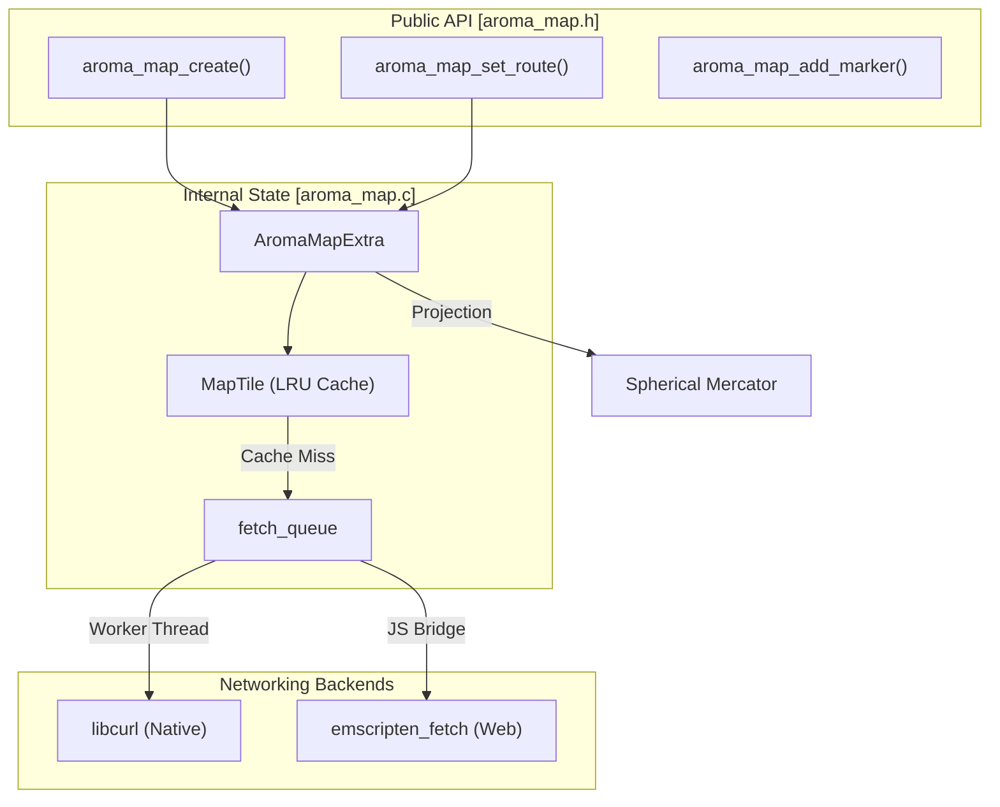
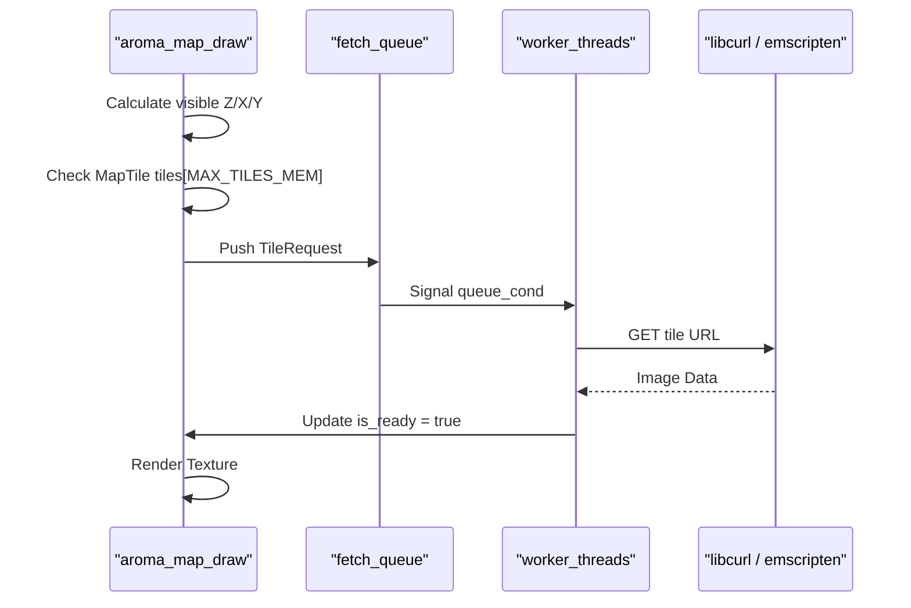

<iframe 
  src="widget-library/wasm/map_example/index.html" 
  width="100%" 
  height="400px" 
  style="
    overflow: hidden; 
    border: 8px solid #1a1a1a;
    border-radius: 12px;
    box-shadow: 
      inset 0 0 0 2px #333,
      0 0 0 4px #0a0a0a,
      0 0 0 8px #2a2a2a,
      0 0 20px rgba(0,0,0,0.5);
    background: #000;
  ">
</iframe>

<br />
```c
AromaNode *map = aroma_ui_map((AromaNode *)window, 0, 0, 700, 400);
if (map)
{
    aroma_map_set_center(map, 33.8869f, 9.5375f);
    aroma_map_add_icon_marker(map, 33.8869f, 9.5375f, 0xFF0000, AROMA_ICON_HOME);                                   // Marker at Tunisia
    aroma_map_add_popup_marker(map, 37.7749f, -122.4194f, 0x0000FF, "San Francisco is a city in California, USA."); // Popup marker at San Francisco
    aroma_map_set_route(map, 48.8566, 2.3522, 48.8049, 2.1204, 0xFF35A8FE);
    // aroma_map_set_zoom(map, 12); // Uncomment to set initial zoom level
}
```
<br />

The `AromaMap` widget provides a high-performance, interactive mapping component capable of rendering OpenStreetMap (OSM) or CartoDB tiles. It supports complex features such as asynchronous tile fetching with a multi-layered cache, spherical mercator projection, marker/popup overlays, and OSRM-based polyline routing.

### Purpose and Scope

The map widget is designed for high-frequency UI updates (60 FPS) on both native (Linux/Android) and web (WebAssembly) targets. It leverages a dedicated background worker pool for networking and image decoding to ensure the main UI thread remains responsive during heavy panning or zooming operations.

---

## Core Architecture and Data Flow

The `AromaMap` widget is built around the `AromaMapExtra` structure, which manages the tile cache, projection state, and overlay data.

### Map Lifecycle

1. **Creation**: `aroma_map_create` allocates the `AromaMapExtra` state and initializes the tile cache and worker threads [src/widgets/aroma_map.c73-110](https://github.com/BinaryInkTN/AromaUI/blob/afd1c6b6/src/widgets/aroma_map.c#L73-L110)
2. **Interaction**: User events (drag, scroll) update the `center_px_x/y` and `zoom` levels [include/widgets/aroma_map.h12-27](https://github.com/BinaryInkTN/AromaUI/blob/afd1c6b6/include/widgets/aroma_map.h#L12-L27)
3. **Tile Fetching**: The widget calculates required tile coordinates (Z, X, Y) and checks the LRU cache. Misses are pushed to a `TileRequest` queue [src/widgets/aroma_map.c97-108](https://github.com/BinaryInkTN/AromaUI/blob/afd1c6b6/src/widgets/aroma_map.c#L97-L108)
4. **Rendering**: The `aroma_map_draw` function projects markers and route polylines from GPS coordinates to screen space and flushes them via the `AromaGraphicsInterface`[src/widgets/aroma_map.c187-212](https://github.com/BinaryInkTN/AromaUI/blob/afd1c6b6/src/widgets/aroma_map.c#L187-L212)

### Component Interaction Diagram

The following diagram illustrates the relationship between the high-level widget API and the underlying implementation entities.

"Map Widget Architecture"



**Sources:**[include/widgets/aroma_map.h29-44](https://github.com/BinaryInkTN/AromaUI/blob/afd1c6b6/include/widgets/aroma_map.h#L29-L44)[src/widgets/aroma_map.c68-95](https://github.com/BinaryInkTN/AromaUI/blob/afd1c6b6/src/widgets/aroma_map.c#L68-L95)[src/widgets/aroma_map.c104-130](https://github.com/BinaryInkTN/AromaUI/blob/afd1c6b6/src/widgets/aroma_map.c#L104-L130)

---

## Tile Management and Fetching

Tiles are 256x256 pixel images fetched from providers like CartoDB or OSM.

### LRU Tile Cache

The widget maintains an in-memory cache of `MAX_TILES_MEM` (default 128) tiles [src/widgets/aroma_map.c45](https://github.com/BinaryInkTN/AromaUI/blob/afd1c6b6/src/widgets/aroma_map.c#L45-L45) Each `MapTile` entry tracks its `access_seq` to implement a Least Recently Used (LRU) eviction policy when the cache is full [src/widgets/aroma_map.c48-57](https://github.com/BinaryInkTN/AromaUI/blob/afd1c6b6/src/widgets/aroma_map.c#L48-L57)

### Cross-Platform Fetching

Fetching logic branches based on the target platform:

- **Native**: Uses `libcurl` within a pool of `num_active_workers` (default 2, max 16) [src/widgets/aroma_map.c123-128](https://github.com/BinaryInkTN/AromaUI/blob/afd1c6b6/src/widgets/aroma_map.c#L123-L128) Tiles are saved to `TILE_CACHE_DIR` (`/tmp/aroma_tiles`) to persist across sessions [src/widgets/aroma_map.c44](https://github.com/BinaryInkTN/AromaUI/blob/afd1c6b6/src/widgets/aroma_map.c#L44-L44)
- **Web (WASM)**: Uses `emscripten_fetch` to leverage the browser's native networking and caching stack [src/widgets/aroma_map.c20-22](https://github.com/BinaryInkTN/AromaUI/blob/afd1c6b6/src/widgets/aroma_map.c#L20-L22)

"Tile Fetching Logic"



**Sources:**[src/widgets/aroma_map.c44-57](https://github.com/BinaryInkTN/AromaUI/blob/afd1c6b6/src/widgets/aroma_map.c#L44-L57)[src/widgets/aroma_map.c104-130](https://github.com/BinaryInkTN/AromaUI/blob/afd1c6b6/src/widgets/aroma_map.c#L104-L130)[src/widgets/aroma_map.c187-212](https://github.com/BinaryInkTN/AromaUI/blob/afd1c6b6/src/widgets/aroma_map.c#L187-L212)

---

## Projection and Physics

### Spherical Mercator Projection

The map uses the standard Web Mercator projection to convert Latitude/Longitude to pixel coordinates. The conversion happens in the routing and drawing phases:

- **Lat to Y**: `(1.0 - log(tan(lat_rad) + 1.0 / cos(lat_rad)) / M_PI) / 2.0`[src/widgets/aroma_map.c217](https://github.com/BinaryInkTN/AromaUI/blob/afd1c6b6/src/widgets/aroma_map.c#L217-L217)
- **Lon to X**: `(lon + 180.0) / 360.0`[src/widgets/aroma_map.c218](https://github.com/BinaryInkTN/AromaUI/blob/afd1c6b6/src/widgets/aroma_map.c#L218-L218)

### Panning and Inertia

The widget implements physics-based panning. When a user releases a drag gesture, the `velocity_x` and `velocity_y` parameters in `AromaMapExtra` are used to continue the scroll with deceleration, providing a "fling" effect [src/widgets/aroma_map.c82-83](https://github.com/BinaryInkTN/AromaUI/blob/afd1c6b6/src/widgets/aroma_map.c#L82-L83)

---

## Routing and Overlays

### OSRM Polyline Routing

The widget integrates with the Open Source Routing Machine (OSRM).

1. **Request**: `aroma_map_set_route` triggers a background fetch to an OSRM API endpoint [include/widgets/aroma_map.h42](https://github.com/BinaryInkTN/AromaUI/blob/afd1c6b6/include/widgets/aroma_map.h#L42-L42)
2. **Decoding**: The polyline response is decoded from the Google Encoded Polyline Algorithm format into a series of coordinates [src/widgets/aroma_map.c157-198](https://github.com/BinaryInkTN/AromaUI/blob/afd1c6b6/src/widgets/aroma_map.c#L157-L198)
3. **Mutex Safety**: Because route data is fetched in a worker thread and read by the UI thread, access is guarded by `route_mutex`[src/widgets/aroma_map.c94](https://github.com/BinaryInkTN/AromaUI/blob/afd1c6b6/src/widgets/aroma_map.c#L94-L94)

### Markers and Popups

Markers are stored in a fixed-size array within the widget state [src/widgets/aroma_map.c76](https://github.com/BinaryInkTN/AromaUI/blob/afd1c6b6/src/widgets/aroma_map.c#L76-L76)

- **Icon Markers**: Rendered using a specific `icon_code` from the icon font [src/widgets/aroma_map.c64](https://github.com/BinaryInkTN/AromaUI/blob/afd1c6b6/src/widgets/aroma_map.c#L64-L64)
- **Popups**: If a marker has `popup_text`, clicking it sets `active_popup_idx`, causing a styled text box to render over the map [src/widgets/aroma_map.c65-78](https://github.com/BinaryInkTN/AromaUI/blob/afd1c6b6/src/widgets/aroma_map.c#L65-L78)

**Sources:**[src/widgets/aroma_map.c157-198](https://github.com/BinaryInkTN/AromaUI/blob/afd1c6b6/src/widgets/aroma_map.c#L157-L198)[src/widgets/aroma_map.c200-237](https://github.com/BinaryInkTN/AromaUI/blob/afd1c6b6/src/widgets/aroma_map.c#L200-L237)[include/widgets/aroma_map.h37-43](https://github.com/BinaryInkTN/AromaUI/blob/afd1c6b6/include/widgets/aroma_map.h#L37-L43)

---

## Usage Example

The following snippet demonstrates initializing a map with a center point, a marker, and a route between Paris and Versailles.

```
// Initialize Map
AromaNode *map = aroma_ui_map((AromaNode *)window, 0, 0, 1920, 1080);
 
// Set View
aroma_map_set_center(map, 33.8869f, 9.5375f);
 
// Add Interactive Elements
aroma_map_add_icon_marker(map, 33.8869f, 9.5375f, 0xFF0000, AROMA_ICON_HOME);
aroma_map_set_route(map, 48.8566, 2.3522, 48.8049, 2.1204, 0xFF35A8FE);
```

**Sources:**[examples/map_example/main.c14-22](https://github.com/BinaryInkTN/AromaUI/blob/afd1c6b6/examples/map_example/main.c#L14-L22)