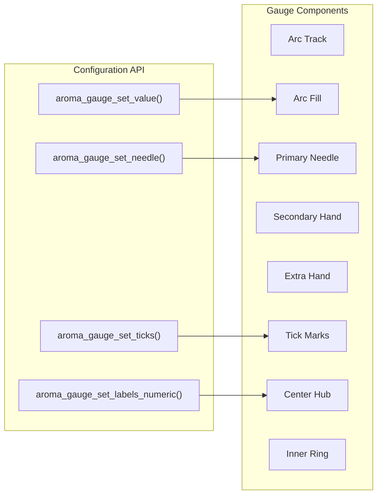

This page documents the progress, gauge, and loading widgets in AromaUI. These widgets visualize numerical values, scalar quantities, and ongoing background activity.

---

## ProgressBar

The `AromaProgressBar` implements the Material Design 3 linear progress indicator. It supports both determinate (0.0 to 1.0) and indeterminate (continuous animation) modes.

### Structure and Types

```c
typedef enum {
    PROGRESS_TYPE_DETERMINATE,
    PROGRESS_TYPE_INDETERMINATE
} AromaProgressType;
```

### API Reference

| Function | Description |
| --- | --- |
| `aroma_progressbar_create` | Creates a progress bar node. |
| `aroma_progressbar_set_progress` | Sets progress as a float from 0.0 to 1.0. |
| `aroma_progressbar_get_progress` | Returns the current progress value. |
| `aroma_progressbar_set_colors` | Overrides track and indicator colors. |

### Rendering

The determinate mode draws a rounded track with a filled indicator whose width is proportional to the progress value. The indeterminate mode animates a sliding indicator using the animation engine.

**Sources:**[include/widgets/aroma_progressbar.h10-28](https://github.com/BinaryInkTN/AromaUI/blob/afd1c6b6/include/widgets/aroma_progressbar.h#L10-L28)[src/widgets/aroma_progressbar.c1-80](https://github.com/BinaryInkTN/AromaUI/blob/afd1c6b6/src/widgets/aroma_progressbar.c#L1-L80)

---

## Gauge

The `AromaGauge` renders a circular or semi-circular indicator. It supports multiple hands, tick marks, numeric labels, and configurable arcs.

### Architecture

The gauge is one of the most configurable widgets in AromaUI. It exposes setters for nearly every visual element:



**Sources:**[include/widgets/aroma_gauge.h13-46](https://github.com/BinaryInkTN/AromaUI/blob/afd1c6b6/include/widgets/aroma_gauge.h#L13-L46)[src/widgets/aroma_gauge.c1-60](https://github.com/BinaryInkTN/AromaUI/blob/afd1c6b6/src/widgets/aroma_gauge.c#L1-L60)

### API Reference

| Function | Description |
| --- | --- |
| `aroma_ui_gauge` | Creates a gauge node. |
| `aroma_gauge_set_value` | Sets the primary value (0.0 to 1.0 normalized). |
| `aroma_gauge_set_range` | Sets the min/max range for value mapping. |
| `aroma_gauge_set_colors` | Sets track and fill arc colors. |
| `aroma_gauge_set_angles` | Defines the start and end angles of the arc in degrees. |
| `aroma_gauge_set_thickness` | Sets track and fill stroke widths. |
| `aroma_gauge_set_needle` | Enables/disables the primary needle. |
| `aroma_gauge_set_secondary_hand` | Enables a second hand with custom length. |
| `aroma_gauge_set_extra_hand` | Enables a third hand (e.g., for max/min markers). |
| `aroma_gauge_set_ticks` | Configures major/minor tick marks. |
| `aroma_gauge_set_labels_numeric` | Adds numeric labels around the arc. |
| `aroma_gauge_set_hub` | Draws a filled circle at the center. |
| `aroma_gauge_set_inner_ring` | Draws an additional inner ring. |
| `aroma_gauge_set_red_zone` | Highlights values above a threshold in red. |

**Sources:**[include/widgets/aroma_gauge.h13-46](https://github.com/BinaryInkTN/AromaUI/blob/afd1c6b6/include/widgets/aroma_gauge.h#L13-L46)

---

## Loading Spinner

The `AromaLoading` widget displays a continuously rotating arc to indicate background processing. It is typically used while data is being fetched or a transition is in progress.

### API Reference

```c
AromaNode *aroma_loading_create(
    AromaNode *parent,
    int x, int y,
    int radius,
    int thickness,
    uint32_t color
);
```

| Parameter | Description |
| --- | --- |
| `parent` | Parent container or window node. |
| `x, y` | Position relative to parent. |
| `radius` | Outer radius of the spinner in pixels. |
| `thickness` | Line thickness in pixels. |
| `color` | Spinner arc color in `0xAARRGGBB` format. |

### Implementation

The spinner uses the animation engine to rotate a partial arc. The `aroma_animation_start` function is used with a custom callback that updates the arc start angle each tick [src/widgets/aroma_loading.c1-60](https://github.com/BinaryInkTN/AromaUI/blob/afd1c6b6/src/widgets/aroma_loading.c#L1-L60).

### Helper Wrapper

`aroma_ui_loading` in `aroma_ui.h` provides a convenience wrapper [include/aroma_ui.h135-141](https://github.com/BinaryInkTN/AromaUI/blob/afd1c6b6/include/aroma_ui.h#L135-L141).

**Sources:**[include/widgets/aroma_loading.h11](https://github.com/BinaryInkTN/AromaUI/blob/afd1c6b6/include/widgets/aroma_loading.h#L11-L11)[src/widgets/aroma_loading.c1-60](https://github.com/BinaryInkTN/AromaUI/blob/afd1c6b6/src/widgets/aroma_loading.c#L1-L60)
